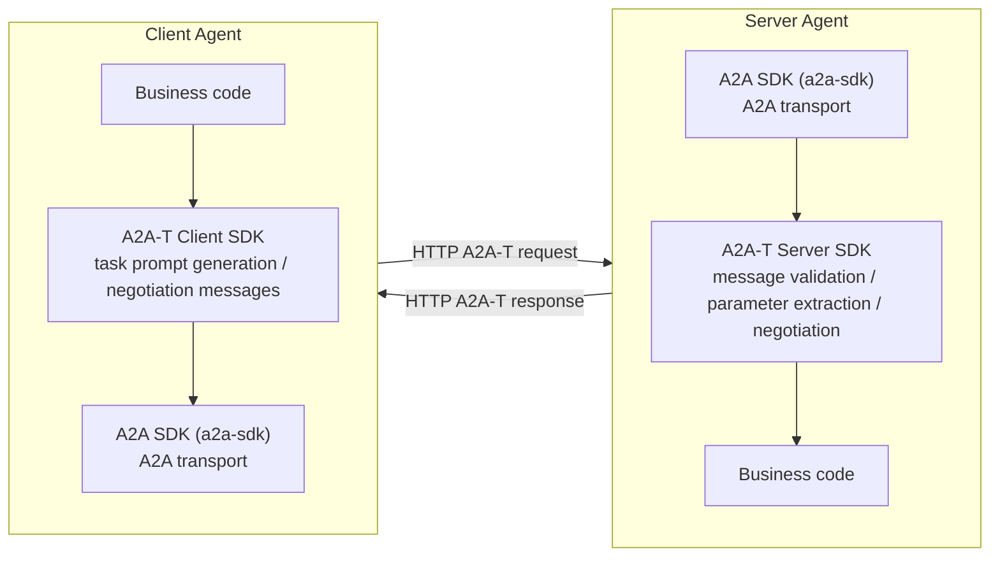

<!--
Copyright (c) 2026 Huawei Technologies Co., Ltd.
All Rights Reserved.

SPDX-License-Identifier: Apache-2.0

   Licensed under the Apache License, Version 2.0 (the "License"); you may
   not use this file except in compliance with the License. You may obtain
   a copy of the License at

        http://www.apache.org/licenses/LICENSE-2.0

   Unless required by applicable law or agreed to in writing, software
   distributed under the License is distributed on an "AS IS" BASIS, WITHOUT
   WARRANTIES OR CONDITIONS OF ANY KIND, either express or implied. See the
   License for the specific language governing permissions and limitations
   under the License.
-->

# a2a-t-sdk-python

<p align="center">
  <a href="https://www.python.org/"></a>
  <a href="LICENSE"></a>
</p>
<p align="center">
  <strong>Python SDK used to generate task prompts and handle task negotiation flows based on the A2A-T protocol.</strong>
</p>
<p align="center">
  <a href="./README_zh.md">中文</a>
</p>

---

## Project Overview

A2A-T (Agent-to-Agent Telecom) is a telecom-domain multi-agent interconnection protocol extended from the A2A protocol. It enhances capabilities such as information models, task negotiation, and collaboration security for telecom business scenarios, supporting deterministic, highly reliable, efficient, and secure collaboration among multi-agents in the telecom domain.

`a2a-t-sdk-python` is the Python SDK of the A2A-T protocol. Its core responsibility is to **generate, validate, and negotiate task prompts** (structured protocol messages) in A2A-T interactions. The SDK primarily targets two kinds of users:

- **Client Agent**: converts natural-language or structured input into task prompts conforming to the A2A-T format, and initiates, receives, and advances negotiation flows.
- **Server Agent**: validates whether A2A-T messages submitted by clients satisfy scenario, template, and slot constraints, extracts parameters, and advances negotiation flows.

The A2A-T SDK is independent of the A2A SDK. Using the two SDKs together builds agents with full A2A-T protocol support (the A2A SDK to pair with in the Python ecosystem is `a2a-sdk`):



## Core Capabilities

| Capability | Description |
| --- | --- |
| Task prompt generation (client) | Covers input normalization, scenario recognition, slot extraction, and template rendering, supporting both natural-language and structured-data input |
| Message validation and parameter extraction (server) | Executes metadata parsing, slot extraction, and semantic validation on SDK-format task prompts, extracts parameters per a Schema, and returns details of missing/invalid slots |
| Negotiation content API | Supports `information` / `feasibility` / `target` negotiation types plus `abort` termination messages, with template-driven negotiation message generation and validation; negotiation session state travels in the message metadata (`negotiationContext`) and the SDK itself is stateless |
| Resource organization | Bundled prompt resources (`prompts` / `scenarios` / `slots` / `templates` / `negotiation-vocabulary`) ship with the package, supporting both `packaged` (installed package) and `local_file` (local files) loading modes |
| LLM adaptation | Connects to external LLMs through OpenAI-compatible call chains, with bounded retries for retryable failure codes |
| Bundled samples | The repository ships runnable sample scenarios such as `subscribe_incident` (event subscription) and `negotiation` (negotiation closed loop); without an API key they automatically degrade to scripted mock LLM responses, running end to end with zero external dependencies |

## Project Structure

The repository is organized with `uv`; the core code lives under `src/a2a_t`:

| Module | Description |
| --- | --- |
| `client` | Client facade providing task prompt generation and negotiation entry points (`A2ATClient`) |
| `server` | Server facade providing A2A-T message validation and negotiation entry points (`A2ATServer`) |
| `core` | Template addressing, metadata models, the validation pipeline, and the structured bilingual error model |
| `common/prompt_resources` | Bundled prompt resource packaging and loading (`packaged` / `local_file`) |
| `config` | `.env`-based configuration loading and configuration models |
| `llm` | LLM adaptation layer with a default OpenAI-compatible client; supports custom LLM integration |
| `prompt` | Prompt resource analysis, slot extraction, template rendering, and validation |
| `negotiation` | Negotiation content models, the generation pipeline, and the validation pipeline |
| `a2a-t-sample` | Runnable client/server sample case collection |
| `a2a-t-corpus` | Accuracy verification corpus (pure test assets): data-driven workflow cases, shared byte-for-byte with the Java repository |

The `tests/` directory mirrors the package structure, covering prompt generation, server validation, negotiation pipelines, prompt resources, and LLM adaptation test cases.

## Quick Start

### Environment Requirements

| Item | Requirement |
| --- | --- |
| Python | `>=3.12` |
| Dependency manager | `uv` (recommended) |
| LLM | Optional. Without an API key the samples automatically degrade to scripted mock LLM responses, running with zero external dependencies |

### Run the First Demo in Three Steps

Take the `subscribe_incident` (event subscription) scenario as an example: the client generates a Notification-T task prompt from natural-language input and sends it to the server over a real HTTP A2A chain; the server validates the message, establishes the event subscription, and streams Incident notifications. All commands below run in the **`a2a-t-sample` directory** (where `.env` lives):

```bash
# 1. Install dependencies and prepare the environment configuration
#    (an empty A2AT_LLM_API_KEY automatically uses the mock LLM)
cp env.example .env
uv pip install -r requirements.txt

# 2. Terminal 1: start the registry center (port 5001)
#    Set the module search path first (.env lives in a2a-t-sample):
#    PowerShell: $env:PYTHONPATH = "$pwd\subscribe-incident\src"
#    bash:       export PYTHONPATH="$(pwd)/subscribe-incident/src"
uv run python -m agentcard_example.registry_main

# 3. Terminal 2: start the server (port 8000);
#    Terminal 3: start the client (keeps receiving artifacts, Ctrl+C to stop)
#    Set PYTHONPATH in both terminals as in step 2
uv run python -m server_example.server_main
uv run python -m client_example.client_main
```

After startup you can observe the full-chain logs: client scenario recognition and slot extraction, the generated task prompt, the A2A request message, the server validation result, and the Incident notification push.

> If the Windows console shows garbled Chinese characters, run `chcp 65001` first.

### Connect a Real LLM (Optional)

Edit `a2a-t-sample/.env` and fill in any OpenAI-compatible endpoint:

```properties
# LLM protocol type
A2AT_LLM_PROVIDER=openai
# Model name
A2AT_LLM_MODEL=<model name>
# Model endpoint
A2AT_LLM_BASE_URL=<OpenAI-compatible endpoint>
# LLM API key
A2AT_LLM_API_KEY=<your API key>
```

See the repository root `env.example` for the full configuration reference.

### Development and Testing

```bash
cd {project path}/a2a-t-sdk-python
uv sync --dev
uv run pytest        # run all tests
uv run ruff check .  # static checks
uv run mypy src      # type checks
```

More runnable samples (event subscription end-to-end, negotiation closed loop, etc.) are described in [a2a-t-sample/README.md](a2a-t-sample/README.md).

## More Documentation

| Document | Location | Content |
| --- | --- | --- |
| Developer Guide | [docs/en/developer_guide.md](docs/en/developer_guide.md) | Feature introduction, installation and integration, parameter configuration, and minimal practices |
| API Reference | [docs/en/API_Reference.md](docs/en/API_Reference.md) | Full API definitions and usage of `A2ATClient` / `A2ATServer` |

## Current Support Scope

Confirm the following limitations before use:

- The built-in LLM call chain is uniformly exposed as an OpenAI adaptation layer.
- The LLM prompt resources are built in and do not support custom extension (`prompts` and `errors` are always loaded from the installed package).
- Negotiation session state travels in the message metadata (the SDK is stateless) and no negotiation state store is provided; the legacy state-machine negotiation APIs (`start_negotiation` / `receive_negotiation` / `continue_negotiation`) are deprecated since 1.1.0.
- Bundled resources and language coverage are limited, and remote resource loading such as `registry-center` (the registry center) is not included.
- This document mainly introduces the SDK itself and does not cover CLI tools, hosted services, deployment flows, or ready-to-use application solutions.

## License

This project is licensed under the [Apache-2.0](LICENSE) license.
