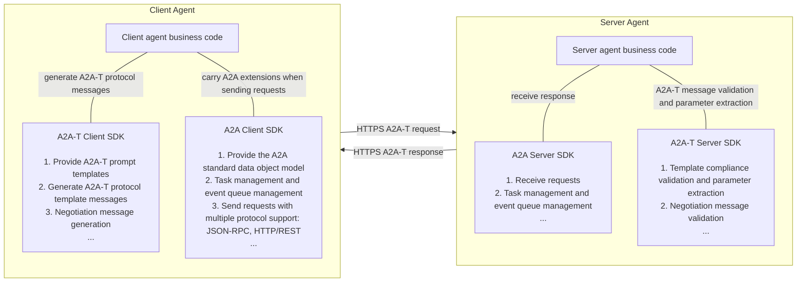
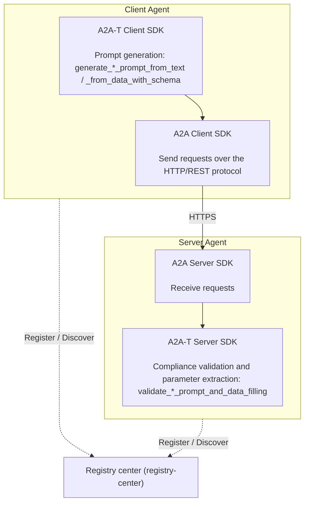
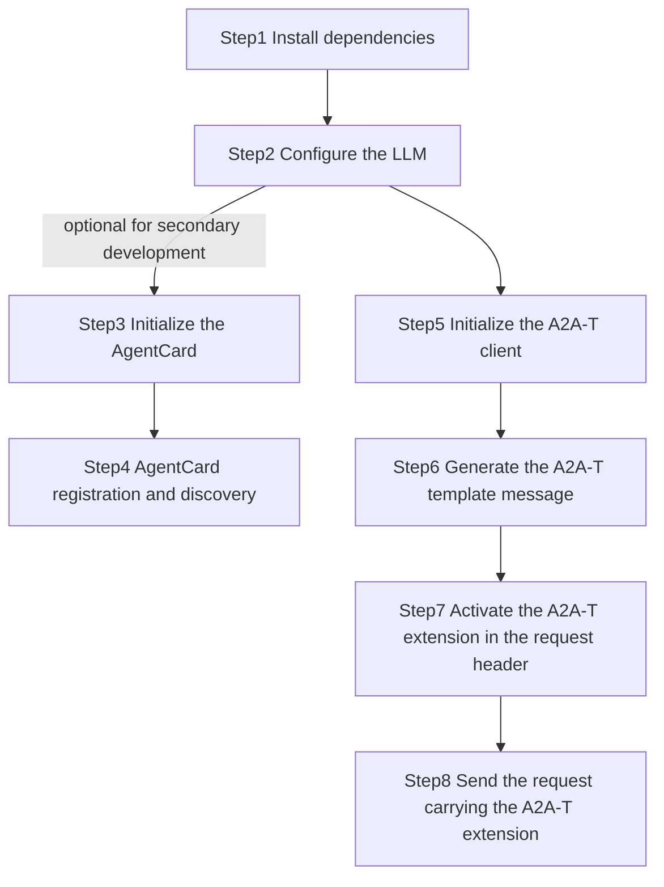
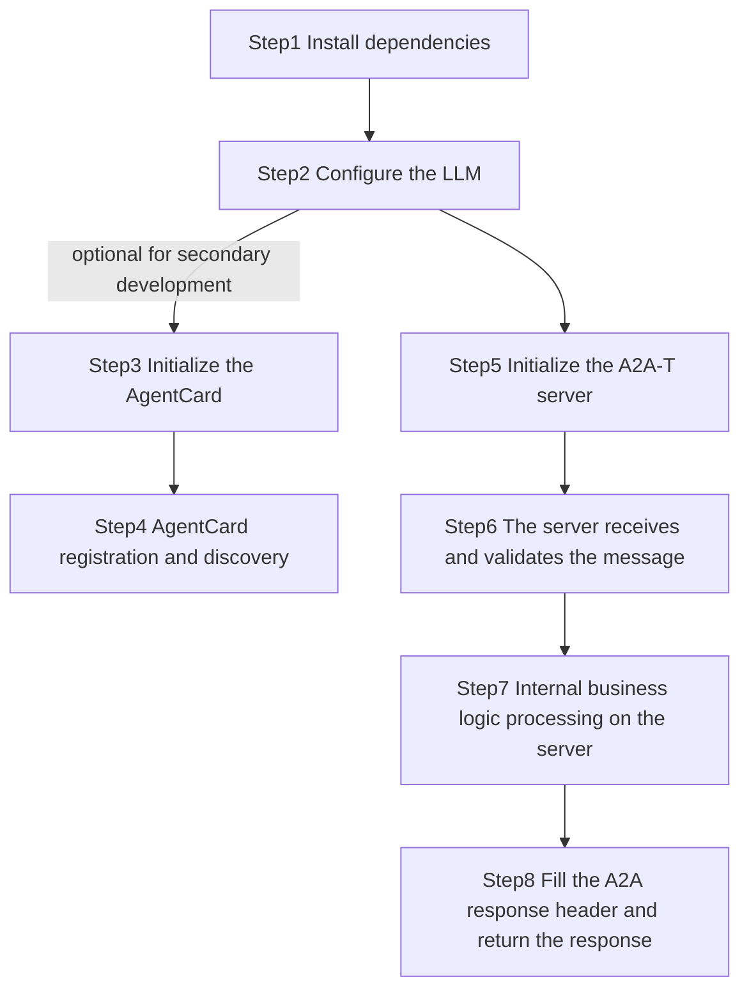

# 1 a2a-t-sdk-python Developer Guide

| Category     | Description                                                              |
| -------- |-----------------------------------------------------------------|
| Target readers | Developers, integration and deployment engineers, and project O&M personnel who build multi-agent protocol interactions based on the A2A-T SDK |
| Purpose | This document describes the complete installation, parameter configuration, and minimal practices of the A2A-T SDK, helping you complete SDK integration, feature development, and rollout quickly and consistently. |
| Prerequisites | Familiar with the data model definitions and usage of the A2A multi-agent protocol, the AgentCard model definition and usage, and registry-center-related functions |

## 1.1 Feature Introduction

### 1.1.1 A2A-T Capabilities
A2A-T (Agent-to-Agent Telecom) is a multi-agent interconnection protocol for the telecom domain built on the A2A protocol, designed specifically for complex collaboration scenarios in the telecom domain.

Business scenarios in the telecom domain are complex and demanding, so the interconnection and collaboration of O&M agents require a dedicated protocol. Based on the A2A protocol, the A2A-T solution focuses on application extensions for enhanced capabilities such as information models, task negotiation, and collaboration security for telecom business flows.

a2a-t-sdk-python is a Python SDK for telecom agent collaboration scenarios. It is used to generate, validate, and negotiate task prompts in A2A-T interactions. The SDK is suitable for integration by client Agents, server Agents, and upper-layer orchestration systems.

Main capabilities include:

- **Client template message generation**: the client generates A2A-T-conformant protocol messages from natural-language or structured input.
- **Server template message validation**: the server validates whether the A2A-T protocol messages submitted by clients match the scenario, template, and slot constraints.
- **Negotiation content API**: supports `information`, `feasibility`, and `target` negotiation types plus `abort` termination messages, with template-driven negotiation message generation and validation; negotiation session state travels in the message metadata (`negotiationContext`) and the SDK itself is stateless.
- **Template resource management**: built-in scenario, slot, template, vocabulary, and system prompt resources, supporting both the `packaged` built-in source and the `local_file` local-file source.
- **LLM adaptation**: connects to external large language models through OpenAI-compatible call chains.

For the complete API list and usage, see [API_Reference.md](API_Reference.md).

### 1.1.2 Relationship Between the A2A-T SDK and the A2A SDK

The A2A-T protocol is an extension of the A2A protocol. The A2A-T SDK is provided for the extended protocol content, supporting rapid construction of agents for complex collaboration scenarios in the telecom domain.

The A2A-T SDK is independent of the A2A SDK. By integrating both the A2A-T SDK and the A2A SDK, you can build agents that support the A2A-T protocol, enabling deterministic, highly reliable, efficient, and secure collaboration among multiple agents in the telecom domain. The A2A SDK to pair with in the Python ecosystem is the official `a2a-sdk`.



### 1.1.3 Typical A2A-T SDK Interaction Scenarios

A typical multi-agent collaboration interaction involves at least three components: the client Agent, the server Agent, and the registry center;

the relationships among the components are shown below:



When the first prompt carries incomplete task information, the two sides switch to the negotiation flow: the server generates a Negotiation-T propose message asking for the missing information, and the client validates that message, fills the requested parameters, and answers with a Task-T prompt plus a Negotiation-T accept message. The full closed loop is available in the `a2a-t-sample/negotiation/` offline sample (see 1.4.5).

## 1.2 Constraints and Limitations

1. Python 3.12+ is required.
2. Complete multi-agent protocol interaction development also requires the `a2a-sdk`, version 1.1.0+.
3. The SDK is stateless: negotiation session state travels with the A2A-T metadata (`negotiationContext`) of each message and is not stored inside the SDK.
4. The legacy state-machine negotiation demo (`start_negotiation` / `receive_negotiation` / `continue_negotiation` and the `negotiation/{types,store,runtime,handling}` packages) is deprecated since 1.1.0 (calls emit a `DeprecationWarning`) and will be removed in the next release.
5. The A2A-T SDK does not provide an agent HTTP service framework, a registry-center client, or authentication and key management capabilities; these must be integrated by the business system.

## 1.3 Environment Preparation

### 1.3.1 Environment Requirements

| Item       | Requirement                                     |
| -------- | ---------------------------------------- |
| Python   | Python 3.12+                             |
| Dependency manager | `uv` recommended                            |
| LLM      | An accessible OpenAI-compatible service and API key required (not needed for offline tests and samples) |
| Operating system | Linux, Windows, and macOS are all suitable for development and integration |

### 1.3.2 Setting Up the Environment

The following uses a Windows 11 64-bit amd64 development environment as an example.

**Install Python 3.12**

1. Official download: https://www.python.org/ftp/python/3.12.10/python-3.12.10-amd64.exe

2. Run `python-3.12.10-amd64.exe` as an administrator

3. **Make sure to check**: Add Python 3.12 to PATH

4. After installation, open a terminal and verify:

   ```shell
   python --version
   # Expected output: Python 3.12.10
   ```

**Install uv**

1. After installing Python, install uv with pip: run `python -m pip install uv` in a terminal

2. After installation, verify:

   ```shell
   uv --version
   # Expected output: uv 0.12.1 (329541a50 2026-07-31 x86_64-pc-windows-msvc)
   ```

3. Install the project dependencies and run the tests:

   ```shell
   cd {project path}/a2a-t-sdk-python
   uv sync --dev
   uv run pytest -q
   ```

## 1.4 Basic Development Sample

Purpose: help you get familiar with the SDK integration flow quickly and consistently through sample client and server code, accelerating feature development and rollout.

### 1.4.1 Sample API Description

This basic sample mainly uses the following two A2A-T SDK APIs. In actual development, select the appropriate APIs based on your business requirements:

**1. A2A-T Client SDK**

API definition and function description: generates a notification subscription prompt message from natural-language text with the specified Notification-T template (skipping scenario recognition). It runs one LLM slot-extraction step and then renders the template deterministically; the generation phase performs built-in slot schema validation.

```python
def generate_notification_prompt_from_text(self, text: str, template_uri: str | TemplateUri) -> MetadataContent
```

Sample call:

```python
from pathlib import Path

from a2a_t.client.a2at_client import A2ATClient

client = A2ATClient(env_path=Path("package_data/.env"))

metadata = client.generate_notification_prompt_from_text(
    "Generate an Incident event subscription task: the notification topic is Incident, "
    "the subscription levels are critical, medium, high, and low, and the notification "
    "data format is DataPart",
    "Notification-T/network-layer/subscribe-incident/v1",
)

print(metadata.prompt_text)              # the rendered prompt message
print(metadata.build_metadata_content()) # the A2A-T metadata map ready to send

"""Output of the generated notification subscription prompt message (metadata.prompt_text;
the actual text varies with the LLM slot-extraction result):
## Subscription Description
Based on the following <Notification Topic>, <Subscribe Condition>, <Notification Data Format>, and <Expected Output> information, complete the network-side intelligent fault Incident subscription and reporting task.

## Notification Topic
The name of this topic is "Incident"

## Subscribe Condition
The fault levels are "critical", "medium", "high", "low"

## Notification Data Format
Report Incident data via DataPart

## Expected Output
1. Subscription result, success or failure
2. Reason for subscription failure (optional)
"""
```

**2. A2A-T Server SDK**

API definition and function description: validates whether a Notification-T notification subscription prompt message matches the template and slot constraints, and extracts parameters (subscription topic, subscription condition, notification data format, etc.) per the caller's schema.

```python
def validate_notification_prompt_and_data_filling(
    self,
    prompt: str,
    schema: Mapping[str, object],
    template_uri: str | TemplateUri,
) -> FilledParamData
```

Sample call: validates the notification subscription message sent by the client and extracts the subscription parameters

```python
from pathlib import Path

from a2a_t.server.a2at_server import A2ATServer

server = A2ATServer(env_path=Path("package_data/.env"))

validation_schema = {
    "type": "object",
    "properties": {
        "topic": {
            "type": "string",
            "description": "Subscription topic (required). Name of the event topic to subscribe to.",
        },
        "subscriptionCondition": {
            "type": "string",
            "description": "Subscription condition (optional). Description of the condition to subscribe to.",
        },
        "notificationDataFormat": {
            "type": "string",
            "description": "Notification data format (required). Description of the notification data format to report.",
        },
    },
    "required": ["topic", "notificationDataFormat"],
}

# prompt_text is the notification subscription prompt message text generated by the client
filled = server.validate_notification_prompt_and_data_filling(
    metadata.prompt_text, validation_schema, "Notification-T/network-layer/subscribe-incident/v1"
)

print(filled.data)
# The subscription parameters extracted per the schema, for example
# {'topic': 'Incident', 'subscriptionCondition': '', 'notificationDataFormat': 'DataPart'}
```

The corresponding pure compliance API `check_task_prompt(processed_prompt_text=...)` returns a `PromptComplianceResult`; on rejection its `failure` carries `code` / `message` / `stage`. The two can be combined — run the compliance check first and the parameter filling after compliance passes.

### 1.4.2 Development Flow

- Client development flow



> Secondary development refers to already having developed agents based on A2A and integrated with a registry center

- Server development flow:



### 1.4.3 Client Sample Development Steps

#### Step1 Install Dependencies

```bash
# A2A-T SDK
pip install a2a-t-sdk

# Official Python A2A SDK
pip install a2a-sdk
```

> Sending A2A requests, receiving responses, and assembling server routes use the official `a2a-sdk` (its transport layer depends on `httpx`); the registry center is outside the scope of the official SDK, so this guide interacts with it directly over `httpx` — business systems may replace it with any HTTP client such as `requests`. Starting an HTTP service on the server also requires `uvicorn`:
>
> ```bash
> pip install uvicorn
> ```

#### Step2 Configure the LLM

Copy the repository root `env.example` to `package_data/.env` (the facades' default read location) and configure the following:

```properties
A2AT_LANGUAGE=en-US
A2AT_PROMPT_SOURCE_TYPE=packaged
A2AT_PROMPT_COMPLIANCE_ENABLED=true
A2AT_INPUT_TEXT_MAX_CHARS=16384
A2AT_LLM_PROVIDER=openai
A2AT_LLM_MODEL=deepseek-chat
A2AT_LLM_API_KEY={your_llm_api_key}
A2AT_LLM_BASE_URL=https://api.deepseek.com
A2AT_LLM_MAX_ATTEMPTS=3
```

> `A2AT_LLM_API_KEY` is the key used to **call the external LLM**; keep it safe
>
> The SDK connects to external LLMs through OpenAI-compatible APIs; `A2AT_LLM_PROVIDER` currently supports only `openai`. When connecting to DeepSeek and other OpenAI-compatible services, use `A2AT_LLM_BASE_URL` for the service endpoint and `A2AT_LLM_MODEL` for the model name.
>
> Since 1.1.0 the default of `A2AT_PROMPT_SOURCE_TYPE` is `packaged` (it was `local_file` before 1.1.0); see 1.5 for the semantics of the resource sources and the migration path.

#### Step3 Initialize the AgentCard

Sample client AgentCard definition reference:

> The supported A2A-T templates can be declared in `extensions`

```json
{
  "agentCards": [
    {
      "name": "Transmission workbench agent",
      "description": "Transmission network O&M management agent, providing O&M capabilities such as circuit recovery verification, base station outage root cause analysis, and network element hidden danger inspection",
      "supportedInterfaces": [
        {
          "url": "http://10.xx.xx.xx:26335/a2a/v1",
          "protocolBinding": "HTTP+JSON",
          "protocolVersion": "1.0"
        }
      ],
      "provider": {
        "organization": "ZzNode"
      },
      "version": "1.0.0",
      "capabilities": {
        "streaming": true,
        "pushNotifications": false,
        "extensions": [
          {
            "uri": "https://projects.tmforum.org/a2aproject/telecommunication/extensions/Task-T/v1",
            "description": "Extension of structured prompt Task-T requests."
          },
          {
            "uri": "https://projects.tmforum.org/a2aproject/telecommunication/extensions/Notification-T/v1",
            "description": "Extension of structured prompt Notification-T requests."
          }
        ],
        "extendedAgentCard": false
      },
      "securitySchemes": {
        "bearerAuth": {
          "httpAuthSecurityScheme": {
            "description": "After querying an accessSession through the login interface with a username and password, use that accessSession for bearer authentication.",
            "scheme": "Bearer"
          }
        }
      },
      "defaultInputModes": [
        "application/json",
        "text/plain"
      ],
      "defaultOutputModes": [
        "application/json",
        "text/plain"
      ],
      "skills": [
        {
          "id": "ne-hidden-danger",
          "name": "Network element hidden danger inspection agent",
          "description": "Network element hidden danger inspection skill. Based on the input network element name, inspect whether the network element still has new hidden dangers.",
          "tags": [
            "Network element inspection",
            "Hidden danger inspection",
            "NE-inspection"
          ],
          "examples": [
            "Check whether network element QZHA-HAZBYSDGG-HRHH still produces new hidden dangers"
          ],
          "inputModes": [
            "application/json",
            "text/plain"
          ],
          "outputModes": [
            "application/json",
            "text/plain"
          ]
        }
      ]
    }
  ]
}
```

AgentCards in the registry center are stored as JSON. When constructing the official A2A client or assembling the server routes, convert them to the official SDK's `a2a.types.AgentCard` object:

```python
from a2a.types import AgentCard
from google.protobuf.json_format import ParseDict

agent_card = ParseDict(agent_card_dict, AgentCard())
```

#### Step4 AgentCard Registration and Discovery

- **AgentCard registration**: publish the client AgentCard to the registry center; the registry center address and URI depend on the actual deployment

```python
import httpx

AGENT_CARD = {...}  # the AgentCard JSON defined in Step3

def register_agent_card(registry_url: str, agent_card: dict) -> None:
    resp = httpx.post(
        registry_url,
        json=agent_card,
        timeout=10,
    )
    resp.raise_for_status()
```

- **AgentCard discovery**: query the registry center for the AgentCard of the target agent by name or skill, and get its `url` and supported skills

```python
import httpx

def discover_agent(discover_url: str, task: str) -> dict:
    resp = httpx.post(
        discover_url,
        params={"task": task},
        timeout=10,
    )
    resp.raise_for_status()
    return resp.json()["agentCards"][0]
```

The discovery result is the JSON structure returned by the registry center. Because the official `ClientFactory` takes an `a2a.types.AgentCard` object, convert it to the official AgentCard model (see the `ParseDict` usage in Step3).

#### Step5 Initialize the A2A-T Client

```python
from pathlib import Path
from a2a_t.client.a2at_client import A2ATClient

client = A2ATClient(env_path=Path("package_data/.env"))
```

Both `A2ATClient` and `A2ATServer` accept `env_path`; when omitted, `package_data/.env` is read by default (the SDK reads configuration from a `.env` file, not from OS environment variables).

#### Step6 Generate the A2A-T Template Message

The client generates a Notification-T subscription message (processed_prompt) with the A2A-T Client SDK API `generate_notification_prompt_from_text`, then sends it to the target agent as part of the A2A message metadata:

```python
from pathlib import Path
from a2a_t.client.a2at_client import A2ATClient
from a2a_t.core.standard_templates import SUBSCRIBE_INCIDENT_URI

client = A2ATClient(env_path=Path("package_data/.env"))

# Generate the A2A-T notification subscription prompt message
# (a PromptGenerationError carrying code and message is raised on generation failure)
metadata = client.generate_notification_prompt_from_text(
    "Generate an Incident event subscription task: the notification topic is Incident, "
    "the subscription levels are critical, medium, high, and low, and the notification "
    "data format is DataPart",
    SUBSCRIBE_INCIDENT_URI,
)

processed_prompt = metadata.prompt_text
extension_uri = metadata.extension_uri          # A2A-T extension URI, used in message metadata and headers
```

#### Step7 Activate the A2A-T Extension in the Request Header

The A2A protocol carries the protocol version and extension declarations in HTTP headers. The following headers are required:

| Header           | Direction   | Required            | Value                                              |
| ---------------- | ------ | --------------- | ------------------------------------------------- |
| `A2A-Version`    | request header | Yes              | Protocol version, e.g. `1.0` (the client must carry it with every request)    |
| `A2A-Extensions` | request header | Required when A2A-T is used | Comma-separated list of extension URIs declaring the extensions used in this request |

Client request header example: with the official A2A Client, request headers are passed through `ClientCallContext.service_parameters` (the key-value pairs are sent as HTTP headers with the request); protocol headers such as `A2A-Version` are carried automatically by the official client:

```python
from a2a.client.client import ClientCallContext

NOTIFICATION_PROMPT_EXT = "https://projects.tmforum.org/a2aproject/telecommunication/extensions/Notification-T/v1"

ACCESS_TOKEN = "{your_access_token}"

context = ClientCallContext(
    service_parameters={
        "A2A-Extensions": NOTIFICATION_PROMPT_EXT,
        "Authorization": f"Bearer {ACCESS_TOKEN}",
    },
)
```

#### Step8 Send the Request Carrying the A2A-T Extension

Create the A2A client with the official `ClientFactory`, build the request with `SendMessageRequest` (the processed prompt goes into `message.metadata` keyed by the extension URI), and declare the extension request header through `ClientCallContext`:

```python
import uuid

from a2a.client.client import ClientCallContext, ClientConfig
from a2a.client.client_factory import ClientFactory
from a2a.types import AgentCard, Role, SendMessageRequest
from a2a.utils.constants import TransportProtocol

from pathlib import Path
from a2a_t.client.a2at_client import A2ATClient
from google.protobuf.json_format import ParseDict

NOTIFICATION_PROMPT_EXT = "https://projects.tmforum.org/a2aproject/telecommunication/extensions/Notification-T/v1"

ACCESS_TOKEN = "{your_access_token}"

# 1) Generate the A2A-T prompt (see Step6)
client = A2ATClient(env_path=Path("package_data/.env"))
metadata = client.generate_notification_prompt_from_text(
    "Generate an Incident event subscription task: the notification topic is Incident, "
    "the subscription levels are critical, medium, high, and low, and the notification "
    "data format is DataPart",
    "Notification-T/network-layer/subscribe-incident/v1",
)

# 2) Construct the official A2A client (the AgentCard comes from the registry center, see Step4)
agent_card = ParseDict(agent_card_dict, AgentCard())
a2a_client = ClientFactory(
    ClientConfig(
        supported_protocol_bindings=[TransportProtocol.HTTP_JSON],
        use_client_preference=True,
    )
).create(agent_card)

# 3) Build the request (the headers declare the extension, the message body carries the A2A-T metadata)
request = SendMessageRequest()
request.message.message_id = str(uuid.uuid4())
request.message.role = Role.ROLE_USER
request.message.parts.add().text = "Create an intelligent fault incident reporting task"
for key, value in metadata.build_metadata_content().items():
    request.message.metadata[key] = str(value)

# 4) Declare the A2A-T extension request header through ClientCallContext (see Step7)
context = ClientCallContext(
    service_parameters={
        "A2A-Extensions": NOTIFICATION_PROMPT_EXT,
        "Authorization": f"Bearer {ACCESS_TOKEN}",
    },
)

# 5) Send the request and consume the response stream (StreamResponse: status_update / artifact_update / message)
async for stream_response in a2a_client.send_message(request, context=context):
    if stream_response.HasField("status_update"):
        print("status:", stream_response.status_update.status.state)
    elif stream_response.HasField("artifact_update"):
        print("artifact:", stream_response.artifact_update.artifact.name)
    elif stream_response.HasField("message"):
        print("message:", stream_response.message.parts[0].text)

await a2a_client.close()
```

#### Complete Client Sample Code

```python
import asyncio
import uuid
from pathlib import Path

import httpx
from a2a.client.client import ClientCallContext, ClientConfig
from a2a.client.client_factory import ClientFactory
from a2a.types import AgentCard, Role, SendMessageRequest
from a2a.utils.constants import TransportProtocol
from a2a_t.client.a2at_client import A2ATClient
from google.protobuf.json_format import ParseDict

NOTIFICATION_PROMPT_EXT = "https://projects.tmforum.org/a2aproject/telecommunication/extensions/Notification-T/v1"

ACCESS_TOKEN = "{your_access_token}"

AGENT_CARD = {...}  # the AgentCard JSON defined in Step3

def register_agent_card(registry_url: str, agent_card: dict) -> None:
    resp = httpx.post(
        registry_url,
        json=agent_card,
        timeout=10,
    )
    resp.raise_for_status()

def discover_agent(discover_url: str, task: str) -> dict:
    resp = httpx.post(
        discover_url,
        params={"task": task},
        timeout=10,
    )
    resp.raise_for_status()
    return resp.json()["agentCards"][0]

async def main() -> None:
    # 1) Register the client AgentCard and discover the server AgentCard
    #    (the registry center is a business-system-side component)
    register_agent_card("{ip:port}/rest/v1/registry-center/agent-cards", AGENT_CARD)
    agent_card_dict = discover_agent("{ip:port}/rest/v1/registry-center/agent-cards/semantic-query", task="fault subscription needed")

    # 2) Generate the A2A-T prompt with the SDK capabilities
    client = A2ATClient(env_path=Path("package_data/.env"))
    metadata = client.generate_notification_prompt_from_text(
        "Generate an Incident event subscription task: the notification topic is Incident, "
        "the subscription levels are critical, medium, high, and low, and the notification "
        "data format is DataPart",
        "Notification-T/network-layer/subscribe-incident/v1",
    )

    # 3) Construct the official A2A client
    agent_card = ParseDict(agent_card_dict, AgentCard())
    a2a_client = ClientFactory(
        ClientConfig(
            supported_protocol_bindings=[TransportProtocol.HTTP_JSON],
            use_client_preference=True,
        )
    ).create(agent_card)

    # 4) Build the request (the headers declare the extension, the message body carries the A2A-T metadata)
    request = SendMessageRequest()
    request.message.message_id = str(uuid.uuid4())
    request.message.role = Role.ROLE_USER
    request.message.parts.add().text = "Create an intelligent fault incident reporting task"
    for key, value in metadata.build_metadata_content().items():
        request.message.metadata[key] = str(value)

    context = ClientCallContext(
        service_parameters={
            "A2A-Extensions": NOTIFICATION_PROMPT_EXT,
            "Authorization": f"Bearer {ACCESS_TOKEN}",
        },
    )

    # 5) Send the request and consume the response stream
    async for stream_response in a2a_client.send_message(request, context=context):
        if stream_response.HasField("status_update"):
            print("status:", stream_response.status_update.status.state)
        elif stream_response.HasField("artifact_update"):
            print("artifact:", stream_response.artifact_update.artifact.name)
        elif stream_response.HasField("message"):
            print("message:", stream_response.message.parts[0].text)

    await a2a_client.close()

asyncio.run(main())
```

### 1.4.4 Server Sample Development Steps

#### Step1-Step5 Preliminary Steps

The steps of installing dependencies, configuring the LLM, initializing the AgentCard, and AgentCard registration and discovery all follow the [client implementation](#143-client-sample-development-steps); the differences are:

- Initialize the A2A-T server

```python
from pathlib import Path
from a2a_t.server.a2at_server import A2ATServer

server = A2ATServer(env_path=Path("package_data/.env"))
```

- Initialize the AgentCard; sample server AgentCard definition reference:

```json
{
  "agentCards": [
    {
      "name": "RAN Domain Agent",
      "description": "RAN Domain Agent",
      "provider": {
        "organization": "Huawei",
        "url": "https://www.huawei.com"
      },
      "version": "1.0.0",
      "capabilities": {
        "streaming": true,
        "pushNotifications": false,
        "extendedAgentCard": false,
        "extensions": [
          {
            "description": "Extension of structured prompt TASK-T requests.",
            "required": false,
            "uri": "https://projects.tmforum.org/a2aproject/telecommunication/extensions/Task-T/v1"
          },
          {
            "description": "Extension of structured prompt Notification-T requests.",
            "required": false,
            "uri": "https://projects.tmforum.org/a2aproject/telecommunication/extensions/Notification-T/v1"
          }
        ]
      },
      "defaultInputModes": [
        "application/json",
        "text/plain"
      ],
      "defaultOutputModes": [
        "application/json",
        "text/plain"
      ],
      "skills": [
        {
          "id": "ran-incident-subscription",
          "name": "Incident reporting",
          "description": "Supports Incident reporting, providing fault intelligent identification and diagnosis capabilities",
          "tags": [
            "Incident reporting"
          ],
          "examples": [
            "## Subscription Description\nBased on the following <Notification Topic>, <Subscribe Condition>, <Notification Data Format>, and <Expected Output> information, complete the network-side intelligent fault Incident subscription and reporting task.\n## Notification Topic\nThe name of this topic is \"Incident\"\n## Subscribe Condition\nThe fault level is \"high\"\n## Notification Data Format\nReport Incident data via DataPart\n## Expected Output\n1. Subscription result, success or failure\n2. Reason for subscription failure (optional)"
          ],
          "inputModes": [
            "application/json",
            "text/plain"
          ],
          "outputModes": [
            "application/json",
            "text/plain"
          ]
        }
      ],
      "securitySchemes": {
        "bearerAuth": {
          "httpAuthSecurityScheme": {
            "scheme": "Bearer",
            "description": "After querying an accessSession through the login interface with a username and password, use that accessSession for bearer authentication."
          }
        }
      },
      "securityRequirements": [],
      "supportedInterfaces": [
        {
          "protocolBinding": "JSONRPC",
          "url": "https://10.xx.xx.xx:27417/a2a/v1",
          "tenant": "",
          "protocolVersion": "1.0"
        },
        {
          "protocolBinding": "HTTP+JSON",
          "url": "https://10.xx.xx.xx:27417/a2a/json",
          "tenant": "",
          "protocolVersion": "1.0"
        }
      ]
    }
  ]
}
```

#### Step6-Step7 The Server Receives and Validates the Message

The official A2A Server calls back the business logic through an `AgentExecutor`. In the `execute` callback: first check the extension request headers declared by the client in the `RequestContext`, then take the processed task prompt from `message.metadata` (keyed by the extension URI), hand it to `A2ATServer.check_task_prompt` for the compliance check and to `validate_notification_prompt_and_data_filling` for parameter extraction, and finally push task statuses to the `EventQueue` based on the validation result:

```python
import uuid

from a2a.server.agent_execution.agent_executor import AgentExecutor
from a2a.server.agent_execution.context import RequestContext
from a2a.server.events.event_queue import EventQueue
from a2a.types import Artifact, Message, Role, Task, TaskState, TaskStatus, TaskStatusUpdateEvent
from google.protobuf.json_format import MessageToDict, ParseDict
from google.protobuf.struct_pb2 import Value

from pathlib import Path
from a2a_t.core.errors.exceptions import ContentValidationError
from a2a_t.server.a2at_server import A2ATServer

NOTIFICATION_PROMPT_EXT = "https://projects.tmforum.org/a2aproject/telecommunication/extensions/Notification-T/v1"
NOTIFICATION_TEMPLATE_URI = "Notification-T/network-layer/subscribe-incident/v1"

PARAM_SCHEMA = {
    "type": "object",
    "properties": {
        "topic": {"type": "string", "description": "Subscription topic (required)"},
        "notificationDataFormat": {"type": "string", "description": "Notification data format (required)"},
    },
    "required": ["topic", "notificationDataFormat"],
}

class NotificationAgentExecutor(AgentExecutor):
    """Server-side executor handling Notification-T extension requests"""

    def __init__(self, prompt_server: A2ATServer) -> None:
        self._prompt_server = prompt_server

    async def execute(self, context: RequestContext, event_queue: EventQueue) -> None:
        task_id = context.task_id or ""
        context_id = context.context_id or ""

        # 1) Validate the A2A-T extension declared by the client (the A2A-Extensions request header)
        if NOTIFICATION_PROMPT_EXT not in context.requested_extensions:
            raise ValueError("missing Notification-T extension")

        # 2) Extract the processed task prompt from message.metadata
        if context.message is None or context.message.metadata is None:
            raise ValueError("missing A2A-T task prompt")
        processed_prompt = str(MessageToDict(context.message.metadata).get(NOTIFICATION_PROMPT_EXT, ""))

        # 3) Push the SUBMITTED status
        task = Task(
            id=task_id,
            context_id=context_id,
            status=TaskStatus(
                state=TaskState.TASK_STATE_SUBMITTED,
                message=self._build_message(task_id, context_id, "subscription accepted"),
            ),
        )
        context.current_task = Task()
        context.current_task.CopyFrom(task)
        await event_queue.enqueue_event(task)

        # 4) Run the completeness check with the A2A-T SDK (compliance check, result track)
        check_result = self._prompt_server.check_task_prompt(processed_prompt_text=processed_prompt)
        if not check_result.success:
            # Validation failed: push REJECTED (the failure carries code, message, and stage)
            await self._emit_status(event_queue, task_id, context_id, TaskState.TASK_STATE_REJECTED, f"prompt validation failed: {check_result.failure}")
            return

        # 5) Validation passed: extract the subscription parameters (exception track)
        try:
            filled = self._prompt_server.validate_notification_prompt_and_data_filling(
                processed_prompt, PARAM_SCHEMA, NOTIFICATION_TEMPLATE_URI
            )
        except ContentValidationError as exc:
            await self._emit_status(event_queue, task_id, context_id, TaskState.TASK_STATE_REJECTED, f"parameter extraction failed: {exc.code_str}")
            return

        # 6) Run the business and push the artifact, then COMPLETED
        await self._emit_status(event_queue, task_id, context_id, TaskState.TASK_STATE_WORKING, "incident reporting in progress")

        artifact = Artifact(artifact_id=str(uuid.uuid4()), name="faultManagement.Incident")
        artifact.parts.add(data=ParseDict(execute_business(filled.data), Value()))
        await event_queue.enqueue_event(
            TaskArtifactUpdateEvent(task_id=task_id, context_id=context_id, artifact=artifact, last_chunk=True)
        )

        await self._emit_status(event_queue, task_id, context_id, TaskState.TASK_STATE_COMPLETED, "task completed")

    async def cancel(self, context: RequestContext, event_queue: EventQueue) -> None:
        return None

    @staticmethod
    def _build_message(task_id: str, context_id: str, text: str) -> Message:
        message = Message(task_id=task_id, context_id=context_id, role=Role.ROLE_AGENT)
        message.parts.add(text=text)
        return message

    async def _emit_status(
        self,
        event_queue: EventQueue,
        task_id: str,
        context_id: str,
        state: TaskState,
        text: str,
    ) -> None:
        await event_queue.enqueue_event(
            TaskStatusUpdateEvent(
                task_id=task_id,
                context_id=context_id,
                status=TaskStatus(state=state, message=self._build_message(task_id, context_id, text)),
            )
        )
```

#### Step8 Fill the A2A Response Header and Return the Response

| Header           | Direction   | Required            | Value                                      |
| ---------------- | ------ | --------------- | ----------------------------------------- |
| `A2A-Extensions` | response header | Required when A2A-T is used | Comma-separated list of extension URIs the server actually participated with |

When the server is hosted by the REST routes of the official A2A Server (`create_rest_routes`), the protocol layer (validation of the request protocol version and extension declarations, task and event management, SSE streaming responses) is handled by the official SDK, and the business side only pushes task status and result events through the `EventQueue`; if the business system implements the HTTP hosting itself, it must fill the `A2A-Extensions` header into the response per the table above.

#### Complete Server Sample Code

The complete server code is the assembly of the parts above: the `AGENT_CARD` JSON of the preliminary steps, the `NotificationAgentExecutor` of Step6-Step7, and the server application assembly — assemble the request handler with the official SDK's `DefaultRequestHandler` and generate the protocol routes (AgentCard queries, task/message send and receive, SSE streaming push, etc.) with `create_agent_card_routes` and `create_rest_routes`; the protocol header parsing and responses are handled by the official SDK, so the business side does not need to process HTTP messages manually:

```python
from a2a.server.request_handlers import DefaultRequestHandler
from a2a.server.routes import create_agent_card_routes, create_rest_routes
from a2a.server.tasks.inmemory_task_store import InMemoryTaskStore
from a2a.types import AgentCard
from google.protobuf.json_format import ParseDict
from starlette.applications import Starlette

agent_card = ParseDict(AGENT_CARD["agentCards"][0], AgentCard())

request_handler = DefaultRequestHandler(
    agent_executor=executor,       # the NotificationAgentExecutor defined in Step6-Step7
    task_store=InMemoryTaskStore(),
    agent_card=agent_card,
)

app = Starlette(routes=[
    *create_agent_card_routes(agent_card),
    *create_rest_routes(request_handler),
])
```

The complete runnable code (the assembly above plus startup) is as follows:

```python
import uuid
from pathlib import Path

import httpx
import uvicorn
from a2a.server.agent_execution.agent_executor import AgentExecutor
from a2a.server.agent_execution.context import RequestContext
from a2a.server.events.event_queue import EventQueue
from a2a.server.request_handlers import DefaultRequestHandler
from a2a.server.routes import create_agent_card_routes, create_rest_routes
from a2a.server.tasks.inmemory_task_store import InMemoryTaskStore
from a2a.types import AgentCard, Artifact, Message, Role, Task, TaskState, TaskStatus, TaskStatusUpdateEvent
from a2a_t.core.errors.exceptions import ContentValidationError
from a2a_t.server.a2at_server import A2ATServer
from google.protobuf.json_format import MessageToDict, ParseDict
from google.protobuf.struct_pb2 import Value
from starlette.applications import Starlette

NOTIFICATION_PROMPT_EXT = "https://projects.tmforum.org/a2aproject/telecommunication/extensions/Notification-T/v1"
NOTIFICATION_TEMPLATE_URI = "Notification-T/network-layer/subscribe-incident/v1"

AGENT_CARD = {...}  # the AgentCard JSON defined in the preliminary steps

PARAM_SCHEMA = {
    "type": "object",
    "properties": {
        "topic": {"type": "string", "description": "Subscription topic (required)"},
        "notificationDataFormat": {"type": "string", "description": "Notification data format (required)"},
    },
    "required": ["topic", "notificationDataFormat"],
}

def register_agent_card(registry_url: str, agent_card: dict) -> None:
    resp = httpx.post(registry_url, json=agent_card, timeout=10)
    resp.raise_for_status()

class NotificationAgentExecutor(AgentExecutor):
    """Server-side executor handling Notification-T extension requests"""

    def __init__(self, prompt_server: A2ATServer) -> None:
        self._prompt_server = prompt_server

    async def execute(self, context: RequestContext, event_queue: EventQueue) -> None:
        task_id = context.task_id or ""
        context_id = context.context_id or ""

        if NOTIFICATION_PROMPT_EXT not in context.requested_extensions:
            raise ValueError("missing Notification-T extension")
        if context.message is None or context.message.metadata is None:
            raise ValueError("missing A2A-T task prompt")
        processed_prompt = str(MessageToDict(context.message.metadata).get(NOTIFICATION_PROMPT_EXT, ""))

        task = Task(
            id=task_id,
            context_id=context_id,
            status=TaskStatus(
                state=TaskState.TASK_STATE_SUBMITTED,
                message=self._build_message(task_id, context_id, "subscription accepted"),
            ),
        )
        context.current_task = Task()
        context.current_task.CopyFrom(task)
        await event_queue.enqueue_event(task)

        check_result = self._prompt_server.check_task_prompt(processed_prompt_text=processed_prompt)
        if not check_result.success:
            await self._emit_status(event_queue, task_id, context_id, TaskState.TASK_STATE_REJECTED, f"prompt validation failed: {check_result.failure}")
            return

        try:
            filled = self._prompt_server.validate_notification_prompt_and_data_filling(
                processed_prompt, PARAM_SCHEMA, NOTIFICATION_TEMPLATE_URI
            )
        except ContentValidationError as exc:
            await self._emit_status(event_queue, task_id, context_id, TaskState.TASK_STATE_REJECTED, f"parameter extraction failed: {exc.code_str}")
            return

        await self._emit_status(event_queue, task_id, context_id, TaskState.TASK_STATE_WORKING, "incident reporting in progress")
        artifact = Artifact(artifact_id=str(uuid.uuid4()), name="faultManagement.Incident")
        artifact.parts.add(data=ParseDict(execute_business(filled.data), Value()))
        await event_queue.enqueue_event(
            TaskArtifactUpdateEvent(task_id=task_id, context_id=context_id, artifact=artifact, last_chunk=True)
        )
        await self._emit_status(event_queue, task_id, context_id, TaskState.TASK_STATE_COMPLETED, "task completed")

    async def cancel(self, context: RequestContext, event_queue: EventQueue) -> None:
        return None

    @staticmethod
    def _build_message(task_id: str, context_id: str, text: str) -> Message:
        message = Message(task_id=task_id, context_id=context_id, role=Role.ROLE_AGENT)
        message.parts.add(text=text)
        return message

    async def _emit_status(
        self,
        event_queue: EventQueue,
        task_id: str,
        context_id: str,
        state: TaskState,
        text: str,
    ) -> None:
        await event_queue.enqueue_event(
            TaskStatusUpdateEvent(
                task_id=task_id,
                context_id=context_id,
                status=TaskStatus(state=state, message=self._build_message(task_id, context_id, text)),
            )
        )

# 1) Register the server AgentCard (the registry center is a business-system-side component)
register_agent_card("{ip:port}/rest/v1/registry-center/agent-cards", AGENT_CARD)

# 2) Initialize the A2A-T server and the executor
server = A2ATServer(env_path=Path("package_data/.env"))
executor = NotificationAgentExecutor(prompt_server=server)

# 3) Assemble the official A2A server application
agent_card = ParseDict(AGENT_CARD["agentCards"][0], AgentCard())
request_handler = DefaultRequestHandler(
    agent_executor=executor,
    task_store=InMemoryTaskStore(),
    agent_card=agent_card,
)
app = Starlette(routes=[
    *create_agent_card_routes(agent_card),
    *create_rest_routes(request_handler),
])

# 4) Start the service
uvicorn.run(app, host="0.0.0.0", port=8000)
```

### 1.4.5 Negotiation Closed-Loop Sample

The repository provides a runnable offline negotiation closed loop under `a2a-t-sample/negotiation/`. It drives the four-message flow in-process (a Task-T prompt with missing parameters → a Negotiation-T information propose → a Task-T prompt with filled parameters + accept → the diagnosis result); without an LLM API key, the LLM steps are handled by a scripted mock LLM:

```bash
cd {project path}/a2a-t-sdk-python/a2a-t-sample
cp env.example .env
uv pip install -r requirements.txt

# Set the module search path before running (see a2a-t-sample/README.md for PowerShell / bash syntax)
uv run python -m negotiation_demo                 # from-data strategy (zero LLM calls)
uv run python -m negotiation_demo --fromText      # from-text strategy (mock LLM)
uv run python -m negotiation_demo --language zh-CN
```

This sample is the reference for integrating the negotiation content API into a real agent pair: `client_runtime.py` shows the client-side generation (Task-T prompt and accept messages), `server_runtime.py` shows the server-side propose generation and the parameter discovery driven by `validate_task_prompt_and_data_filling`, and `shared/strategies.py` isolates the from-data / from-text differences. See [a2a-t-sample/README.md](../../a2a-t-sample/README.md) for details.

## 1.5 Loading Custom Templates

### 1.5.1 Background

The SDK depends on four kinds of prompt resources when generating and validating A2A-T prompts: scenario catalogs (scenarios), slot definitions (slots), template bodies (templates), and the negotiation vocabulary (negotiation-vocabulary). The built-in resources are packaged inside the SDK and read from the installed package by default. When the business side needs its own business scenario templates (for example adding a business scenario, adjusting template wording, or changing slot constraints), it can switch the resource source to `local_file` and load custom templates from a local directory without repackaging the SDK.

**The capability boundaries of custom templates are as follows**:

| Resource | `local_file` mode | `packaged` mode |
| --- | --- | --- |
| Business templates/slots/scenarios (templates/slots/scenarios of Task-T, Notification-T, Authorization-T) and negotiation resources (Negotiation-T templates and negotiation-vocabulary) | Read from the local root directory (including the Negotiation-T tree) | Installed package |
| LLM instruction prompts (the prompts directory) and error messages (errors) | Always loaded from the installed package; local copies are ignored with a warning | Installed package |

**Key constraints**:

1. **Construction-time validation**: in `local_file` mode, when `A2AT_PROMPT_RESOURCE_LOCAL_ROOT_DIR` is unset, the path does not exist, or the path is not a directory, construction fails immediately with a clear error message.
2. **Initialization-time loading (frozen snapshot)**: the local root directory is read once into a read-only snapshot at facade construction and the filesystem is not accessed again at runtime; after modifying local files, the SDK process must be restarted for the changes to take effect.
3. **No built-in fallback**: in `local_file` mode, business templates are only read from the local root directory with no fallback to the package; when the files for a `template_uri` are missing, the generation path raises `PromptGenerationError` and the validation path raises `ContentValidationError`, both with the `template.not_found` code.

### 1.5.2 Implementation Steps

#### Step1 Prepare the Local Resource Root Directory

Following the directory structure of `src/a2a_t/prompt_resources`, place the resource files under a local root directory as needed:

```text
<local resource root directory>/
├── templates/
│   └── <Extension-T>/<scenario path>/v1/<language>/template.md
│       for example templates/Task-T/network-layer/ran-energy-saving/v1/en-US/template.md
├── slots/
│   └── <Extension-T>/<scenario path>/v1/<language>/slot.json
├── scenarios/
│   └── <language>/scenarios.json
└── negotiation-vocabulary/           # optional; only needed when overriding the vocabulary
    └── <language>/vocabulary.json
```

Notes:

1. `<Extension-T>` supports `Task-T`, `Notification-T`, `Authorization-T`, and `Negotiation-T`; the template version segment is fixed at `v1`; the built-in languages are `zh-CN` and `en-US`.
2. The `<scenario path>` of Task-T / Notification-T is `network-layer/<scenario code>` (for example `network-layer/ran-energy-saving`); for Negotiation-T it is `<type segment>/<performative segment>` (for example `information-negotiation/propose`); Authorization-T carries no domain segment.
3. If the local root directory contains `prompts/` or `errors/` directories, they are ignored at construction with a warning log (these resources are always loaded from the installed package).

#### Step2 Author the Resource Files

**Template body template.md**: a Markdown file referencing slots with `{{slot name}}` placeholders, for example:

```markdown
## Operation Type

{{operation_type}} (required)
```

**Slot definition slot.json**: in JSON Schema (draft 2020-12) format; declare each slot's type, `description`, and `examples` under `properties`, and optionally use the extension field `x-a2at-value-constraint` for additional value constraints (used by LLM extraction and semantic validation), for example:

```json
{
  "$schema": "https://json-schema.org/draft/2020-12/schema",
  "type": "object",
  "additionalProperties": false,
  "properties": {
    "operationType": {
      "type": "string",
      "description": "Please provide the operation type. Allowed values: create, modify",
      "examples": ["create"],
      "x-a2at-value-constraint": "Allowed values: create, modify"
    }
  }
}
```

**Scenario catalog scenarios.json**: top-level `scenarios` array; each entry contains `scenario_code`, `scenario_name`, `description`, and `example` fields, for example:

```json
{
  "scenarios": [
    {
      "scenario_code": "ran-energy-saving",
      "scenario_name": "Energy efficiency optimization task dispatch",
      "description": "Used to generate A2A-T task requests for energy efficiency optimization tasks in the telecom network management system.",
      "example": "Reduce the energy consumption of the Songshan Lake campus by 30% while keeping the guaranteed rate no lower than 10 Mbps."
    }
  ]
}
```

#### Step3 Configure the Resource Source

Edit `package_data/.env` (or the file pointed to by `env_path`) to switch the resource source to local files and specify the root directory:

```properties
A2AT_LANGUAGE=en-US
A2AT_PROMPT_SOURCE_TYPE=local_file
A2AT_PROMPT_RESOURCE_LOCAL_ROOT_DIR=/opt/a2at/prompt_resources
```

Notes:

1. `A2AT_PROMPT_SOURCE_TYPE` takes `packaged` (default since 1.1.0) or `local_file`; any other value fails at construction with `Unsupported prompt source type`.
2. In `local_file` mode, `A2AT_PROMPT_RESOURCE_LOCAL_ROOT_DIR` is required: when unset, an error is reported prompting to set `A2AT_PROMPT_RESOURCE_LOCAL_ROOT_DIR`; when the path does not exist or is not a directory, assembly fails as well.
3. A relative local root directory is resolved against the directory containing the `.env` file; absolute paths are recommended.
4. In `packaged` mode, a configured local root directory is ignored: the configuration parsing logs a warning.

**templateUri mapping**

The `generate_*_prompt_from_text` APIs skip scenario recognition; the template is specified explicitly by the caller through `template_uri`. `template_uri` and local directories correspond one to one; the mapping rule is:

```text
Local file: <local resource root directory>/templates/<extensionName>/<pathSegments>/<templateVersion>/<language>/template.md
templateUri: <extensionName>/<pathSegments>/<templateVersion>
```

For example, when the local file is `<local resource root directory>/templates/Task-T/network-layer/site-inspection/v1/en-US/template.md`, the corresponding `template_uri` is `Task-T/network-layer/site-inspection/v1`:

```python
from a2a_t.client.a2at_client import A2ATClient

client = A2ATClient(env_path=...)

# Raw URI strings are accepted directly
metadata = client.generate_task_prompt_from_text(
    "Please run an on-site inspection of base station xx, focusing on alarm and performance indicators",
    "Task-T/network-layer/site-inspection/v1",
)
```

The failure policy for `template_uri`: `None` raises `TypeError`; a blank or malformed URI (fewer than three segments, or a segment that is not a simple segment) raises `ValueError` with the message `Unparseable template URI: <input>`.

To override a built-in template (for example `PRIVATE_LINE_COMPLAINT_URI`), place `template.md` and `slot.json` under the same relative path in the local root directory and keep using the original constant in the code. Note that in `local_file` mode business templates are only read from the local root directory with no fallback to the package (see the key constraints in 1.5.1); when the local files are missing, the generation chain raises `PromptGenerationError` and the validation chain raises `ContentValidationError`, both with the `template.not_found` code.

#### Step4 Verification and Troubleshooting

After starting the client or the server, confirm and troubleshoot as follows:

1. **Missing resources**: when a template is not found, the generation chain raises `PromptGenerationError` and the validation chain raises `ContentValidationError`, both with the `template.not_found` code; the exception message includes the expected file path — complete the directory structure per the hint.
2. **Content not updated**: changes to local files do not take effect without a restart; restart the SDK process and reconstruct.
3. **LLM instructions and error messages cannot be customized**: `prompts/` and `errors/` are always loaded from the installed package; local copies are ignored with a warning.

## 1.6 Logging Configuration and Integration Guide

### 1.6.1 Logging Mechanism Overview

The SDK's LLM call logs are emitted through the Python standard library `logging` module using the **dedicated logger** `a2a_t.llm.call`, decoupled from other business logs of the application, making level control and filtering easy:

| Log category | Level | Content | Controlled by a switch |
| --- | --- | --- | --- |
| Call summary logs (`llm_call event=request` / `event=response` / `event=error`) | DEBUG | Timestamp, model, message count/character count, elapsed time (elapsed_ms), input/output/total tokens (prompt_tokens/completion_tokens/total_tokens), response content length (content_chars), response_id; **no message content** | No, emitted at the DEBUG level |
| Full message logs (`llm_call event=request_body` / `event=response_body`) | DEBUG | Complete request messages and response content, **not truncated** | Yes, controlled by `A2AT_LLM_DETAIL_LOG_ENABLED`, off by default |

Summary log example:

```text
llm_call event=response ts=2026-09-14T08:12:36.012Z provider=openai model=deepseek-v3 elapsed_ms=2556.4 prompt_tokens=512 completion_tokens=120 total_tokens=632 content_chars=344 response_id=chatcmpl-abc123
```

Key points:

1. **No message content is printed by default**: `A2AT_LLM_DETAIL_LOG_ENABLED` defaults to `false`; the summary logs are visible only when the integrator opens the dedicated logger to DEBUG, and at the production default INFO/WARN level the SDK produces no extra output.
2. **Two-level control**: first set the `a2a_t.llm.call` level to DEBUG through the application's logging configuration (deciding whether the summary logs are visible), then set `A2AT_LLM_DETAIL_LOG_ENABLED=true` as needed (deciding whether full messages are printed).
3. **Risk warning**: enabling the switch prints detailed LLM interaction content, which may print sensitive information (business templates, slots, negotiation messages, model responses, etc.) or consume large amounts of log space; **use it only during the project DEBUG phase and keep the config off in production**.

### 1.6.2 Configuration

Add to `.env` (the `package_data/.env` or the file pointed to by `env_path`):

```properties
# Whether to print the complete LLM request and response messages (not truncated). Default false.
# Risk warning: enabling this prints detailed LLM interaction content, which may expose
# sensitive information or consume log space; use it only during the project DEBUG
# phase and keep this config off in production.
A2AT_LLM_DETAIL_LOG_ENABLED=false
```

| Value | Behavior |
| --- | --- |
| `false` (default, unset, or empty) | Does not print complete request/response messages |
| `true` | Prints full messages on top of the DEBUG-level logs, with no truncation |

`true`/`false` is case-insensitive; any other invalid value is recorded as a configuration parsing error and the SDK raises `LLMConfigError` at construction.

### 1.6.3 Integration Configuration Guide

Opening LLM call logs requires cooperation from the application side (recommended only in joint debugging environments). The log level (logger) and the output location/rotation (handler) are the two layers of logging configuration: the level decides which log events are produced, and the handler decides which file the events are written to and how they rotate. Common configurations are:

**Option A: global DEBUG (affects all application modules, joint debugging only)**

```python
import logging

logging.basicConfig(level=logging.DEBUG)
```

**Option B: only enable the SDK LLM call logs (recommended, output path + rotation)**

```python
import logging
from logging.handlers import RotatingFileHandler

call_logger = logging.getLogger("a2a_t.llm.call")
call_logger.setLevel(logging.DEBUG)

# Output path and rotation: 100 MB per file, keeping 7 historical copies
handler = RotatingFileHandler(
    "logs/llm-call.log", maxBytes=100 * 1024 * 1024, backupCount=7, encoding="utf-8"
)
handler.setFormatter(logging.Formatter("%(asctime)s %(levelname)s %(message)s"))
call_logger.addHandler(handler)
# Stop propagating to the root logger to avoid duplicating console output
call_logger.propagate = False
```

For daily rotation, use `TimedRotatingFileHandler("logs/llm-call.log", when="midnight", backupCount=7)` instead.

**Typical troubleshooting scenarios**:

| Goal | Action |
| --- | --- |
| Observe the token usage and elapsed time of each LLM call | Set the dedicated logger to DEBUG, keep the switch at the default `false` |
| Confirm the request construction and model response content | Set the dedicated logger to DEBUG + `A2AT_LLM_DETAIL_LOG_ENABLED=true`, restore `false` and the logger level after troubleshooting |
| Inspect messages by file | Look at `logs/llm-call.log` (historical rotation files are `llm-call.log.1`, `llm-call.log.2`, ...); may be cleaned manually after troubleshooting |
| Production environment | Keep the logger at the default (INFO and above) and the switch at `false`; both off |

> Note: the SDK only produces log events and configures no handler/level; the log output path and rotation policy are entirely decided by the integrator's configuration (the examples above are suggestions only). Once `A2AT_LLM_DETAIL_LOG_ENABLED` is enabled, every LLM call outputs its complete message; set per-file size limits and retention counts as in the examples to avoid filling the disk. If the integrator does not configure logging at all, Python by default sends only WARNING and above to stderr, so the DEBUG-level `llm_call` logs are invisible.

## 1.7 Configuration Reference

The sample configuration file provided by the SDK is `env.example`; copy it to `package_data/.env` (or pass an explicit `env_path`). Both the A2A-T Client and the A2A-T Server read the `.env` file at construction (OS environment variables are not read). The configuration items are:

| Configuration item                      | Description                                                         |
| ------------------------------------- | ------------------------------------------------------------ |
| `A2AT_LANGUAGE`                       | Language of the prompt resources; built-in `zh-CN` and `en-US`, default `en-US`        |
| `A2AT_PROMPT_SOURCE_TYPE`             | Source of the prompt resources; supports `packaged` (default since 1.1.0) and `local_file` |
| `A2AT_PROMPT_RESOURCE_LOCAL_ROOT_DIR` | Local prompt resource root directory; required in `local_file` mode, failing fast at assembly when unset or when the path does not exist; only the business content (templates/slots/scenarios of Task-T/Notification-T/Authorization-T plus Negotiation-T templates and negotiation-vocabulary) is read from this root, while LLM prompts and error messages are always loaded from the installed package |
| `A2AT_PROMPT_COMPLIANCE_ENABLED`      | Whether server-side prompt compliance validation is enabled, default `false`                    |
| `A2AT_INPUT_TEXT_MAX_CHARS`           | Maximum character count of free-text inputs (from-text generation and message validation entry points); oversized inputs fail fast with the error code `input.text_too_long`, default `16384`; structured data that does not involve LLM calls is not limited |
| `A2AT_LLM_PROVIDER`                   | Supported LLM protocol type; currently only `openai`                        |
| `A2AT_LLM_MODEL`                      | Model name                                                     |
| `A2AT_LLM_API_KEY`                    | LLM API key                                                  |
| `A2AT_LLM_BASE_URL`                   | LLM service endpoint (OpenAI-compatible)                            |
| `A2AT_LLM_MAX_TOKENS`                 | Maximum number of generated tokens for completion calls, sample value `2000`; the provider default is used when empty |
| `A2AT_LLM_TEMPERATURE`                | Sampling temperature, sample value `0`; the provider default is used when empty                   |
| `A2AT_LLM_TIMEOUT_SECONDS`            | LLM request timeout (seconds), sample value `60`; the provider default is used when empty    |
| `A2AT_LLM_HISTORY_WINDOW`             | Number of conversation history messages to keep, default `10`                            |
| `A2AT_LLM_REASONING_EFFORT`           | Reasoning effort; values `none`/`minimal`/`low`/`medium`/`high`/`xhigh`; not set when empty |
| `A2AT_LLM_SSL_VERIFY`                 | Whether to verify the TLS certificate chain and hostname of the LLM endpoint; setting `false` disables both; prefer importing a trusted CA, use only short-term in controlled environments, default `true` |
| `A2AT_LLM_SESSION_MAX_TOTAL`          | Maximum total number of tracked sessions, default `300`                                 |
| `A2AT_LLM_SESSION_MAX_PER_PROVIDER`   | Maximum number of tracked sessions per provider, default `100`                           |
| `A2AT_LLM_MAX_ATTEMPTS`               | Maximum number of attempts for retryable LLM steps, range 1-10 (out-of-range values are clipped), default `3` |
| `A2AT_LLM_DETAIL_LOG_ENABLED`         | Whether to print the complete LLM request/response messages (not truncated), default `false`; enabling it may print sensitive information or consume log space, use only in the DEBUG phase and keep it off in production; time/token/elapsed-time summary logs are emitted at DEBUG level by the dedicated logger `a2a_t.llm.call`, see 1.6 |
| `A2AT_NEGOTIATION_STATE_STORE_TYPE`   | Negotiation state store of the deprecated state-machine negotiation demo (`in_memory`); the 1.1.0 negotiation content API is stateless and does not use this key |