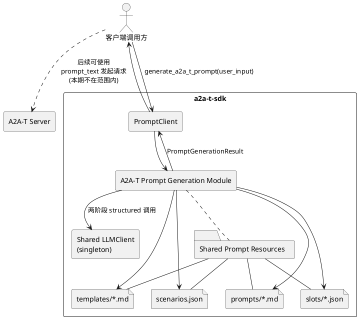
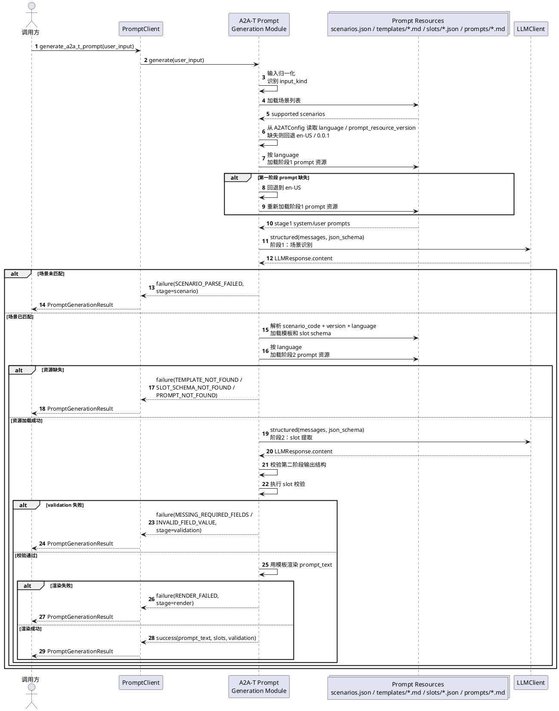

# A2A-T Prompt 生成设计文档

## 0. 状态说明

本文档保留 client 侧 A2A-T Prompt 生成能力的对外契约、两阶段语义、结果模型和校验规则。

自共享重构方案确定后，以下内容以
[2026-04-12-a2a-t-prompt-shared-refactor-design.md](C:/Users/w00609601/project/a2a-t-sdk/docs/superpowers/specs/2026-04-12-a2a-t-prompt-shared-refactor-design.md)
为准：

- 共享代码架构
- 资源目录结构与资源定位规则
- `src/a2a_t/prompt/` 与 `src/a2a_t/server/prompt_compliance/` 的重构方式
- server 对 front matter、slot 提取与 slot 校验的对接方式

本文件中被共享重构文档替代的重点章节为：

- 第 4 章中的代码落点描述
- 第 10 章资源模型
- 第 12 章主要类关系
- 第 16 章 LLM 集成落点
- 第 17 章实现职责边界中的共享层拆分方式

## 1. 背景

本文档定义客户端 SDK 的 A2A-T Prompt 生成功能。

目标问题如下：

1. 调用方输入一段自然语言，或者一个 JSON 对象。
2. SDK 从输入中识别业务场景。
3. SDK 按场景提取所需业务信息。
4. SDK 将提取结果确定性地填充到预制的 A2A-T Prompt 模板中。
5. SDK 返回：
   - 成功时的 `prompt_text`
   - 或失败时的结构化错误结果

该能力的目标是帮助客户端生成符合场景模板要求的 A2A-T 自然语言任务请求，同时保证准确率、可预测性，以及与当前 SDK 架构的一致性。

## 2. 范围

### 2.1 本次范围

- 在客户端 SDK 中新增一个 A2A-T Prompt 生成方法
- 支持两类输入：
  - 自然语言字符串
  - JSON 对象
- 使用 LLM 完成：
  - 场景识别
  - slot 提取
- 使用 SDK 完成：
  - 输入归一化
  - 资源加载
  - LLM 输出结构校验
  - 必填 slot 校验
  - 模板渲染
  - 最终结果对象组装
- 将场景、slot schema、模板文件、LLM 指导 prompt 文件作为 SDK 资源文件管理
- 返回结构化结果对象
- 支持中英文模板选择，并在外部提供的当前语言值缺失或不支持时回退到 `en-US`

### 2.2 不在本次范围

- 生成完成后自动向服务端发请求
- 服务端处理逻辑改造
- 通用工作流引擎
- 模板在线配置、编辑、发布能力
- 本期运行时自定义场景、自定义模板能力
- slot 的高级校验能力：
  - 类型校验
  - 枚举校验
  - 正则校验
  - 字段依赖校验
  - 日期语义校验

## 3. 设计目标

1. 准确优先：语义理解交给 LLM，但最终 `prompt_text` 必须由 SDK 确定性生成。
2. 效率优先：主流程只采用必要的 LLM 调用次数，本期固定为两次。
3. 架构一致：复用现有 `PromptClient` 和现有 LLM 调用模块。
4. 输出稳定：对外暴露稳定、可测试、可排障的结果对象。
5. 资源驱动：场景、模板、slot 定义不写死在 Python 长字符串中。
6. 适度扩展：为后续自定义场景、自定义模板保留扩展空间，但本期不实现。

## 4. 与当前架构的契合方式

新能力位于客户端侧，需遵循当前 SDK 边界：

- 对外入口仍为现有 `PromptClient`
- LLM 调用复用现有 SDK LLM 模块，并通过共享 `LLMClient` 发起
- 场景定义、模板、slot schema、LLM 指导 prompt 以共享 `a2a_t.prompt.resources` 资源体系管理
- 不新增独立的 prompt generation client
- 不新增 feature 专属的 LLM 调用栈
- client 最终输出需要与 server prompt compliance 的 front matter 契约保持一致

### 4.1 上下文视图

下面的上下文视图描述本模块在整体系统中的位置。



## 5. 总体流程

本功能采用固定两阶段 LLM 流程，加上 SDK 侧确定性校验与渲染。

### 5.1 端到端流程

1. 接收 `user_input: str | dict[str, object]`
2. 将输入归一化为：
   - `input_kind = "natural_language"` 或 `input_kind = "json"`
   - LLM 可直接使用的标准化输入
3. 从 `A2ATConfig` 顶层读取：
   - 当前语言值
   - `prompt_resource_version`
   若缺失则分别回退到 `en-US` 与 `0.0.1`
4. 按当前语言加载第一阶段 prompt 资源；若缺失则回退到 `en-US`
5. 若第一阶段 prompt 资源缺失，则直接失败
6. 调用第一阶段 LLM，识别 `scenario_code`
7. 校验第一阶段输出结构
8. 校验 `scenario_code` 是否存在于 SDK 内置场景表中
9. 按 `scenario_code + version + language` 解析模板和 slot schema，其中：
   - `version = prompt_resource_version`
   - `language` 为最终使用语言
10. 按最终使用语言加载第二阶段 prompt 资源；若缺失则回退到 `en-US`
11. 若回退后仍无法解析到模板、slot schema 或第二阶段 prompt 资源，则直接失败，不进入第二阶段
12. 调用第二阶段 LLM，提取该场景下的 slot
13. 校验第二阶段输出结构
14. 按 slot schema 执行 slot 校验
15. 若校验失败，则返回失败结果，且 `prompt_text = null`
16. 若校验成功，则由 SDK 按 Markdown 模板渲染最终 markdown prompt，并生成 front matter
17. 返回 `PromptGenerationResult`

### 5.2 时序图

下面的时序图描述整个生成流程。



### 5.3 为什么必须是两次 LLM 调用

不能压缩成一次调用的原因是：不同场景对应不同业务模板，而 SDK 无法在一次请求中把所有场景模板都高效地传给模型。必须先做场景识别，再根据场景选择具体模板和 slot schema，最后再做信息提取。

## 6. 对外 API

### 6.1 方法定义

该能力新增到 `PromptClient`，提供一个同步方法：

```python
def generate_a2a_t_prompt(
    self,
    user_input: str | dict[str, object],
) -> PromptGenerationResult: ...
```

### 6.2 输入契约

支持的输入类型仅有：

- `str`
- `dict[str, object]`

归一化规则：

- 输入为 `dict` 时，直接视为 JSON 输入
- 输入为 `str` 且可解析成 JSON object 时，视为 JSON 输入
- 输入为 `str` 且可解析成非 object JSON 值时，仍视为自然语言输入
- 其他字符串均视为自然语言输入

以下情况视为非法输入，直接抛异常，不走正常失败结果：

- 空字符串
- 全空白字符串
- 空 dict
- 不支持的输入类型

## 7. 返回对象

### 7.1 顶层返回对象

```python
@dataclass(slots=True)
class PromptGenerationResult:
    success: bool
    prompt_text: str | None
    scenario: ScenarioResolution | None
    language: str
    input_kind: str
    slots: dict[str, str | None]
    validation: ValidationResult
    failure: PromptGenerationFailure | None

    def to_dict(self) -> dict[str, object]: ...
```

约束：

- `success = true` 时，`failure` 必须为 `null`
- `success = false` 时，`failure` 必须存在
- `validation` 始终存在
- 结果对象只要求提供 `to_dict()`，本期不要求提供 `to_json()`
- `language` 表示从 `A2ATConfig` 顶层读取并回退后的最终使用语言，不由 LLM 生成
- 任意失败场景下，`prompt_text` 必须为 `null`
- 若失败发生在第一阶段之前或第一阶段内部，则：
  - `scenario = null`
  - `language = 最终使用语言`
  - `slots = {}`
- 若失败发生在第一阶段成功之后、第二阶段结构化结果产出之前，则：
  - `scenario = {"code": scenario_code}`
  - `language = 最终使用语言`
  - `slots = {}`
- 若第二阶段输出结构合法但校验失败，则：
  - `scenario = {"code": scenario_code}`
  - `language = 最终使用语言`
  - `slots` 返回第二阶段实际产出
- 对于尚未进入 slot 校验的失败场景，`validation` 固定为：
  - `passed = false`
  - `missing_required_fields = []`
  - `slot_errors = []`

### 7.2 子对象

```python
@dataclass(slots=True)
class ScenarioResolution:
    code: str
```

```python
@dataclass(slots=True)
class ValidationResult:
    passed: bool
    missing_required_fields: list[str]
    slot_errors: list[SlotError]
```

```python
@dataclass(slots=True)
class SlotError:
    slot_name: str
    code: str
    message: str
```

```python
@dataclass(slots=True)
class PromptGenerationFailure:
    code: str
    message: str
    stage: str | None
```

## 8. 第一阶段：场景识别

### 8.1 职责

第一阶段只负责：

- 将输入匹配到一个受支持场景

第一阶段不负责提取业务 slot。

### 8.2 输入

第一阶段接收：

- 归一化后的用户输入
- SDK 资源中的受支持场景列表
- 从 `A2ATConfig` 顶层读取并回退后的当前语言
- 对应语言的第一阶段 `system` prompt
- 对应语言的第一阶段 `user` prompt

每个场景条目至少包含：

- `scenario_code`
- `scenario_name`
- `description`
- `example`

本期不额外设计显式 alias / synonym 字段，场景语义匹配统一由第一阶段 LLM 基于上述场景信息完成。

### 8.3 输出结构

```json
{
  "matched": true,
  "scenario_code": "energy_saving",
  "error_message": null
}
```

失败示例：

```json
{
  "matched": false,
  "scenario_code": null,
  "error_message": "输入内容不匹配任何受支持场景。"
}
```

### 8.4 第一阶段后的 SDK 行为

SDK 必须校验：

- 输出结构是否合法
- `scenario_code` 是否存在于内置场景表
- `scenario_code + version + language` 是否能解析出模板和 slot schema，其中：
  - `version` 为 `prompt_resource_version`
  - `language` 为当前语言值回退后的最终使用语言

语言处理规则：

- SDK 从 `A2ATConfig` 顶层读取当前语言值
- SDK 从 `A2ATConfig` 顶层读取 `prompt_resource_version`
- 若当前语言值缺失或不受支持，则回退到 `en-US`
- 若 `prompt_resource_version` 缺失，则回退到 `0.0.1`
- 第一阶段目标语言 prompt 资源缺失时，继续回退到 `en-US`
- 若回退后的 `en-US` 资源仍不存在，则在第一阶段后直接失败
- 最终结果中的 `language` 为最终使用语言

### 8.5 第一阶段 `json_schema`

第一阶段 `json_schema` 固定写在代码中，不单独使用资源文件管理。

示例：

```json
{
  "type": "object",
  "additionalProperties": false,
  "required": ["matched", "scenario_code", "error_message"],
  "properties": {
    "matched": {
      "type": "boolean"
    },
    "scenario_code": {
      "type": ["string", "null"]
    },
    "error_message": {
      "type": ["string", "null"]
    }
  }
}
```

补充语义约束：

- 当 `matched = true` 时：
  - `scenario_code` 必须是非空字符串
  - `error_message` 必须为 `null`
- 当 `matched = false` 时：
  - `scenario_code` 必须为 `null`
  - `error_message` 必须是非空字符串
- 上述语义约束由 SDK 在读取第一阶段结构化结果后继续校验，不仅依赖 `json_schema`

## 9. 第二阶段：slot 提取

### 9.1 职责

第二阶段负责在一个已确定场景、已确定语言的前提下提取业务 slot。

第二阶段不直接生成最终 `prompt_text`。

### 9.2 输入

第二阶段接收：

- 原始归一化输入
- 已解析的 `scenario_code`
- `prompt_resource_version`
- 最终使用语言
- 最终渲染模板正文
- 对应场景和语言的 slot schema
- 对应语言的第二阶段 `system` prompt
- 对应语言的第二阶段 `user` prompt
- 根据当前 slot schema 动态生成的 `json_schema`

### 9.3 输出结构

```json
{
  "slots": {
    "site": "Shenzhen Nanshan Zone A equipment room",
    "time_range": "2026-04-01 to 2026-04-07",
    "analysis_target": "power system, cooling system",
    "expected_output": "optimization suggestions"
  },
  "slot_errors": []
}
```

### 9.4 一致性原则

最终模板填充必须由 SDK 完成。即使 LLM 已成功提取 slot，也不允许直接让 LLM 生成最终 `prompt_text`。这样可以保证最终输出与 `slots` 一致，避免出现“slot 正确但最终文本不一致”的问题。

### 9.5 第二阶段约束

- 第二阶段输出固定包含：
  - `slots`
  - `slot_errors`
- `slots` 中所有字段都必须出现
- `slots` 中所有字段类型统一为 `string | null`
- 第二阶段返回的 slot 值必须已经是最终可渲染字符串
- 若必填字段无法提取，则必须：
  - 将该字段置为 `null`
  - 在 `slot_errors` 中返回 `missing_input`
- 若非必填字段无法提取，则必须：
  - 将该字段置为 `null`
  - 不返回 `slot_errors`
- 若字段值不满足该字段的 `value_constraint`，则必须：
  - 将该字段置为 `null`
  - 在 `slot_errors` 中返回 `invalid_value`
- `slot_errors` 只包含出错的 slot
- `slot_errors.code` 本期固定为：
  - `missing_input`
  - `invalid_value`

### 9.6 第二阶段动态 `json_schema` 规则

第二阶段必须基于当前场景的 slot schema 动态生成 `json_schema`，并传给 `LLMClient.structured(...)`。

第二阶段 `json_schema` 不新增独立资源文件，而是由 SDK 根据当前场景的 `slot_schema` 动态生成。

生成原则如下：

- `slot_schema` 是业务定义来源
- 第二阶段 `json_schema` 是 SDK 基于 `slot_schema` 生成的 LLM 输出约束
- 二者不是两份独立配置，不允许分别维护
- 第二阶段 `json_schema` 由两部分组成：
  - 固定外壳：写在代码中
  - `slots` 动态部分：由 `slot_schema` 生成

动态 `json_schema` 必须满足以下约束：

- 顶层 `type = "object"`
- 顶层 `required = ["slots", "slot_errors"]`
- 顶层 `additionalProperties = false`
- `slots.type = "object"`
- `slots.required` 必须包含当前场景定义的全部 slot 名
- `slots.additionalProperties = false`
- 每个 slot 的 schema 类型固定为 `["string", "null"]`
- `slot_errors.type = "array"`
- `slot_errors.items.type = "object"`
- `slot_errors.items.required = ["slot_name", "code", "message"]`
- `slot_errors.items.additionalProperties = false`
- `slot_errors.slot_name` 必须限制在当前场景的 slot 名集合内
- `slot_errors.code` 必须限制为：
  - `missing_input`
  - `invalid_value`

生成步骤如下：

1. 读取当前场景的 `slot_schema.slots`
2. 为每个 slot 生成 `slots.properties[slot.name]`
3. 每个 slot 的类型固定为 `["string", "null"]`
4. `slots.required` 必须包含当前场景定义的全部 slot 名，包括非必填 slot
5. `slots.additionalProperties = false`
6. `slot_errors.items.properties.slot_name.enum` 必须等于当前场景全部 slot 名集合
7. 固定拼接 `slot_errors` 的公共结构：
   - `slot_name`
   - `code`
   - `message`

固定外壳示例：

```json
{
  "type": "object",
  "additionalProperties": false,
  "required": ["slots", "slot_errors"],
  "properties": {
    "slots": {},
    "slot_errors": {
      "type": "array",
      "items": {
        "type": "object",
        "additionalProperties": false,
        "required": ["slot_name", "code", "message"],
        "properties": {
          "slot_name": {
            "type": "string"
          },
          "code": {
            "type": "string",
            "enum": ["missing_input", "invalid_value"]
          },
          "message": {
            "type": "string"
          }
        }
      }
    }
  }
}
```

示例：

```json
{
  "type": "object",
  "additionalProperties": false,
  "required": ["slots", "slot_errors"],
  "properties": {
    "slots": {
      "type": "object",
      "additionalProperties": false,
      "required": [
        "site",
        "time_range",
        "analysis_target",
        "expected_output",
        "additional_notes"
      ],
      "properties": {
        "site": {
          "type": ["string", "null"]
        },
        "time_range": {
          "type": ["string", "null"]
        },
        "analysis_target": {
          "type": ["string", "null"]
        },
        "expected_output": {
          "type": ["string", "null"]
        },
        "additional_notes": {
          "type": ["string", "null"]
        }
      }
    },
    "slot_errors": {
      "type": "array",
      "items": {
        "type": "object",
        "additionalProperties": false,
        "required": ["slot_name", "code", "message"],
        "properties": {
          "slot_name": {
            "type": "string",
            "enum": [
              "site",
              "time_range",
              "analysis_target",
              "expected_output",
              "additional_notes"
            ]
          },
          "code": {
            "type": "string",
            "enum": ["missing_input", "invalid_value"]
          },
          "message": {
            "type": "string"
          }
        }
      }
    }
  }
}
```

## 10. 资源模型

本章已被共享重构文档替代。

当前实现应以
[2026-04-12-a2a-t-prompt-shared-refactor-design.md](C:/Users/w00609601/project/a2a-t-sdk/docs/superpowers/specs/2026-04-12-a2a-t-prompt-shared-refactor-design.md)
中的以下内容为准：

- `package_data/prompt_resources/` 统一资源根目录
- `scenario_code + version + language` 的资源定位规则
- `scenario_recognition` / `slot_extraction` prompt 资源路径
- 统一 `slot.json` 结构
- `PromptLoader` 与共享 `resources` 子包的职责边界

本文件后续仅保留 client 结果契约、校验规则和示例，不再重复维护资源目录细节。

## 11. 校验与渲染

### 11.1 校验范围

本期校验由两部分组成：

- SDK 负责必填 slot 完整性校验
- 第二阶段 LLM 负责字段值是否满足 `value_constraint` 的判断

本期不做：

- 类型校验
- 枚举校验
- 正则校验
- 语义校验
- 跨字段依赖校验

字段取值是否合法，由第二阶段 LLM 按 `value_constraint` 判断，不由 SDK 自行判断。

### 11.2 判定规则

slot 视为“已填写”的条件：

- 非空字符串，且去除首尾空白后仍非空
- 其他类型值不在本期范围内

slot 视为“缺失”的条件：

- 值为 `null`
- 空字符串或全空白字符串

### 11.3 校验结果

- 当且仅当同时满足以下条件时，`validation.passed = true`：
  - 所有必填 slot 都已填写
  - 不存在任何 `invalid_value`
  - 不存在任何必填字段的 `missing_input`
- 其他情况均为 `validation.passed = false`
- 缺失字段名通过 `validation.missing_required_fields` 返回
- 第二阶段 LLM 返回的字段级错误通过 `validation.slot_errors` 返回

### 11.4 渲染规则

只有校验通过后才允许渲染模板。

值转换规则：

- 字符串原样渲染
- 非必填字段若值为 `null`，渲染时使用空字符串 `""`
- 必填字段若值为 `null`，应在校验阶段拦截
- 其他值类型不在本期范围内

若模板中引用了不存在的 slot，则返回 `RENDER_FAILED`。

## 12. 主要类关系

本章已被共享重构文档替代。

当前代码关系、类图和文件落点，应以
[2026-04-12-a2a-t-prompt-shared-refactor-design.md](C:/Users/w00609601/project/a2a-t-sdk/docs/superpowers/specs/2026-04-12-a2a-t-prompt-shared-refactor-design.md)
中的共享架构为准：

- 共享层在 `src/a2a_t/prompt/`
- client 编排层在 `src/a2a_t/client/prompt/`
- server 编排层在 `src/a2a_t/server/prompt_compliance/`

因此，本文件中原先的 `ScenarioRegistry`、`stage1_recognizer.py`、`stage2_extractor.py`、client 私有 `validator.py` 等落点不再作为当前实现基线。

## 13. 失败模型

### 13.1 错误码

错误码统一在常量类中定义。

错误码如下：

- `SCENARIO_PARSE_FAILED`
- `TEMPLATE_NOT_FOUND`
- `SLOT_SCHEMA_NOT_FOUND`
- `PROMPT_NOT_FOUND`
- `INVALID_LLM_OUTPUT`
- `MISSING_REQUIRED_FIELDS`
- `INVALID_FIELD_VALUE`
- `LLM_EXECUTION_FAILED`
- `RENDER_FAILED`

### 13.2 失败阶段

失败阶段采用粗粒度固定集合：

- `scenario`
- `generation`
- `validation`
- `render`

`failure.code` 与 `failure.stage` 不要求一一对应，`stage` 只表示真实出错阶段。

### 13.3 失败处理规则

- 非法输入：抛异常
- 第一阶段无法匹配场景：返回正常失败结果
- 第一阶段 `matched = true` 但 `scenario_code` 不在内置场景表中：返回 `INVALID_LLM_OUTPUT`
- LLM 输出结构非法：返回正常失败结果
- validation 失败：返回正常失败结果
- 资源解析失败：返回正常失败结果
- 第一阶段 prompt 资源缺失：返回 `PROMPT_NOT_FOUND`，且 `stage = scenario`
- 第二阶段 prompt 资源缺失：返回 `PROMPT_NOT_FOUND`，且 `stage = generation`
- 渲染失败：返回正常失败结果
- `failure.message` 只提供聚合性失败描述，不重复逐 slot 诊断细节；字段级原因统一通过 `validation.slot_errors` 返回

## 14. 重试策略

每个 LLM 阶段最多重试一次。

可重试情况：

- 超时
- 网络失败
- Provider 临时性执行失败

不可重试情况：

- `matched = false`
- `scenario_code` 非法
- 资源不存在
- `INVALID_LLM_OUTPUT`
- `MISSING_REQUIRED_FIELDS`
- `INVALID_FIELD_VALUE`

若重试后仍失败，则通过正常结果返回 `LLM_EXECUTION_FAILED`。

## 15. 可观测性

### 15.1 对外暴露原则

最终 `PromptGenerationResult` 不暴露中间执行细节。

### 15.2 默认日志

默认日志记录：

- 高层事件
- 最终结果状态
- 归一化后的输入类型
- 第一阶段识别出的 `scenario_code`
- 第二阶段提取出的 `slots`
- 第二阶段返回的 `slot_errors`
- 缺失必填字段
- `failure.code`
- `failure.stage`

### 15.3 Debug 日志

打开 debug 开关后，额外记录：

- 原始输入
- 第一阶段原始 LLM 输出
- 第二阶段原始 LLM 输出

## 16. LLM 集成策略

本章保留“调用 `LLMClient.structured(...)`”这一 client 侧语义约束，但共享实现落点以共享重构文档为准。

- 复用 SDK 现有 LLM 调用模块
- 本模块不直接创建或调用 `LLMAdapterFactory` / `LLMAdapter`
- 本模块统一依赖共享单例 `LLMClient`
- `generate_a2a_t_prompt` 不暴露每次调用单独选模型的参数
- 两阶段统一调用 `LLMClient.structured(...)`
- `complete(...)` 与 `chat(...)` 不作为本功能主路径
- 两阶段所需指导 prompt 均从 `prompts/` 资源目录加载，不写死在代码常量中
- 当前语言值与 `prompt_resource_version` 从 `A2ATConfig` 顶层获取，不通过 LLM 识别

### 16.1 LLM 调用契约

标准调用形式如下：

```python
structured(
    *,
    messages: list[dict[str, str]],
    json_schema: dict[str, object],
    **kwargs: object,
) -> LLMResponse
```

约束如下：

- prompt 输入统一组织为 `messages`
- 不采用单一 `prompt: str` 作为主路径
- `messages` 至少包含：
  - `system`：规则、输出约束、schema 约束
  - `user`：原始输入和业务上下文
- 第一阶段 `system` / `user` 来自当前语言对应的 prompt 资源文件，由 SDK 加载并组装
- 第二阶段 `system` / `user` 来自当前语言对应的 prompt 资源文件，由 SDK 加载并组装
- 若目标语言 prompt 资源缺失，则回退到 `en-US`
- 本模块读取 `LLMClient.structured(...)` 返回的结构化结果
- 不依赖 provider 特定扩展字段读取业务结果
- 第一阶段 `json_schema` 固定
- 第一阶段 `json_schema` 作为代码常量维护，不单独配置
- 第二阶段 `json_schema` 由当前场景的 slot schema 动态生成
- 第二阶段动态 `json_schema` 必须满足：
  - 顶层 `required` 包含 `slots` 和 `slot_errors`
  - `slots.required` 包含全部 slot 名
  - `slots.additionalProperties = false`
  - 每个 slot 类型为 `string | null`
  - `slot_errors` 的对象结构固定为 `slot_name + code + message`
  - `slot_errors.code` 枚举为 `missing_input | invalid_value`

## 17. 实现职责边界

虽然对外只暴露一个方法，但内部实现必须保持职责清晰。

补充说明：

- 共享资源加载、共享分析能力、共享校验能力的具体代码拆分，已由共享重构文档接管
- 本章只保留 client 编排视角下的职责边界，不再定义共享层的文件结构

内部实现必须包含以下职责边界：

1. 输入归一化
   - 校验 public input
   - 识别 `input_kind`
   - 保留 JSON object 原始结构

2. 场景资源解析
   - 加载 `scenarios.json`
   - 解析模板与 slot schema 路径
   - 解析 prompt 资源路径
   - 基于 `A2ATConfig` 顶层语言值完成语言回退后的资源定位
   - 基于 `A2ATConfig.prompt_resource_version` 确定资源版本

3. 第一阶段执行
   - 加载并组装第一阶段 prompt
   - 调用 LLM
   - 校验第一阶段输出结构

4. 第二阶段执行
   - 加载并组装第二阶段 prompt
   - 调用 LLM
   - 校验第二阶段输出结构

5. slot 校验
   - 计算 `missing_required_fields`
   - 汇总 `slot_errors`
   - 生成 `ValidationResult`

6. 模板渲染与结果组装
   - 确定性生成 `prompt_text`
   - 组装 `PromptGenerationResult`
   - 组装 `PromptGenerationFailure`

最终代码可以不按六个公开类实现，但职责边界必须与这里保持一致。

## 18. 返回结果示例

### 18.1 成功示例

```json
{
  "success": true,
  "prompt_text": "---\nscenario_code: energy_saving\nlanguage: en-US\nversion: 0.0.1\ndescription: Used for generating A2A-T task requests for energy-saving analysis.\n---\n\nPlease create an energy-saving analysis task for Shenzhen Nanshan Zone A equipment room, covering 2026-04-01 to 2026-04-07, focusing on the power and cooling systems, and output optimization suggestions.",
  "scenario": {
    "code": "energy_saving"
  },
  "language": "en-US",
  "input_kind": "natural_language",
  "slots": {
    "site": "Shenzhen Nanshan Zone A equipment room",
    "time_range": "2026-04-01 to 2026-04-07",
    "analysis_target": "power system, cooling system",
    "expected_output": "optimization suggestions"
  },
  "validation": {
    "passed": true,
    "missing_required_fields": [],
    "slot_errors": []
  },
  "failure": null
}
```

### 18.2 校验失败示例

```json
{
  "success": false,
  "prompt_text": null,
  "scenario": {
    "code": "energy_saving"
  },
  "language": "zh-CN",
  "input_kind": "natural_language",
  "slots": {
    "site": "深圳南山A区机房",
    "time_range": null,
    "analysis_target": "供配电系统、制冷系统",
    "expected_output": null
  },
  "validation": {
    "passed": false,
    "missing_required_fields": [
      "time_range",
      "expected_output"
    ],
    "slot_errors": [
      {
        "slot_name": "time_range",
        "code": "missing_input",
        "message": "未从输入中提取到时间范围。"
      },
      {
        "slot_name": "expected_output",
        "code": "invalid_value",
        "message": "输入中给出的输出要求不满足该字段取值约束。"
      }
    ]
  },
  "failure": {
    "code": "INVALID_FIELD_VALUE",
    "message": "无法生成符合模板要求的 A2A-T 请求，因为字段校验未通过。",
    "stage": "validation"
  }
}
```

### 18.3 非必填字段缺失但可成功示例

```json
{
  "success": true,
  "prompt_text": "---\nscenario_code: energy_saving\nlanguage: en-US\nversion: 0.0.1\ndescription: Used for generating A2A-T task requests for energy-saving analysis.\n---\n\nPlease create an energy-saving analysis task for Shenzhen Nanshan Zone A equipment room, covering 2026-04-01 to 2026-04-07, focusing on power system, and output optimization suggestions. Additional notes: ",
  "scenario": {
    "code": "energy_saving"
  },
  "language": "en-US",
  "input_kind": "natural_language",
  "slots": {
    "site": "Shenzhen Nanshan Zone A equipment room",
    "time_range": "2026-04-01 to 2026-04-07",
    "analysis_target": "power system",
    "expected_output": "optimization suggestions",
    "additional_notes": null
  },
  "validation": {
    "passed": true,
    "missing_required_fields": [],
    "slot_errors": []
  },
  "failure": null
}
```

## 19. 测试策略

### 19.1 输入归一化

必须覆盖：

- 普通自然语言字符串
- 可解析为 JSON object 的字符串
- 可解析为非 object JSON 值的字符串
- 直接传入 `dict`
- 空字符串
- 全空白字符串
- 空 dict
- 非法输入类型

### 19.2 两阶段编排

必须覆盖：

- 第一阶段成功 -> 第二阶段成功 -> 最终成功
- 第一阶段 `matched = false`
- 第一阶段 LLM 执行失败
- 第一阶段输出结构非法
- `scenario_code` 非法
- `A2ATConfig` 顶层提供受支持语言
- 当前语言值缺失 -> 回退 `en-US`
- 当前语言值不支持 -> 回退 `en-US`
- 第一阶段成功后模板缺失
- 第一阶段成功后 slot schema 缺失
- 第一阶段 prompt 资源缺失
- 回退后的模板仍缺失
- 回退后的 slot schema 仍缺失
- 回退后的第二阶段 prompt 资源仍缺失
- 第二阶段 LLM 执行失败
- 第二阶段输出结构非法
- 第二阶段 prompt 资源缺失
- 第二阶段结构合法但缺失必填 slot
- 第二阶段结构合法并返回 `slot_errors`
- 第二阶段非必填字段缺失且无 `slot_errors`
- 第二阶段非必填字段出现 `invalid_value`

### 19.3 校验逻辑

必须覆盖：

- 所有必填字段均存在
- 缺失一个必填字段
- 缺失多个必填字段
- 空字符串视为缺失
- 全空白字符串视为缺失
- `slot_errors` 被原样保留到 `validation`
- 非必填字段缺失不影响成功
- 非必填字段 `invalid_value` 导致失败
- 存在 `invalid_value` 时失败码为 `INVALID_FIELD_VALUE`
- 仅存在必填缺失时失败码为 `MISSING_REQUIRED_FIELDS`

### 19.4 渲染逻辑

必须覆盖：

- 成功场景下的确定性模板渲染
- 非必填字段为 `null` 时渲染为空字符串
- 渲染失败时返回 `RENDER_FAILED`

### 19.5 失败契约

必须断言：

- `failure` 对象结构
- 预期错误码
- 预期失败阶段
- 校验失败时 `prompt_text = null`
- `validation` 始终存在
- `validation.slot_errors` 结构

## 20. 后续扩展点

本期不实现。扩展边界如下：

- 调用方传入自定义场景
- 调用方为自定义场景传入自定义模板
- 调用方覆盖内置场景的默认模板
- 更丰富的 slot 校验规则
- 可扩展异步 API
