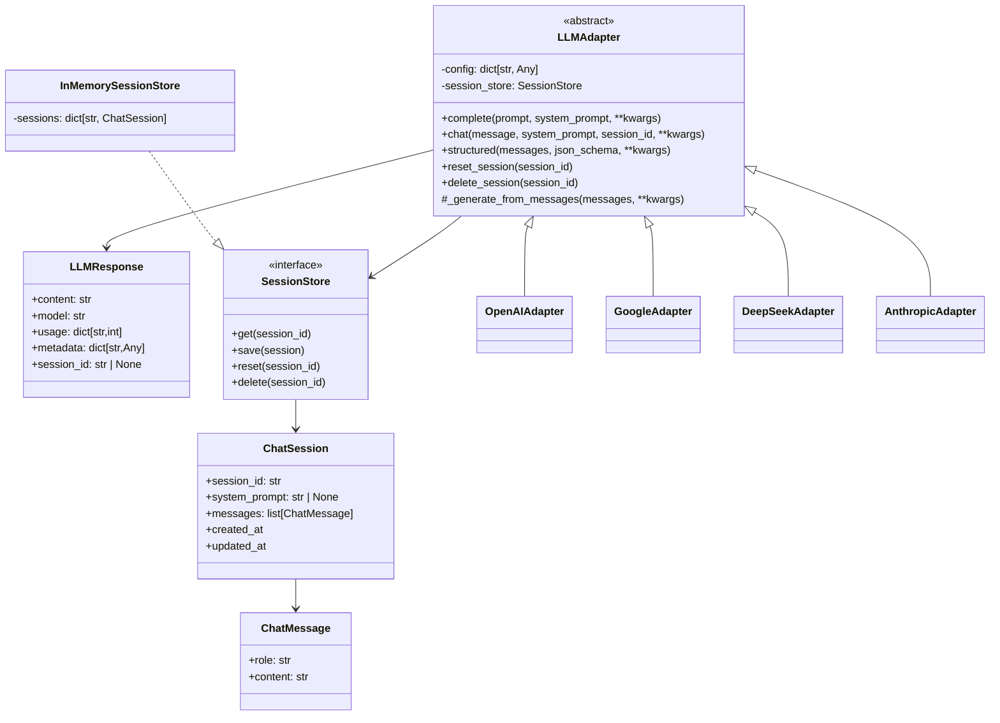
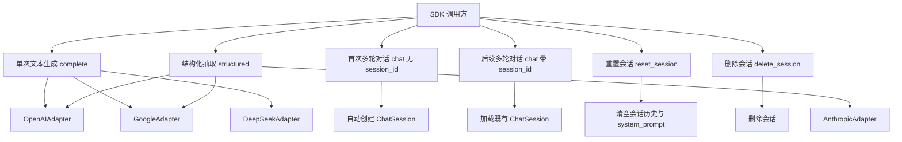
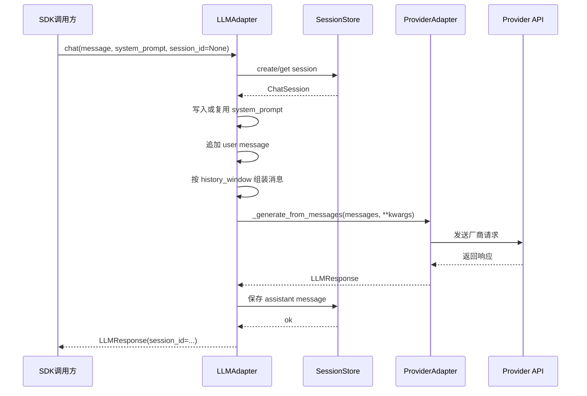
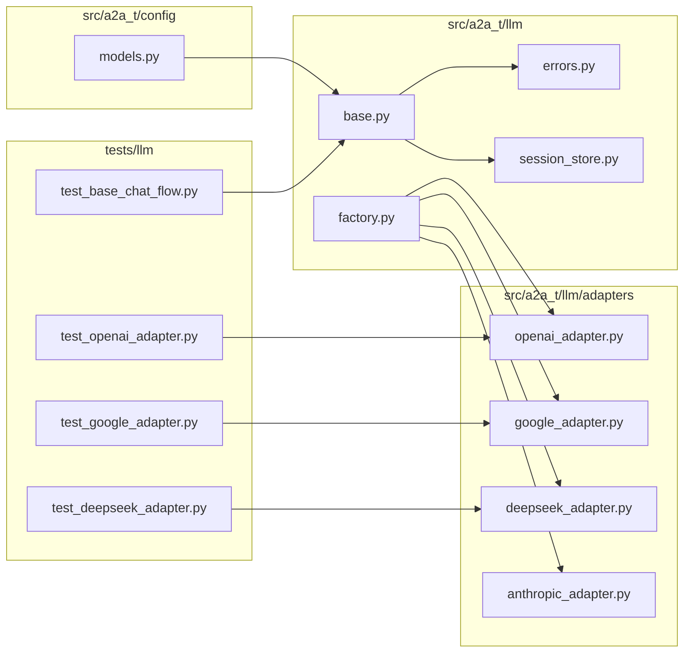
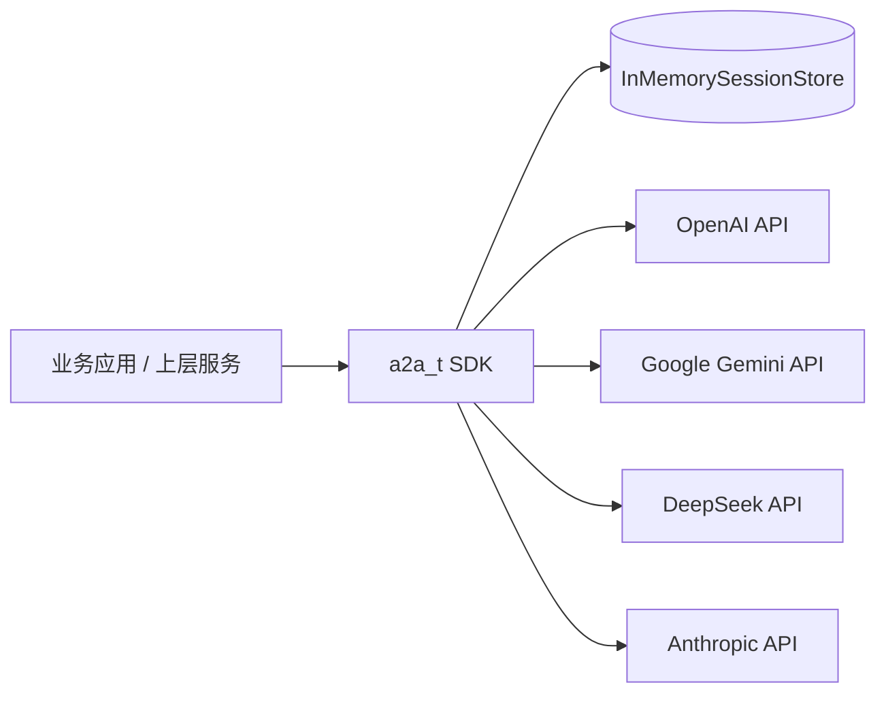

# `a2a_t.llm` 通用 LLM 网关一期设计

## 1. 背景与目标

当前 `a2a_t.llm` 模块已经具备 `LLMAdapter` 抽象以及 OpenAI、Google、Anthropic 三类 adapter 的基础结构，但目前真正落地的能力主要是 `structured()`，这是由现有 prompt compliance 场景先行驱动的结果，而不是长期目标本身。

长期目标是构建一个统一的 LLM SDK，能够同时承载：

- 文本单次调用能力
- 多轮对话能力
- 结构化抽取能力
- 多厂商模型适配能力

本设计文档聚焦第一阶段，只解决以下问题：

- 在保持现有 `LLMAdapter` 主结构基本不变的前提下，为 SDK 增加 `complete()` 和 `chat()` 两项通用文本能力
- 以 `openai`、`google`、`deepseek` 作为一期重点适配对象
- 保留 `anthropic` 入口和现有 `structured()` 能力，但一期不实现其 `complete()` 和 `chat()`
- 让 `chat()` 对上层调用者表现为“有状态会话”，无需调用方自行维护历史消息拼接

## 2. 一期范围

### 2.1 本期实现

- `LLMAdapter.complete()`
- `LLMAdapter.chat()`
- `SessionStore` 抽象
- 默认的 `InMemorySessionStore`
- `OpenAIAdapter.complete()/chat()`
- `GoogleAdapter.complete()/chat()`
- `DeepSeekAdapter.complete()/chat()`
- 会话管理接口：`reset_session()`、`delete_session()`

### 2.2 本期保留但不重做

- `LLMAdapter.structured()`
- OpenAI / Google / Anthropic 的现有结构化抽取路径

### 2.3 本期不做

- Anthropic 的 `complete()/chat()`
- 流式输出
- 工具调用统一抽象
- 多模态输入
- 持久化 session store
- 会话查询接口，如 `list_sessions()` / `get_history()`

## 3. 核心设计原则

### 3.1 保持现有主结构

不引入额外的 `LLMGateway` 层，仍然以 `LLMAdapter` 作为对外核心抽象，保持当前代码骨架的连续性。

### 3.2 会话对外有状态，对内统一管理

`chat()` 对调用者是有状态接口，但会话状态不由具体 provider adapter 各自维护，而是在 `LLMAdapter` 基类中通过 `SessionStore` 统一管理。

### 3.3 Provider adapter 只负责协议适配

会话生命周期、system prompt 规则、历史裁剪策略由基类统一实现；具体 adapter 只负责把统一的消息模型转换为各厂商请求，并解析响应。

### 3.4 DeepSeek 独立建 adapter，但尽量复用 OpenAI 路径

DeepSeek 与 OpenAI 在接口形态上高度接近，一期应尽量复用 OpenAI 的实现思路；但仍然保留单独的 `DeepSeekAdapter`，避免后续能力演进被强行绑定到 OpenAI。

## 4. 总体架构

### 4.1 类职责划分

#### `LLMAdapter`

作为基类，承担以下职责：

- 暴露统一的 `complete()`、`chat()`、`structured()`
- 持有 `session_store`
- 统一生成与管理 `session_id`
- 在 `chat()` 中管理会话历史
- 管理 `system_prompt` 的首次写入规则
- 统一执行 history window 裁剪
- 调用子类完成 provider-specific 请求发送与响应解析

#### `SessionStore`

作为会话存储抽象，承担以下职责：

- 根据 `session_id` 读取会话
- 保存会话
- 重置会话历史
- 删除会话

#### `OpenAIAdapter`

- 实现单次文本调用
- 实现基于完整消息历史的多轮对话调用
- 将统一消息转换为 OpenAI 所需 payload
- 解析统一响应

#### `GoogleAdapter`

- 实现单次文本调用
- 实现基于完整消息历史的多轮对话调用
- 将统一消息转换为 Gemini 所需 payload
- 不把 Google 原生 chat/history 语义暴露到上层 SDK

#### `DeepSeekAdapter`

- 独立 adapter 类型
- 一期在实现方式上尽量复用 OpenAI-compatible 请求组织方式
- 保持后续独立演进空间

#### `AnthropicAdapter`

- 保留现有入口
- 保留 `structured()`
- `complete()` 和 `chat()` 一期继续返回 `NotImplemented` 或统一运行期错误

### 4.2 4+1 视图

本节使用 4+1 视图补充说明一期通用 LLM 网关的架构。考虑到当前阶段的重点是 SDK 内部抽象与调用链路，而不是复杂部署拓扑，因此这里选取最有价值的五个视角：

- 逻辑视图：类图
- 场景视图：用例图
- 过程视图：`chat()` 时序图
- 开发视图：模块划分图
- 物理视图：一期部署视图

#### 4.2.1 逻辑视图

逻辑视图用于回答“系统由哪些核心对象组成、它们之间如何协作”。



逻辑视图中最关键的设计点有三个：

- `LLMAdapter` 是统一对外抽象，同时承载会话编排逻辑
- `SessionStore` 是状态管理扩展点，避免 provider adapter 内部各自维护会话
- `OpenAIAdapter`、`GoogleAdapter`、`DeepSeekAdapter` 只关注 provider 请求转换与响应解析

#### 4.2.2 场景视图

场景视图用于回答“系统支持哪些关键使用方式”。



一期重点覆盖的核心场景是：

- 调用方使用 `complete()` 进行单次文本生成
- 调用方使用 `chat()` 发起首次对话，SDK 自动返回 `session_id`
- 调用方在后续轮次携带 `session_id` 继续对话
- 调用方通过显式接口重置或删除会话
- 现有 `structured()` 场景继续保留

#### 4.2.3 过程视图

过程视图用于回答“运行时一次关键调用是如何流转的”。这里选取最重要的 `chat()` 调用路径。



这个过程视图体现了一期设计的一个关键取舍：会话状态由统一抽象管理，provider adapter 不直接拥有会话生命周期。

#### 4.2.4 开发视图

开发视图用于回答“代码在仓库里如何组织，模块边界是什么”。



开发视图强调的是：

- `base.py` 是统一抽象与通用流程核心
- provider 差异沉淀在 `adapters/`
- `session_store.py` 与 `errors.py` 是新增基础设施模块
- 测试按“基类行为 + provider 适配”分层组织

#### 4.2.5 物理视图

物理视图用于回答“一期运行时部署关系是什么”。由于当前阶段是 SDK 形态，一期物理视图相对简单：



一期的物理视图说明：

- session 默认保存在 SDK 进程内存中
- SDK 通过不同 adapter 调用外部 provider API
- Anthropic 一期主要仍服务于已有 `structured()` 路径
- 若后续引入 Redis/DB，会主要替换 `InMemorySessionStore` 这一节点，而不是改动整体调用结构

## 5. 对外接口设计

### 5.1 `complete()`

建议签名：

```python
def complete(
    self,
    prompt: str,
    system_prompt: str | None = None,
    **kwargs: Any,
) -> LLMResponse:
    ...
```

语义：

- 单次调用
- 不进入 session store
- 支持 `system_prompt`
- 支持通过 `kwargs` 传递模型控制参数，如 `temperature`、`max_tokens`

### 5.2 `chat()`

建议签名：

```python
def chat(
    self,
    message: str,
    system_prompt: str | None = None,
    session_id: str | None = None,
    **kwargs: Any,
) -> LLMResponse:
    ...
```

语义：

- 面向会话的多轮调用
- 首次调用时不要求传 `session_id`
- 若未提供 `session_id`，由 SDK 自动创建并在返回结果中返回
- 后续调用方带回 `session_id` 即可继续会话
- 上层调用者不需要自行拼装历史消息

### 5.3 会话管理接口

一期提供最小集合：

```python
def reset_session(self, session_id: str) -> None:
    ...

def delete_session(self, session_id: str) -> None:
    ...
```

语义：

- `reset_session()`：清空该会话的用户/助手历史，并清空已保存的 `system_prompt`
- `delete_session()`：彻底删除该会话

## 6. `system_prompt` 语义

`system_prompt` 指系统级指令或背景上下文，与用户输入一起构成最终发送给模型的请求语义，但在统一抽象中应被视为独立的系统消息，而不是简单字符串拼接。

一期明确约束如下：

- `complete()` 支持 `system_prompt`
- `chat()` 支持 `system_prompt`
- 当 `chat()` 首次创建会话时，若提供了 `system_prompt`，则写入会话
- 当同一 `session_id` 的后续轮次再次传入新的 `system_prompt` 时，若该会话已经存在 `system_prompt`，则忽略该值
- 若会话经过 `reset_session()` 被清空了 `system_prompt`，则后续首次 `chat()` 可重新写入新的 `system_prompt`
- 若需要彻底重新开始，也可直接创建新会话

## 7. 会话模型

### 7.1 内部消息模型

建议引入轻量的内部消息模型 `ChatMessage`：

- `role`: `"system" | "user" | "assistant"`
- `content`: `str`

该模型只用于内部统一语义与 provider 转换，不对外暴露复杂多模态结构。

### 7.2 会话对象

建议引入 `ChatSession`：

- `session_id: str`
- `system_prompt: str | None`
- `messages: list[ChatMessage]`
- `created_at`
- `updated_at`

约束：

- `system_prompt` 单独存储，不混在 `messages` 中持久化
- `messages` 仅存储 user / assistant 历史消息
- 每次发送给 provider 时，由基类统一决定是否把 `system_prompt` 插入到消息序列头部

## 8. `SessionStore` 设计

### 8.1 接口

一期最小接口如下：

```python
class SessionStore(Protocol):
    def get(self, session_id: str) -> ChatSession | None: ...
    def save(self, session: ChatSession) -> None: ...
    def reset(self, session_id: str) -> ChatSession | None: ...
    def delete(self, session_id: str) -> None: ...
```

### 8.2 默认实现

默认提供 `InMemorySessionStore`：

- 进程内字典存储
- 不做持久化
- 不做 TTL
- 不做分布式一致性

该设计用于一期快速落地，同时为未来 Redis/DB 存储预留替换点。

## 9. `complete()` 与 `chat()` 的统一执行模型

一期建议不要让 provider adapter 同时维护两套调用逻辑。更合理的设计是将两者统一到“基于消息列表生成文本响应”的底层路径。

### 9.1 建议的受保护方法

由基类定义一个受保护抽象方法，例如：

```python
@abstractmethod
def _generate_from_messages(
    self,
    messages: list[ChatMessage],
    **kwargs: Any,
) -> LLMResponse:
    ...
```

### 9.2 `complete()` 流程

`complete()` 在基类中执行：

1. 校验参数
2. 将 `system_prompt` 与用户 `prompt` 规范化为消息列表
3. 调用 `_generate_from_messages()`
4. 返回 `session_id=None` 的 `LLMResponse`

### 9.3 `chat()` 流程

`chat()` 在基类中执行：

1. 读取 `session_id`
2. 若未提供，则创建新会话
3. 若已提供，则从 `SessionStore` 加载会话
4. 对已存在会话，若已保存 `system_prompt`，则忽略新的 `system_prompt`
   若当前会话没有保存 `system_prompt`，则允许写入本次提供的 `system_prompt`
5. 将本轮用户消息追加到会话
6. 根据 `system_prompt + 历史消息 + 当前消息` 生成本次调用消息列表
7. 按 `history_window` 裁剪历史
8. 调用 `_generate_from_messages()`
9. 将 assistant 响应写回会话
10. 保存会话
11. 返回带 `session_id` 的 `LLMResponse`

## 10. `history_window` 语义

### 10.1 定义

`history_window` 表示保留最近 N 轮 user/assistant 往返。

一轮的定义为：

- 一条 user 消息
- 与其对应的一条 assistant 消息

例如：

- `user: 你好`
- `assistant: 你好`

以上算 1 轮，而不是 2 条独立轮次。

### 10.2 裁剪规则

一期建议按“轮次”裁剪，而不是按消息条数裁剪，避免留下半轮不完整上下文。

规则如下：

- `system_prompt` 不计入 `history_window`
- 始终保留最近 N 轮完整 user/assistant 历史
- 当前调用中的用户输入与本轮模型输出总是参与本次处理

## 11. 响应模型

现有 `LLMResponse` 在一期只做最小扩展，建议字段如下：

- `content: str`
- `model: str`
- `usage: dict[str, int]`
- `metadata: dict[str, Any]`
- `session_id: str | None = None`

约束：

- `complete()` 返回 `session_id=None`
- `chat()` 返回有效 `session_id`
- provider 原始响应、finish reason 等暂时继续放在 `metadata` 中

## 12. 异常模型

为了控制复杂度，一期仅保留三类异常：

### 12.1 `LLMError`

统一基类，所有 LLM 相关异常均继承自该类型。

### 12.2 `LLMConfigError`

用于配置与调用前校验问题，例如：

- 缺少 `transport`
- 缺少 `model`
- 非法 `history_window`
- 参数组合不合法

### 12.3 `LLMRuntimeError`

用于运行期问题，例如：

- `session_id` 不存在
- provider 调用失败
- provider 返回结构异常
- 当前 adapter 不支持该操作，例如 Anthropic 的 `complete()/chat()`

## 13. Provider 适配策略

### 13.1 OpenAI

- 接收统一消息列表
- 转换为 OpenAI 风格消息请求
- 解析文本、model、usage、metadata

### 13.2 DeepSeek

- 作为独立 adapter 类型注册
- 一期在实现上尽量复用 OpenAI-compatible 逻辑
- 保持后续针对 DeepSeek 独立能力扩展的空间

### 13.3 Google

- 接收统一消息列表
- 转换为 Gemini 所需结构
- 一期不把 Google 原生会话对象或原生 history 能力上浮到 SDK 统一语义

### 13.4 Anthropic

- 保留现有 `structured()` 适配路径
- `complete()` 与 `chat()` 不在一期范围内

## 14. 配置建议

基于当前 `LLMConfig`，一期建议新增以下字段：

- `history_window: int = 10`
- `session_store_type: str = "memory"`

可继续沿用或保留的字段：

- `adapter_type`
- `base_url`
- `api_key`
- `model`
- `max_tokens`

可通过 `kwargs` 进行单次覆盖的控制参数包括：

- `history_window`
- `temperature`
- `max_tokens`

优先级建议为：

`kwargs` 覆盖配置默认值。

## 15. 文件落点建议

建议变更范围如下：

- 修改 [`src/a2a_t/llm/base.py`](C:\Users\y00642297\MyWork\a2a-t-sdk\src\a2a_t\llm\base.py)
- 新增 `src/a2a_t/llm/session_store.py`
- 新增 `src/a2a_t/llm/errors.py`
- 修改 [`src/a2a_t/llm/adapters/openai_adapter.py`](C:\Users\y00642297\MyWork\a2a-t-sdk\src\a2a_t\llm\adapters\openai_adapter.py)
- 修改 [`src/a2a_t/llm/adapters/google_adapter.py`](C:\Users\y00642297\MyWork\a2a-t-sdk\src\a2a_t\llm\adapters\google_adapter.py)
- 新增 `src/a2a_t/llm/adapters/deepseek_adapter.py`
- 修改 [`src/a2a_t/llm/factory.py`](C:\Users\y00642297\MyWork\a2a-t-sdk\src\a2a_t\llm\factory.py)
- 修改 [`src/a2a_t/config/models.py`](C:\Users\y00642297\MyWork\a2a-t-sdk\src\a2a_t\config\models.py)

## 16. 测试策略

一期测试重点是统一语义，而不是联网验证第三方 SDK。

### 16.1 基类行为测试

- 首次 `chat()` 自动创建 `session_id`
- 后续 `chat()` 能延续会话
- 后续轮次传入新 `system_prompt` 被忽略
- `history_window` 生效
- `reset_session()` 清空历史并清空 `system_prompt`
- `reset_session()` 后首次 `chat()` 可重新写入新的 `system_prompt`
- `delete_session()` 删除会话

### 16.2 Adapter 映射测试

- OpenAI 请求 payload 是否正确
- Google 请求 payload 是否正确
- DeepSeek 是否按 OpenAI-compatible 方式生成请求

### 16.3 响应解析测试

- 文本响应是否正确映射为 `LLMResponse`
- usage / model / metadata 是否保留
- 非法 provider 响应是否抛出统一运行期异常

## 17. 非目标与后续演进

一期之后可继续扩展：

- `structured()` 的统一入口
- Anthropic 的 `complete()/chat()`
- 流式输出
- 工具调用
- 多模态消息
- 持久化 session store

但这些不应影响一期的核心目标：在当前结构基础上，先把 `complete()` 与有状态 `chat()` 做成稳定、统一、可扩展的通用能力。

## 18. 结论

一期的最佳路径不是额外引入新的网关层，而是在现有 `LLMAdapter` 结构上做增量演进：

- 由 `LLMAdapter` 基类统一承载会话编排逻辑
- 通过 `SessionStore` 实现可替换的状态管理
- 让 `openai`、`google`、`deepseek` 三个 adapter 只关注 provider 协议转换
- 保留 `structured()` 的现有成果，并为后续统一 SDK 的完整能力版图预留扩展空间

这条路径既保持了当前项目结构的连续性，也满足了第一阶段对易用性、统一性和后续扩展性的要求。
