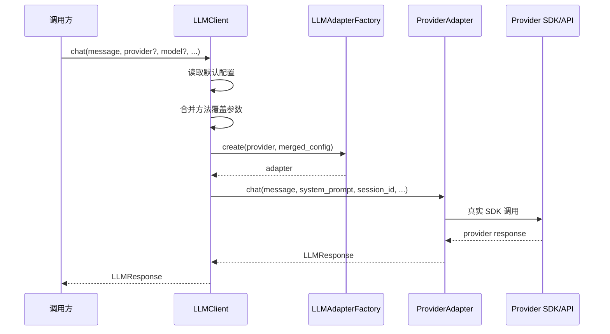

# `a2a_t.llm` LLM Client 与真实 Provider SDK 重构设计

## 1. 背景

当前 `a2a_t.llm` 已经具备以下基础：

- `LLMAdapter` 基类
- `openai`、`google`、`deepseek`、`anthropic` 等 adapter 入口
- 统一的 `complete()` / `chat()` / `structured()` 抽象
- 基于 `SessionStore` 的会话管理

但当前 `openai`、`google`、`deepseek` adapter 中的 `_transport` 机制只是历史占位，不应作为正式架构的一部分继续保留。正式形态下，adapter 应直接调用各厂商官方 SDK 或兼容 SDK，而不是要求上层调用方传入 `transport` 函数。

与此同时，当前模块对上层调用者仍然偏底层。调用方需要自行选择 provider、组装 adapter 配置，再调用 adapter 方法。下一阶段需要在此之上增加一个更易用的 `LLMClient`，将配置读取、adapter 选择与方法分发统一封装起来。

## 2. 目标

本次设计的目标是：

- 在 `src/a2a_t/llm/` 下新增 `LLMClient`
- `LLMClient` 默认从 `package_data/.env` 读取 LLM 默认配置
- `LLMClient` 自动选择并创建相应的 adapter
- `LLMClient` 对外暴露统一接口：
  - `chat()`
  - `complete()`
  - `structured()`
  - `reset_session()`
  - `delete_session()`
- 方法级参数允许覆盖 `.env` 默认配置
- 在 adapter 内部直接接入真实厂商 SDK
- 移除当前 `transport` 机制及其依赖设计

## 3. 非目标

本次不解决以下问题：

- 流式输出
- 工具调用统一抽象
- 多模态输入
- 持久化 `SessionStore`
- Anthropic 的完整 `chat()` / `complete()` 接入
- 自动负载均衡、多 provider fallback、熔断重试策略

## 4. 核心原则

### 4.1 `LLMClient` 是易用入口，不替代 adapter 抽象

`LLMClient` 的职责是降低调用门槛，而不是吞掉 provider 差异处理逻辑。厂商差异仍保留在各个 adapter 内。

### 4.2 `transport` 必须被彻底移除

任何正式调用路径都不再允许依赖调用方传入 `transport`。真实请求发送由 adapter 内部完成。

### 4.3 配置默认值来自 `.env`，方法参数可覆盖

`.env` 提供一套全局默认 provider/model 配置；具体方法调用时可以临时覆盖 provider、model、temperature、max_tokens 等参数。

### 4.4 会话状态统一保留在 adapter 基类语义中

现有 `SessionStore`、`ChatSession`、`chat()` 语义不推倒重来。`LLMClient` 只负责把共享 session store 注入 adapter，并对外暴露更易用的入口。

## 5. 总体方案

### 5.1 推荐方案

保留 `LLMAdapter` 分层，在 adapter 内实现真实 SDK 调用，在 `LLMClient` 中完成：

- `.env` 读取
- 默认配置解析
- adapter 选择
- 共享 `SessionStore`
- 接口透传与配置覆盖

这是当前代码演进成本最低、结构最稳定的路径。

### 5.2 不采用的方案

#### 方案 A：把所有 provider 调用逻辑都塞进 `LLMClient`

不采用。这样会让 `LLMClient` 变成巨型分支分发器，`LLMAdapter` 层失去意义。

#### 方案 B：新增一层 provider service

暂不采用。当前阶段目标明确，继续加抽象会让改动面变大、收益不足。

## 6. 对外接口设计

### 6.1 `LLMClient`

建议新增：

```python
class LLMClient:
    def __init__(
        self,
        env_path: Path | None = None,
        session_store: SessionStore | None = None,
    ) -> None:
        ...
```

说明：

- `env_path` 默认指向 `package_data/.env`
- `session_store` 默认使用 `InMemorySessionStore`
- `LLMClient` 持有一个共享的 `session_store`，确保不同调用轮次复用同一会话状态

### 6.2 `chat()`

```python
def chat(
    self,
    message: str,
    system_prompt: str | None = None,
    session_id: str | None = None,
    *,
    provider: str | None = None,
    model: str | None = None,
    temperature: float | None = None,
    max_tokens: int | None = None,
    history_window: int | None = None,
    **kwargs: Any,
) -> LLMResponse:
    ...
```

语义：

- 默认使用 `.env` 的 provider/model
- 显式传入参数时覆盖默认值
- 通过所选 provider 创建 adapter 并调用 `adapter.chat()`

### 6.3 `complete()`

```python
def complete(
    self,
    prompt: str,
    system_prompt: str | None = None,
    *,
    provider: str | None = None,
    model: str | None = None,
    temperature: float | None = None,
    max_tokens: int | None = None,
    **kwargs: Any,
) -> LLMResponse:
    ...
```

### 6.4 `structured()`

```python
def structured(
    self,
    *,
    messages: list[dict[str, str]],
    json_schema: dict[str, Any],
    provider: str | None = None,
    model: str | None = None,
    temperature: float | None = None,
    max_tokens: int | None = None,
    **kwargs: Any,
) -> LLMResponse:
    ...
```

### 6.5 会话管理接口

```python
def reset_session(
    self,
    session_id: str,
    *,
    provider: str | None = None,
    model: str | None = None,
) -> None:
    ...

def delete_session(
    self,
    session_id: str,
    *,
    provider: str | None = None,
    model: str | None = None,
) -> None:
    ...
```

说明：

- 这两个接口也通过 adapter 暴露，但共享同一个 session store
- `model` 对这两个接口本身不关键，但允许保持统一调用形式

## 7. 配置设计

### 7.1 配置来源

默认从 `package_data/.env` 读取。

建议新增一组统一的 LLM 配置项：

```dotenv
A2AT_LLM_PROVIDER=openai
A2AT_LLM_MODEL=gpt-4.1
A2AT_LLM_API_KEY=
A2AT_LLM_BASE_URL=
A2AT_LLM_HISTORY_WINDOW=10
A2AT_LLM_MAX_TOKENS=2000
A2AT_LLM_TEMPERATURE=0
A2AT_LLM_TIMEOUT_SECONDS=30
```

### 7.2 配置语义

- `A2AT_LLM_PROVIDER`
  - 默认 provider
  - 允许值：`openai`、`google`、`deepseek`、`anthropic`
- `A2AT_LLM_MODEL`
  - 默认模型名称
- `A2AT_LLM_API_KEY`
  - 对应 provider 的默认认证信息
- `A2AT_LLM_BASE_URL`
  - 允许自定义 base URL
  - DeepSeek 默认会使用该值或其默认公开地址
- `A2AT_LLM_HISTORY_WINDOW`
  - chat 默认历史轮数
- `A2AT_LLM_MAX_TOKENS`
  - 默认最大输出 token
- `A2AT_LLM_TEMPERATURE`
  - 默认温度
- `A2AT_LLM_TIMEOUT_SECONDS`
  - 默认超时时间

### 7.3 覆盖规则

优先级：

1. 方法显式参数
2. `.env` 默认值
3. adapter / SDK 默认行为

若 provider 或 model 在前两层都缺失，则抛 `LLMConfigError`。

## 8. 内部对象设计

### 8.1 `LLMClient` 内部默认配置对象

建议新增一个内部配置模型，例如 `LLMClientConfig`，用于承载从 `.env` 解析后的标准化配置：

- `provider`
- `model`
- `api_key`
- `base_url`
- `history_window`
- `max_tokens`
- `temperature`
- `timeout_seconds`

这个对象可以定义在 `src/a2a_t/llm/client.py` 内部，也可以单独拆到 `src/a2a_t/llm/config.py`。本期建议先放在 `client.py` 或紧邻模块中，避免过早抽象。

### 8.2 共享 `SessionStore`

`LLMClient` 持有单例 `SessionStore` 实例，并在每次创建 adapter 时注入：

```python
adapter_config["session_store"] = self._session_store
```

这样可以保证：

- 同一个 `LLMClient` 实例下，多次 `chat()` 能共享会话状态
- `reset_session()` / `delete_session()` 针对的是同一份 store

## 9. Adapter 重构设计

### 9.1 OpenAIAdapter

`OpenAIAdapter` 改为直接依赖 OpenAI 官方 Python SDK。

职责：

- 在初始化时读取 `api_key`、`base_url`、`timeout_seconds`
- 创建 OpenAI client
- 在 `_generate_from_messages()` 中调用真实 Responses/Chat 接口
- 在 `structured()` 中调用 OpenAI 的结构化输出能力

建议保留当前统一消息转换语义：

- `ChatMessage(role="system")` -> OpenAI system message
- `ChatMessage(role="user")` -> user message
- `ChatMessage(role="assistant")` -> assistant message

### 9.2 DeepSeekAdapter

`DeepSeekAdapter` 继续复用 `OpenAIAdapter` 主路径，但不再复用 `transport`。

实现方式：

- 使用 OpenAI 官方 SDK client
- 通过 DeepSeek 的兼容 `base_url`
- 使用 DeepSeek 的 `api_key`
- 维持独立 `adapter_type == "deepseek"`

### 9.3 GoogleAdapter

`GoogleAdapter` 直接接入 Google Gemini 官方 Python SDK。

职责：

- 创建 Gemini client
- 将统一 `ChatMessage` 转换为 Gemini contents
- 在 `structured()` 中映射 response schema / JSON schema 配置

Google 原生 SDK 可能具备更高层的 chat/history 语义，但本设计不把这层语义直接上浮到统一 SDK；仍使用统一消息模型驱动。

### 9.4 AnthropicAdapter

本期保留入口，但不做完整真实接入。

建议策略：

- `structured()` 若当前已有清晰实现路径，可继续保留
- `complete()` / `chat()` 明确抛 `LLMRuntimeError`
- 不再允许依赖 `transport`

如果当前 `structured()` 也依赖 `transport`，则本轮需要一并改造为真实 SDK 调用或明确临时降级；不能保留“对外正式接口依赖 transport”这种状态。

## 10. 调用流程

### 10.1 `LLMClient.chat()`



### 10.2 `LLMClient.structured()`

与 `chat()` 类似，只是调用 adapter 的 `structured()` 路径。

## 11. 异常模型

继续限制在现有三类异常：

- `LLMError`
- `LLMConfigError`
- `LLMRuntimeError`

约束如下：

### 11.1 `LLMConfigError`

用于：

- `.env` 缺失关键配置
- provider 非法
- model 缺失
- API key 缺失
- 不支持的配置组合

### 11.2 `LLMRuntimeError`

用于：

- SDK 调用失败
- 网络或认证失败后的统一封装
- 响应结构解析失败
- 当前 provider 暂不支持的操作
- session 读写异常

## 12. 测试策略

本次必须按 TDD 推进，测试先于实现。

### 12.1 `LLMClient` 测试

建议新增 `tests/test_llm/test_client.py`，覆盖：

- 默认从 `.env` 读取 provider/model
- 方法参数可以覆盖 `.env`
- `chat()` 会创建正确类型的 adapter
- 多次 `chat()` 共用同一个 session store
- `reset_session()` / `delete_session()` 能正确透传

### 12.2 Adapter 测试

现有 adapter 测试需要重写，不再验证 `transport(payload)`，而改为验证：

- SDK client 是否按预期参数被创建
- SDK 方法是否接收到正确的模型、消息和控制参数
- provider 响应是否映射为统一 `LLMResponse`

测试中允许 mock 官方 SDK client，但不允许继续通过外部传入 `transport` 来完成核心调用。

### 12.3 配置测试

建议新增或扩展配置测试，覆盖：

- `.env` 中 LLM 默认配置解析
- 非法 provider 抛配置异常
- 缺失 model/api_key 的报错行为

## 13. 文件落点建议

新增：

- `src/a2a_t/llm/client.py`
- `tests/test_llm/test_client.py`

修改：

- `src/a2a_t/llm/__init__.py`
- `src/a2a_t/llm/adapters/openai_adapter.py`
- `src/a2a_t/llm/adapters/google_adapter.py`
- `src/a2a_t/llm/adapters/deepseek_adapter.py`
- `src/a2a_t/llm/adapters/anthropic_adapter.py`
- `src/a2a_t/llm/factory.py`
- `package_data/.env`
- `package_data/env.example`
- 现有 `tests/test_llm/*`

视具体实现情况可选修改：

- `src/a2a_t/config/source.py`
- `src/a2a_t/config/models.py`

## 14. 风险与取舍

### 14.1 风险：当前测试与实现被 `transport` 语义污染

这是本轮最大的历史包袱。需要接受“已有测试要重写”，而不是试图兼容旧占位语义。

### 14.2 风险：不同厂商 SDK 的请求结构存在差异

解决方式不是在 `LLMClient` 中做特殊分支，而是把差异稳固在各个 adapter 中。

### 14.3 风险：`structured()` 与 `chat()` 使用路径不同

这是正常的。统一抽象的是对外接口，不是强行要求 provider 内部完全同构。

## 15. 结论

下一阶段的正确方向不是继续完善 `transport`，而是彻底删除这条历史占位路径，建立如下正式调用链：

`LLMClient -> LLMAdapterFactory -> Provider Adapter -> Official SDK/API`

在这条链路中：

- `LLMClient` 提供统一、易用、可配置覆盖的入口
- `.env` 提供一套全局默认 LLM 配置
- adapter 负责真实厂商 SDK 调用
- 会话状态继续由统一 `SessionStore` 管理

这样可以在不破坏现有 adapter 抽象与会话语义的前提下，把 `a2a_t.llm` 从“测试占位实现”推进到“可正式使用的 SDK 实现”。
