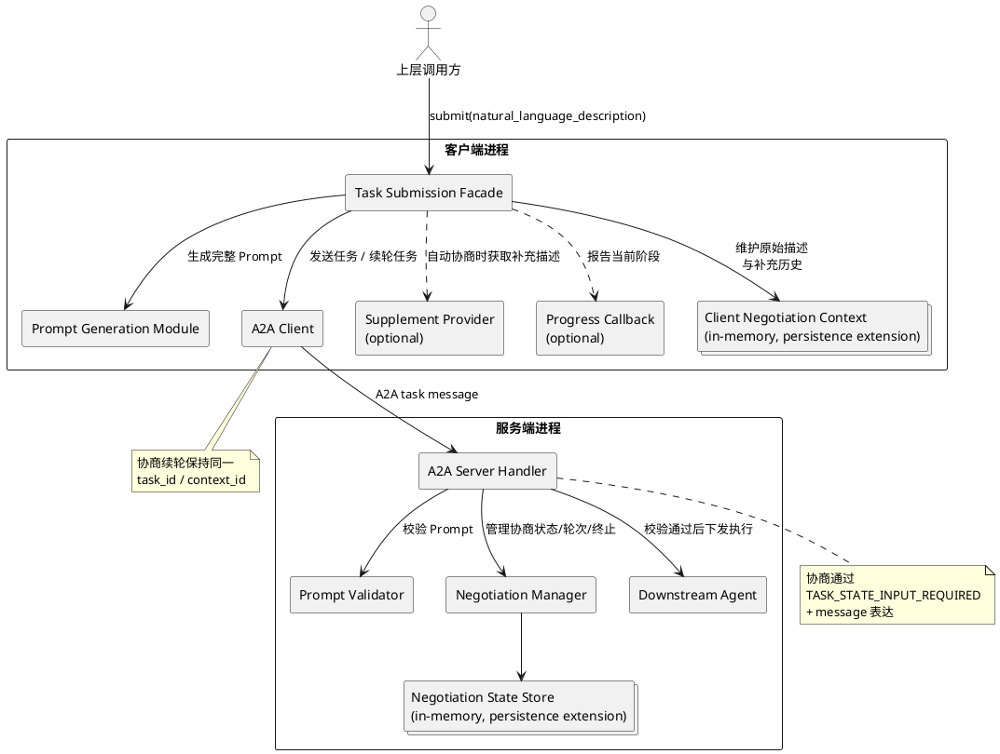
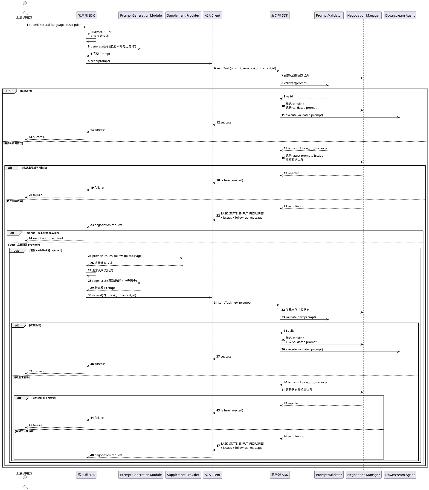

# A2A-T 协商下发设计

## 1. 目标

本设计面向如下链路：

- 上层调用方把原始自然语言任务描述交给客户端 SDK
- 客户端 SDK 生成任务 Prompt，并通过 A2A 发送给服务端
- 服务端在调用下游 Agent 之前，对任务 Prompt 做校验
- 如果信息缺失或存在可修正的明显非法信息，服务端发起协商
- 客户端根据配置决定自动补参继续协商，或将协商结果返回给上层

第一版目标是打通以下主链路：

1. 客户端通过 A2A 发送任务 Prompt
2. 服务端通过 A2A 接收任务 Prompt 并校验
3. 服务端在需要补参时返回协商要求
4. 客户端在同一任务内继续协商
5. 服务端管理协商状态、轮次和终止条件

## 2. 非目标

第一版不负责：

- 在下游 Agent 执行阶段再次触发协商
- 定义独立的 negotiation HTTP API
- 定义 A2A-T 自定义 negotiation 事件体系
- 自动恢复客户端或服务端重启前未完成的协商
- 客户端智能补全的具体实现
- 以结构化增量字段替代完整 Prompt 续轮提交

## 3. 范围

第一版协商范围包括：

- 缺失信息
- 明显非法但可以由客户端补充或修正的信息

第一版协商只发生在：

- 客户端 Prompt 生成之后
- 服务端下游 Agent 执行之前

一旦服务端 Prompt 校验通过并进入下游 Agent 执行，第一版不再重新触发协商。

## 4. 总体方案

采用以下总体方案：

- 客户端闭环驱动，服务端状态主控

含义如下：

- 客户端负责驱动 Prompt 生成、A2A 发送、接收协商响应、补参、重生成 Prompt、继续发送
- 服务端负责 Prompt 校验、协商状态管理、轮次控制、终止判断、最终执行决策
- 协议层尽量复用 A2A 原生语义，通过同一个 `task_id/context_id` 和 `TASK_STATE_INPUT_REQUIRED + message` 表达协商

### 4.1 上下文视图

下面的上下文视图描述第一版协商下发方案在整体系统中的位置。

## 5. 角色职责

### 5.1 上层调用方

上层调用方负责：

- 发起一次任务下发请求
- 按需配置补参 provider
- 按需配置进度回调
- 在自动协商关闭或无法继续时，自行决定如何与最终用户交互

### 5.2 客户端 SDK

客户端 SDK 负责：

- 接收原始自然语言任务描述
- 维护客户端侧协商上下文
- 调用现有 Prompt 生成链路生成完整任务 Prompt
- 通过 A2A 向服务端发送 Prompt
- 接收服务端的 `INPUT_REQUIRED` 协商响应
- 在自动协商模式下，通过补参 provider 获取增量自然语言补充描述
- 基于原始描述和补充历史重生成新的完整 Prompt
- 在同一 `task_id/context_id` 上继续协商
- 向调用方返回最终结果或 `negotiation_required`

客户端不负责：

- 主控协商轮次和终止条件
- 在服务端完成校验后替代服务端做执行决策

### 5.3 补参 Provider

补参 provider 是客户端的一个可配置接口，只负责：

- 在服务端要求补充或修正信息时，向调用方获取增量自然语言补充描述

它不负责：

- A2A 通信
- 协商状态管理
- 直接生成任务 Prompt

### 5.4 进度回调

进度回调是客户端的一个可选接口，只负责：

- 向调用方报告当前执行阶段

它不参与协商控制逻辑。是否配置进度回调，不改变任务下发与协商的语义。

### 5.5 服务端 SDK

服务端负责：

- 接收客户端提交的任务 Prompt
- 对任务 Prompt 执行校验
- 判断是否进入协商
- 维护协商状态、轮次和当前任务最新输入
- 在需要补参时通过 A2A 返回 `TASK_STATE_INPUT_REQUIRED`
- 在校验通过后，把最后通过校验的 Prompt 传给下游 Agent
- 在达到终止条件时结束协商

## 6. 协议与任务语义

第一版协议层采用以下原则：

- 协商始终属于同一个任务
- 协商期间保持同一个 `task_id`
- 协商期间保持同一个 `context_id`
- 不新增 A2A-T 自定义 negotiation 事件

服务端在需要补参时：

- 将任务状态置为 `TASK_STATE_INPUT_REQUIRED`
- 在返回消息中说明当前缺失/错误信息和补充要求

客户端后续补参时：

- 继续使用原来的 `task_id/context_id`
- 再次发送新的完整任务 Prompt

## 7. 协商状态模型

服务端第一版最小协商状态集为：

- `negotiating`
- `satisfied`
- `rejected`

含义如下：

- `negotiating`：仍在协商中，等待客户端提交新的完整 Prompt
- `satisfied`：最新 Prompt 已通过校验，可以进入下游 Agent 执行
- `rejected`：协商终止，不再继续

第一版不扩展更多中间状态。

## 8. 客户端协商上下文

客户端需要维护的协商上下文至少包括：

- 原始自然语言任务描述
- 每轮补充得到的自然语言描述历史
- 当前关联的 `task_id/context_id`

客户端每轮重生成 Prompt 时，只使用：

- 原始自然语言任务描述
- 每轮补充描述

服务端追问文本本身不纳入下一轮 Prompt 生成输入。

## 9. 服务端协商状态

服务端需要持有的协商状态至少包括：

- 当前协商状态
- 当前轮次
- 当前任务最新输入 Prompt
- 最后通过校验的 Prompt

服务端每轮收到新的完整 Prompt 后：

- 将其视为当前任务最新输入
- 对其重新执行完整校验
- 如通过，则将最后通过校验的 Prompt 交给下游 Agent

## 10. 自动协商策略

客户端协商行为需要做成可配置策略。第一版至少支持两种策略：

### 10.1 `manual`

- 客户端不自动调用补参 provider
- 服务端一旦返回协商要求，客户端直接返回 `negotiation_required`

### 10.2 `auto`

- 客户端通过补参 provider 自动获取补充描述并继续协商
- 如果未配置补参 provider，则自动退化为 `manual`

## 11. 返回结果

第一版顶层返回结果需要覆盖三类结果：

- `success`
- `failure`
- `negotiation_required`

其中：

- `success`：任务已通过校验并成功下发给服务端下游执行链路
- `failure`：任务无法继续，且不属于“等待上层继续补参”的中间状态
- `negotiation_required`：当前需要补参，但客户端未继续自动协商

`negotiation_required` 必须是结构化结果，而不是纯文本。它至少包含：

- 结构化缺失/错误信息
- 服务端追问文本
- 当前任务关联标识
- 当前协商轮次和上限信息

服务端追问文本作为结构化结果中的一个字段存在。

## 12. 公开接口策略

长期上客户端会支持三种调用方式：

- 同步调用
- 流式调用
- 异步调用

第一版公开接口策略为：

- 三种接口都可以对外暴露
- 第一版只实现同步调用
- 流式调用和异步调用显式抛出 `NotImplementedError`

## 13. 第一版同步调用语义

第一版同步调用仍然是：

- 一次调用跑到成功、失败或 `negotiation_required`

同步调用支持可选的进度回调：

- 如果提供进度回调，客户端在关键阶段通知调用方
- 如果未提供进度回调，客户端静默执行，只返回最终结果

同步调用不会因为缺少进度回调而改变控制语义。

## 14. 端到端流程

### 14.1 流程时序图

下面的时序图描述第一版同步调用下的主流程，以及进入协商后的手动/自动分支。

### 14.2 首次下发

1. 调用方调用客户端封装对象，输入原始自然语言任务描述
2. 客户端创建协商上下文
3. 客户端生成第一版完整任务 Prompt
4. 客户端通过 A2A 发送给服务端
5. 服务端接收后执行 Prompt 校验

### 14.3 校验通过

如果服务端校验通过：

1. 服务端将协商状态置为 `satisfied`
2. 服务端记录最后通过校验的 Prompt
3. 服务端把该 Prompt 传给下游 Agent 执行
4. 客户端返回 `success`

### 14.4 进入协商

如果服务端发现缺失信息或可修正的明显非法信息：

1. 服务端将协商状态置为 `negotiating`
2. 服务端一次性返回当前已知的全部缺失/错误信息
3. 服务端通过 `TASK_STATE_INPUT_REQUIRED + message` 返回协商要求

### 14.5 客户端处理协商要求

客户端收到协商要求后，按策略处理：

- `manual`
  - 客户端直接返回 `negotiation_required`
- `auto`
  - 如果配置了补参 provider，则向其获取增量自然语言补充描述
  - 如果未配置补参 provider，则退化为 `manual`

### 14.6 自动协商续轮

在 `auto` 且成功获取补充描述的情况下：

1. 客户端把本轮补充描述追加到协商上下文
2. 客户端基于“原始描述 + 补充历史”重新生成新的完整 Prompt
3. 客户端继续使用原来的 `task_id/context_id` 发送新 Prompt
4. 服务端把该 Prompt 视为当前任务最新输入，并重新完整校验

### 14.7 协商终止

协商在以下情况下结束：

- 校验通过，进入执行
- 达到协商轮次上限
- 客户端明确放弃
- 其他无法继续协商的情况

除“校验通过，进入执行”外，其余情况统一落到 `rejected`。

## 15. 持久化与恢复扩展点

### 15.1 客户端

第一版客户端：

- 默认只在内存中保存协商上下文
- 不支持进程重启后的自动恢复

但必须预留接口，支持未来：

- 持久化协商上下文
- 恢复未完成协商并继续任务

### 15.2 服务端

第一版服务端：

- 默认只在内存中保存协商状态和当前有效 Prompt
- 不支持重启后的自动恢复

但必须预留接口，支持未来：

- 持久化协商状态
- 恢复未完成协商
- 恢复最后通过校验的 Prompt

## 16. 第一版设计原则

第一版坚持以下原则：

- 优先复用现有 Prompt 生成和 Prompt 校验能力
- 优先复用 A2A 原生状态语义
- 同一个任务内完成协商，不把续轮伪装成新任务
- 自动协商与状态感知解耦
- 自动协商与手动上层承接兼容
- 默认只做内存态，但不堵死未来恢复能力
