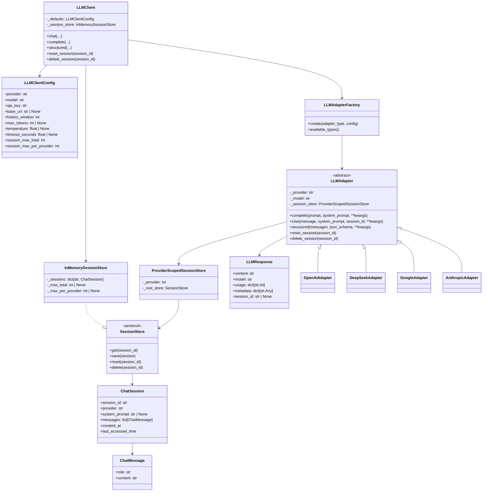
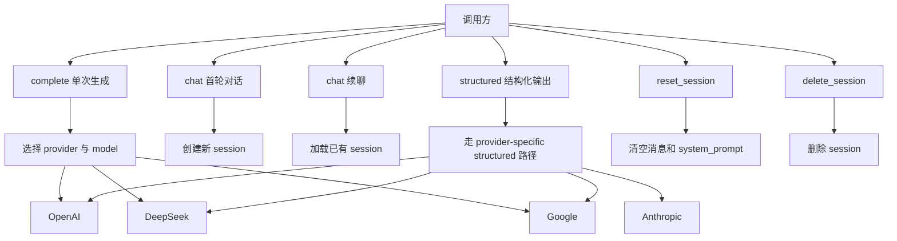
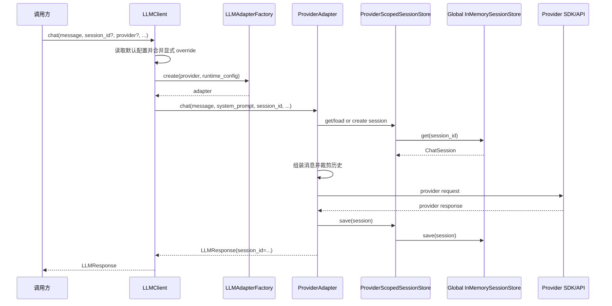
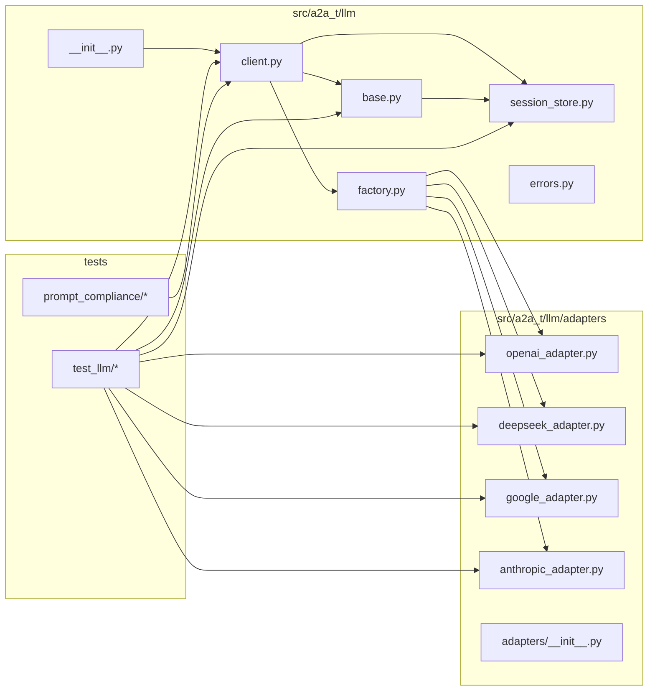
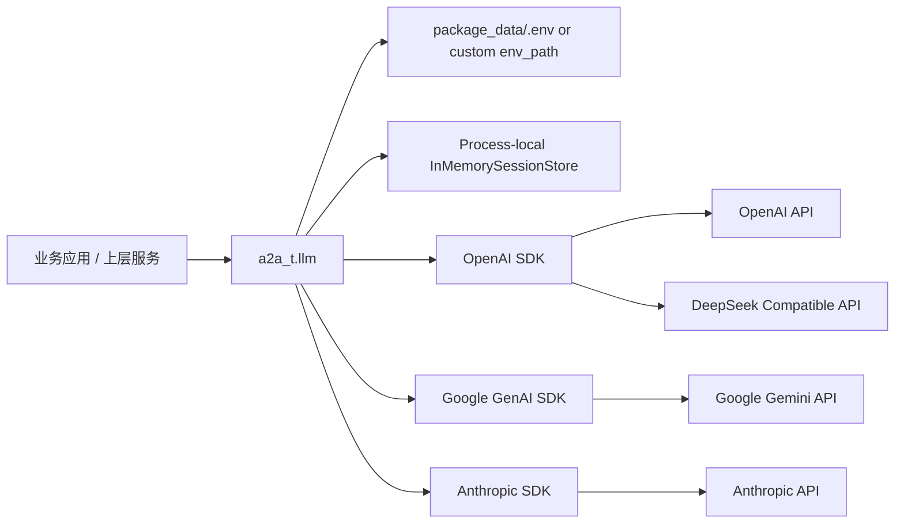

# `a2a_t.llm` 当前设计与实现文档

## 1. 文档目的

本文档用于描述 **截至 2026-04-16 当前代码已经实现的 `a2a_t.llm` 模块事实**。

本文档关注的是当前实现，不再重复保留已经过时的中间设计形态。

建议配套阅读：

- `2026-04-16-a2a-t-llm-evolution.md`
- `2026-04-16-a2a-t-llm-usage-constraints.md`

## 2. 设计目标

`a2a_t.llm` 当前承担三个职责：

1. 提供统一的多 provider LLM 抽象与工厂装配能力
2. 提供面向调用方的易用入口 `LLMClient`
3. 在 `chat()` 场景下提供受控的 session 记忆能力，并保证 provider 隔离与容量保护

## 3. 模块边界

当前核心模块位于：

- `src/a2a_t/llm/base.py`
- `src/a2a_t/llm/session_store.py`
- `src/a2a_t/llm/factory.py`
- `src/a2a_t/llm/client.py`
- `src/a2a_t/llm/adapters/*.py`

对外公开入口位于：

- `a2a_t.llm`
- `a2a_t.llm.client.LLMClient`

## 4. 总体架构

当前架构可以概括为：

`LLMClient -> LLMAdapterFactory -> Provider Adapter -> Official SDK/API`

其中：

- `LLMClient` 负责 `.env` 默认值加载、方法级 runtime override 合并、默认全局 session store 管理
- `LLMAdapterFactory` 负责根据 provider 名称解析具体 adapter
- `LLMAdapter` 基类负责统一 `complete()` / `chat()` 的共性流程与 session 语义
- 各 provider adapter 负责厂商协议映射与 SDK 调用
- `SessionStore` 负责 chat session 的内存态保存、刷新、reset、delete 与容量淘汰

### 4.1 4+1 视图总览

本节使用 4+1 视图补充说明当前实现形态。考虑到 `a2a_t.llm` 当前是 SDK 内部模块，而不是独立服务，本节重点放在最有价值的五个视角：

- 逻辑视图：核心对象与关系
- 场景视图：调用方如何使用模块
- 过程视图：关键运行时调用链
- 开发视图：代码在仓库中的组织方式
- 物理视图：运行时依赖与部署关系

#### 4.1.1 逻辑视图

逻辑视图回答“当前系统由哪些核心对象组成，以及它们如何协作”。



逻辑视图中最关键的设计点有四个：

- `LLMClient` 是公开入口，但 provider 差异没有被塞进 `LLMClient`，而是继续沉淀在 adapter 中
- root session store 当前是进程级共享的 `InMemorySessionStore`
- 真正注入到 adapter 的不是 root store 本身，而是 `ProviderScopedSessionStore`
- `AnthropicAdapter` 保留在统一抽象中，但能力边界比其他三个 provider 更窄

#### 4.1.2 场景视图

场景视图回答“当前模块支持哪些关键使用方式”。



当前最重要的场景约束是：

- session 只存在于 `chat()`
- `structured()` 的 provider 能力强度并不一致
- `reset_session()` / `delete_session()` 已经不依赖 provider adapter 创建

#### 4.1.3 过程视图

过程视图回答“关键运行时调用是如何流转的”。这里选取当前最重要的 `LLMClient.chat()` 路径。



当前过程视图体现出的关键收敛是：

- `LLMClient` 负责配置与入口控制
- `LLMAdapter` 负责 chat 编排
- root store 负责真实状态持久化
- provider scoped store 负责 provider 安全边界

#### 4.1.4 开发视图

开发视图回答“代码在仓库中如何组织，模块边界如何划分”。



当前开发视图下的模块职责比较清晰：

- `client.py` 负责公开入口与 runtime config
- `base.py` 负责统一抽象与 chat 共性流程
- `session_store.py` 负责 session 状态边界
- `factory.py` 负责 provider 到 adapter 的解析
- `adapters/` 负责厂商能力映射

#### 4.1.5 物理视图

物理视图回答“当前模块在运行时依附于什么环境与外部系统”。



当前物理视图有三个要点：

- `a2a_t.llm` 不是独立部署服务，而是被上层应用直接引入的 SDK 模块
- session 状态默认保留在当前 Python 进程内存中
- 外部依赖不是统一一个网关，而是按 provider 分别访问各自 SDK/API

## 5. 核心对象模型

### 5.1 `LLMAdapter`

`LLMAdapter` 是统一抽象基类。

其主要职责：

- 持有 provider/model/config
- 在 `complete()` 中将 prompt 转换为统一消息列表
- 在 `chat()` 中处理 session 的加载、创建、system prompt 继承、历史裁剪和落库
- 对具体 provider 暴露 `structured()` 抽象能力

当前公共响应模型为 `LLMResponse`，包含：

- `content`
- `model`
- `usage`
- `metadata`
- `session_id`

### 5.2 `ChatSession`

当前 session 数据模型包含：

- `session_id`
- `provider`
- `system_prompt`
- `messages`
- `created_at`
- `last_accessed_time`

当前已经移除了历史遗留的 `updated_at` 字段，统一使用 `last_accessed_time` 作为访问与淘汰依据。

### 5.3 `SessionStore`

`SessionStore` 协议定义了：

- `get(session_id)`
- `save(session)`
- `reset(session_id)`
- `delete(session_id)`

当前默认实现为 `InMemorySessionStore`。

### 5.4 `ProviderScopedSessionStore`

`ProviderScopedSessionStore` 是当前 session 安全边界的关键。

其职责是：

- 限制只能读取对应 provider 前缀的 session
- 限制只能保存 provider 元数据一致、且 `session_id` 前缀一致的 session
- 限制 reset/delete 只能影响当前 provider 名下的 session

它不是独立存储，而是包裹在 root store 外层的 provider 作用域视图。

### 5.5 `LLMClient`

`LLMClient` 是当前推荐的公开入口。

其职责是：

- 从 `package_data/.env` 或显式 `env_path` 加载默认配置
- 管理进程级默认 root session store
- 构建推理调用 runtime config
- 通过工厂创建 provider adapter
- 对外暴露统一方法：
  - `chat()`
  - `complete()`
  - `structured()`
  - `reset_session()`
  - `delete_session()`

## 6. Session 设计

### 6.1 Session 仅用于 `chat()`

当前语义明确如下：

- `chat()` 使用和更新 session
- `complete()` 不使用 session
- `structured()` 不使用 session

这意味着：

- `complete()` 返回的 `session_id` 永远是 `None`
- `structured()` 不创建会话状态

### 6.2 Session ID 规则

当前 session id 固定格式为：

```text
<provider>-<uuid>
```

该规则同时承担两类职责：

- 对外暴露 provider 归属信息
- 对内支持 provider 作用域过滤

### 6.3 进程级共享 root store

当前默认 root store 已经不是 `LLMClient` 实例级，而是 **进程级共享**。

也就是说：

- 同一进程内多个 `LLMClient()` 默认共享同一个 `InMemorySessionStore`
- 不同 `LLMClient` 实例之间可以访问同一份底层 session 数据
- provider 级隔离仍然通过 `ProviderScopedSessionStore` 保持

### 6.4 首次初始化锁定

默认全局 root store 在首次创建时，会锁定以下配置：

- `A2AT_LLM_SESSION_MAX_TOTAL`
- `A2AT_LLM_SESSION_MAX_PER_PROVIDER`

后续同一进程内再次创建 `LLMClient`：

- 若这两个配置一致，则复用 root store
- 若不一致，则直接抛 `LLMConfigError`

### 6.5 容量保护与淘汰

当前 `InMemorySessionStore` 支持：

- 全局 session 总量上限：`max_total`
- 单 provider session 数量上限：`max_per_provider`

淘汰依据为：

- `last_accessed_time`

淘汰顺序为：

1. 先检查当前 provider 是否超出 `max_per_provider`
2. 再检查全局是否超出 `max_total`

这是一种基于 session 数量的近似内存保护，而不是字节级或 token 级精确控制。

### 6.6 `history_window` 语义

当前 `history_window` 一值两用：

1. 控制传给模型的上下文窗口
2. 控制 session 持久化保留的最近历史长度

当前持久化规则是：

- session 最终只保留最近 `2 * history_window` 条消息

## 7. 配置设计

### 7.1 配置来源

当前 `LLMClient` 默认配置来源为：

- `package_data/.env`

也可通过 `env_path` 指向其他 `.env` 文件。

### 7.2 当前 LLM 运行时关键配置

当前实现实际使用的主要键包括：

- `A2AT_LLM_PROVIDER`
- `A2AT_LLM_MODEL`
- `A2AT_LLM_API_KEY`
- `A2AT_LLM_BASE_URL`
- `A2AT_LLM_HISTORY_WINDOW`
- `A2AT_LLM_MAX_TOKENS`
- `A2AT_LLM_TEMPERATURE`
- `A2AT_LLM_TIMEOUT_SECONDS`
- `A2AT_LLM_SESSION_MAX_TOTAL`
- `A2AT_LLM_SESSION_MAX_PER_PROVIDER`

### 7.3 配置校验

当前实现包含以下硬约束：

- `provider` 必须在工厂已注册类型中
- `model` 必须非空
- `api_key` 在实际调用时必须非空
- `history_window` 必须是正整数且不超过 `100`
- `session_max_total` 必须是正整数且不超过 `3000`
- `session_max_per_provider` 必须是正整数且不超过 `1000`
- `session_max_total >= session_max_per_provider`

## 8. Provider 适配策略

### 8.1 OpenAI

当前 `OpenAIAdapter`：

- 使用官方 OpenAI SDK
- `complete()` / `chat()` 走 `chat.completions.create`
- `complete()` / `chat()` 强制 `response_format={"type": "json_object"}`
- `structured()` 走 `json_schema` 响应格式

### 8.2 DeepSeek

当前 `DeepSeekAdapter`：

- 使用 OpenAI SDK 访问 DeepSeek 的兼容接口
- 默认 `base_url` 为 `https://api.deepseek.com`
- `complete()` / `chat()` / `structured()` 全部强制 JSON object 输出
- `structured()` 不是协议级 schema 约束，而是通过 system prompt 注入 schema 文本实现 prompt 级约束

因此，DeepSeek 的结构化输出强度低于 OpenAI / Google / Anthropic 的协议级结构化能力。

### 8.3 Google

当前 `GoogleAdapter`：

- 使用 `google-genai` SDK
- `complete()` / `chat()` / `structured()` 统一走 `models.generate_content`
- `structured()` 通过 `response_json_schema` 传递 schema
- 输出 MIME 类型统一走 `application/json`

### 8.4 Anthropic

当前 `AnthropicAdapter`：

- 使用 `anthropic` SDK
- 仅支持 `structured()`
- `complete()` / `chat()` 明确抛 `LLMRuntimeError`
- `structured()` 使用 tool-use 模式，通过 `tools + tool_choice` 提取结构化 JSON

若响应中没有 `tool_use` block，则直接失败。

## 9. `LLMClient` 对外接口

### 9.1 推理接口

当前 `LLMClient` 已收敛为显式签名，不再接受公开 `**kwargs`。

`chat()` 公开参数：

- `message`
- `system_prompt`
- `session_id`
- `provider`
- `model`
- `api_key`
- `base_url`
- `temperature`
- `max_tokens`
- `timeout_seconds`
- `history_window`

`complete()` 公开参数：

- `prompt`
- `system_prompt`
- `provider`
- `model`
- `api_key`
- `base_url`
- `temperature`
- `max_tokens`
- `timeout_seconds`

`structured()` 公开参数：

- `messages`
- `json_schema`
- `provider`
- `model`
- `api_key`
- `base_url`
- `temperature`
- `max_tokens`
- `timeout_seconds`

### 9.2 Session 管理接口

当前 `reset_session()` / `delete_session()` 已收敛为纯 session 管理接口：

- `reset_session(session_id)`
- `delete_session(session_id)`

它们不再经过 provider adapter 构建路径，也不再公开 provider/model/api_key 等参数。

## 10. 错误模型

当前主要错误类型为：

- `LLMError`
- `LLMConfigError`
- `LLMRuntimeError`

其中：

- `LLMConfigError` 用于配置错误、能力不支持、非法参数、全局 store 配置冲突
- `LLMRuntimeError` 用于 provider 调用失败、session 不存在、provider 不匹配、结构化返回异常

## 11. 当前明确不做的事情

截至当前实现，以下能力仍不在正式范围内：

- 流式输出
- 持久化 session store
- token/字节级精确内存限制
- 通用工具调用抽象
- 多模态统一抽象
- OpenAI Responses API 迁移
- Anthropic 的完整 `chat()` / `complete()`

## 12. 测试覆盖状态

当前相关测试主要覆盖：

- `LLMAdapter` 基础 chat flow
- `SessionStore` provider 隔离与容量淘汰
- `LLMClient` 默认配置、显式 override、全局 root store、接口收敛
- OpenAI / DeepSeek / Google / Anthropic 四类 adapter 的核心行为
- 与 prompt compliance 运行时的集成使用

## 13. 结论

截至 2026-04-16，`a2a_t.llm` 已经从“带 transport 占位语义的早期适配层”演进为：

- 以 `LLMClient` 为主入口
- 以 adapter/factory 为 provider 适配边界
- 以进程级共享 root store + provider scoped store 为 session 安全边界
- 以显式公开签名与受限结构化输出为接口风格

当前模块适合承担受控的多 provider JSON / structured 推理场景，但还不是一个覆盖流式、多模态、工具编排与持久化会话的完整通用 LLM 平台。

## 14. 阅读建议

若需要继续深入，建议按以下顺序阅读：

1. `2026-04-16-a2a-t-llm-design.md`
2. `2026-04-16-a2a-t-llm-evolution.md`
3. `2026-04-16-a2a-t-llm-usage-constraints.md`
