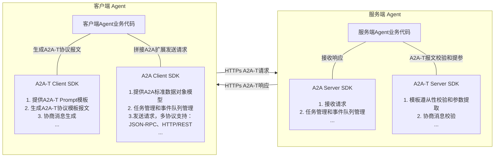
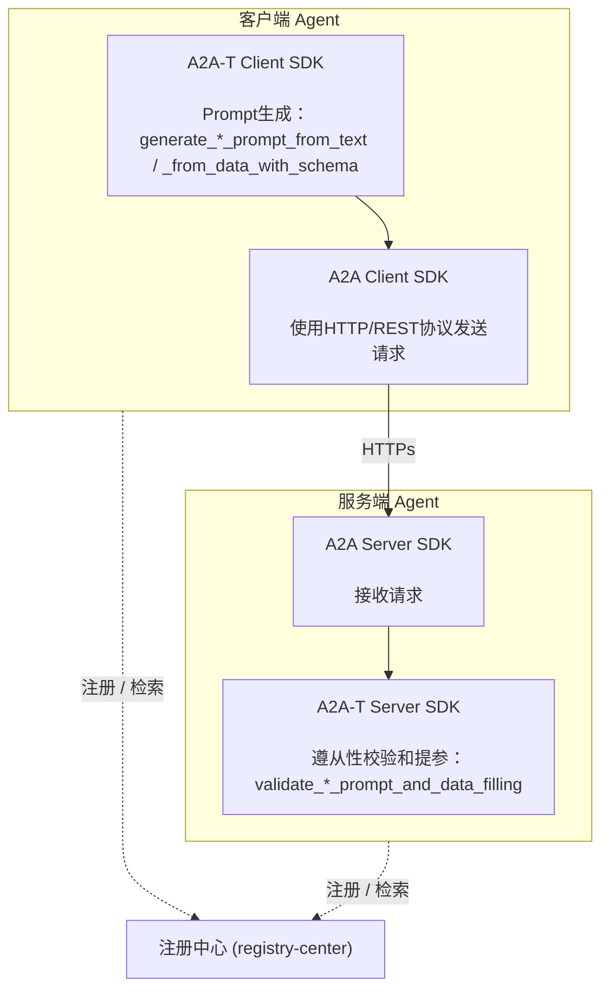
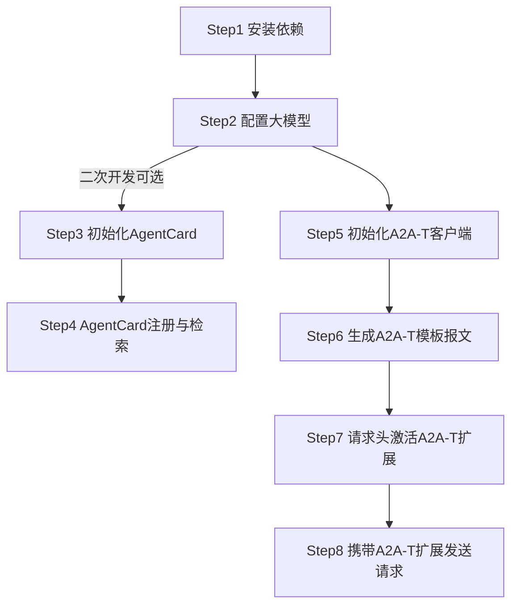
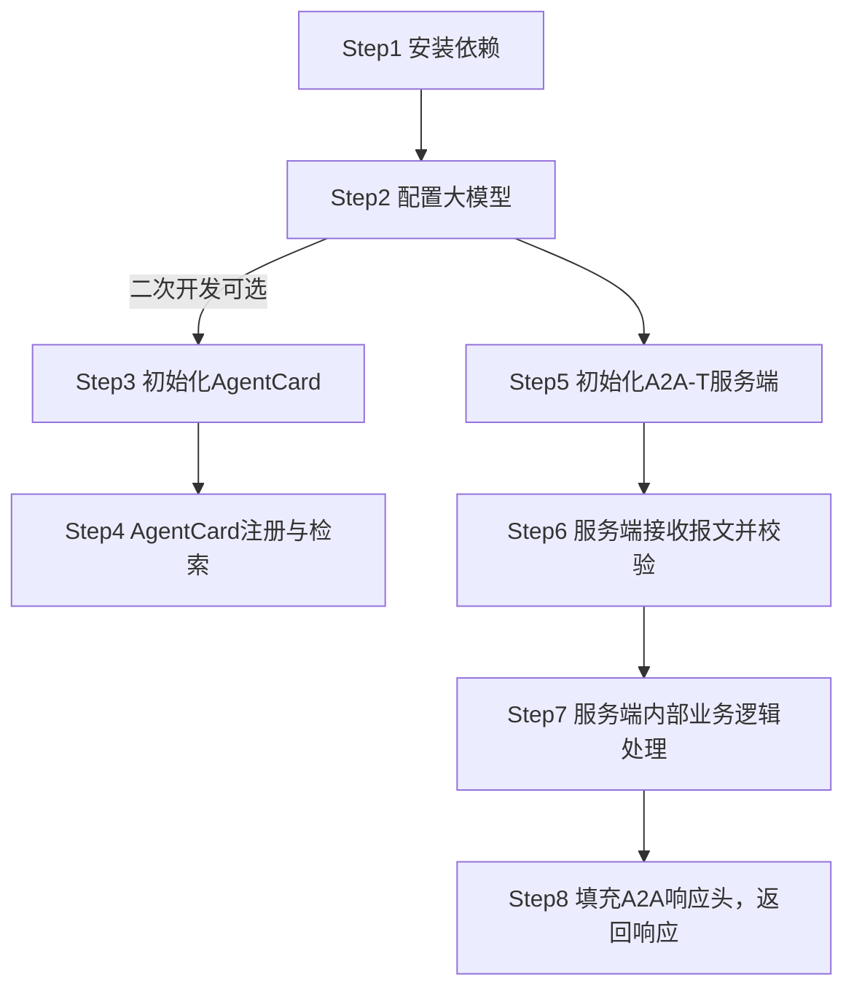

# 1 a2a-t-sdk-python 开发指南

| 分类     | 说明                                                              |
| -------- |-----------------------------------------------------------------|
| 目标读者 | 基于A2A-T SDK进行多智能体协议交互的开发者、集成部署人员、项目对接运维人员                       |
| 文档目的 | 本文档详细介绍A2A-T SDK的完整安装方式、参数配置及最小实践。帮助使用者快速、规范地完成SDK接入、功能开发和上线落地。 |
| 阅读前提 | 了解A2A多智能体协议的数据模型定义和使用，了解AgentCard模型定义和使用，了解注册中心相关功能             |

## 1.1 特性介绍

### 1.1.1 A2A-T能力介绍
A2A-T（Agent-to-Agent Telecom）是基于A2A协议推出的电信领域多智能体互联协议，专为电信领域复杂协同场景设计。

电信领域的业务场景复杂、要求高，运维智能体互联和协同需要有专门的协议进行支撑。A2A-T方案基于A2A协议，重点针对电信领域业务流相关的信息模型、任务协商、协作安全等增强能力进行应用扩展。

a2a-t-sdk-python是面向电信智能体协作场景的 Python SDK，用于在 A2A-T 交互中生成、校验和协商任务提示词。SDK 适合客户端 Agent、服务端 Agent 以及上层编排系统集成使用。

主要能力包括：

- **客户端模板报文生成**：客户端根据自然语言或结构化输入生成符合 A2A-T 格式的协议报文。
- **服务端模板报文校验**：服务端校验客户端下发的 A2A-T协议格式报文 是否匹配场景、模板和槽位约束。
- **协商内容 API**：支持`information`、`feasibility`、`target`三类协商及`abort`终止消息，提供模板驱动的协商报文生成与校验；协商会话状态随消息 metadata（`negotiationContext`）往返，SDK 本身无状态。
- **模板资源管理**：内置场景、槽位、模板、词表和系统提示词资源，支持`packaged`内置资源与`local_file`本地文件两种资源加载方式。
- **LLM 适配**：通过 OpenAI-compatible 调用链接入外部大模型。
- **结构化双语错误模型**：封闭的 42 个机器可读错误码目录（含事实参数）与双语消息模板。

SDK提供的API列表和使用说明，详见 [API参考.md](API参考.md)。

### 1.1.2 A2A-T SDK与A2A SDK的关系

A2A-T协议是基于A2A协议的扩展，针对协议扩展的内容提供了A2A-T SDK，支撑快速构建用于电信领域复杂协同场景的智能体。

A2A-T SDK独立于A2A SDK，通过同时集成A2A-T SDK与A2A SDK可以构建支持A2A-T协议的agent，支持电信领域多agent之间的确定性、高可靠、高效及安全协同。Python生态中可搭配的A2A SDK为官方 `a2a-sdk`。



### 1.1.3 A2A-T SDK典型交互场景

一个典型的多智能体协作交互场景至少涉及到三个组件：客户端Agent、服务端Agent、注册中心；

各组件间关系示例如下：



当首个提示词携带的任务信息不完整时，双方切换到协商流程：服务端生成 Negotiation-T propose 消息询问缺失信息，客户端校验该消息、补齐所请求的参数后，以 Task-T 提示词加 Negotiation-T accept 消息应答。完整闭环见 `a2a-t-sample/negotiation/` 离线样例（见 1.4.5）。

## 1.2 约束与限制

1. Python 版本要求为 3.12+。
2. 完整的多智能体协议交互开发需要同时引入`a2a-sdk`，要求版本为 1.1.0+。
3. SDK 无状态：协商会话状态随每条消息的 A2A-T metadata（`negotiationContext`）往返，不保存在 SDK 内部。
4. 旧的状态机协商 demo（`start_negotiation` / `receive_negotiation` / `continue_negotiation` 及 `negotiation/{types,store,runtime,handling}` 包）自 1.1.0 起废弃（调用时发出 `DeprecationWarning`），将在下一版本删除。
5. A2A-T SDK 不提供 Agent HTTP 服务框架、注册中心客户端、鉴权和密钥管理能力，需由业务系统集成。

## 1.3 环境准备

### 1.3.1 环境要求

| 项目     | 要求                                     |
| -------- | ---------------------------------------- |
| Python   | Python 3.12+                             |
| 依赖管理 | 推荐使用 `uv`                            |
| LLM      | 需要可访问的 OpenAI 兼容服务及 API Key（离线测试与样例不需要） |
| 操作系统 | Linux、Windows、macOS 均可用于开发和联调 |

### 1.3.2 搭建环境

以Windows11 64位 amd64 开发环境为例

**安装Python 3.12**

1. 官网下载链接：https://www.python.org/ftp/python/3.12.10/python-3.12.10-amd64.exe

2. 以管理员身份执行`python-3.12.10-amd64.exe`

3. **务必勾选**：Add Python 3.12 to PATH

4. 安装完成，打开终端输入校验命令：

   ```shell
   python --version
   # 预期输出：Python 3.12.10
   ```

**安装uv**

1. 安装完Python之后，使用pip安装uv，在终端中输入：`python -m pip install uv`

2. 安装完成，输入校验命令：

   ```shell
   uv --version
   # 预期输出：uv 0.12.1 (329541a50 2026-07-31 x86_64-pc-windows-msvc)
   ```

3. 安装项目依赖并运行测试：

   ```shell
   cd {项目路径}/a2a-t-sdk-python
   uv sync --dev
   uv run pytest -q
   ```

## 1.4 基础开发样例

目的：通过提供A2A-T客户端和服务端的样例代码，帮助使用者快速、规范地熟悉SDK接入流程，加速功能开发和上线落地。

### 1.4.1 样例接口说明

本基础开发样例主要使用到A2A-T SDK如下两个API，实际开发过程中需按业务实际诉求选择不同API使用：

**1、A2A-T Client SDK**

接口定义及功能描述：根据自然语言文本与指定 Notification-T 模板生成通知订阅提示词报文（跳过场景识别）。执行一次 LLM 槽位抽取后确定性渲染模板；生成阶段做内置槽位 schema 校验。

```python
def generate_notification_prompt_from_text(self, text: str, template_uri: str | TemplateUri) -> MetadataContent
```

接口调用样例：

```python
from pathlib import Path

from a2a_t.client.a2at_client import A2ATClient

client = A2ATClient(env_path=Path("package_data/.env"))

metadata = client.generate_notification_prompt_from_text(
    "请生成一个Incident事件订阅任务：通知主题为Incident，订阅级别为critical、medium、high、low，"
    "上报通知数据格式为DataPart",
    "Notification-T/network-layer/subscribe-incident/v1",
)

print(metadata.prompt_text)              # 渲染出的提示词报文
print(metadata.build_metadata_content()) # 可直接发送的 A2A-T metadata 映射

"""输出生成的通知订阅提示词报文（metadata.prompt_text；实际文本随 LLM 槽位抽取结果变化）：
## 订阅描述
请根据以下 <通知主题>、<订阅条件>、<上报通知数据格式>及<预期输出> 信息，完成网络侧智能故障Incident订阅与上报任务。

## 通知主题
该主题的名称是"incident"

## 订阅条件
故障级别为"critical"、"medium"、"high"、"low"

## 上报通知数据格式
通过DataPart上报Incident数据

## 预期输出
1、订阅结果，成功或失败
2、订阅失败原因（可选）
"""
```

**2、A2A-T Server SDK**

接口定义及功能描述：校验 Notification-T 通知订阅提示词报文是否匹配模板与槽位约束，并按调用方 schema 提取参数（订阅主题、订阅条件、上报通知数据格式等）。

```python
def validate_notification_prompt_and_data_filling(
    self,
    prompt: str,
    schema: Mapping[str, object],
    template_uri: str | TemplateUri,
) -> FilledParamData
```

接口调用样例：校验客户端下发的通知订阅报文并提取订阅参数

```python
from pathlib import Path

from a2a_t.server.a2at_server import A2ATServer

server = A2ATServer(env_path=Path("package_data/.env"))

validation_schema = {
    "type": "object",
    "properties": {
        "topic": {
            "type": "string",
            "description": "订阅主题（必填）。要订阅的事件主题名称。",
        },
        "subscriptionCondition": {
            "type": "string",
            "description": "订阅条件（可选）。要订阅的条件的描述。",
        },
        "notificationDataFormat": {
            "type": "string",
            "description": "上报通知数据格式（必填）。要上报的通知数据格式的描述。",
        },
    },
    "required": ["topic", "notificationDataFormat"],
}

# prompt_text 为客户端生成的通知订阅提示词报文文本
filled = server.validate_notification_prompt_and_data_filling(
    metadata.prompt_text, validation_schema, "Notification-T/network-layer/subscribe-incident/v1"
)

print(filled.data)
# 按 schema 提取出的订阅参数，例如
# {'topic': 'Incident', 'subscriptionCondition': '', 'notificationDataFormat': 'DataPart'}
```

对应的纯合规校验 API `check_task_prompt(processed_prompt_text=...)` 返回 `PromptComplianceResult`，其 `failure` 在驳回时携带 `code` / `message` / `stage`；两者可以组合使用 —— 先做合规校验，合规通过后再做参数填充。

### 1.4.2 开发流程

- 客户端开发流程



> 二次开发指已基于A2A开发Agent，并对接过注册中心

- 服务端开发流程：



### 1.4.3 样例客户端开发步骤

#### Step1 安装依赖

```bash
# A2A-T SDK
pip install a2a-t-sdk

# A2A 官方 Python SDK
pip install a2a-sdk
```

> A2A 请求的发送、响应的接收和服务端路由组装使用官方 `a2a-sdk`（其传输层依赖 `httpx`）；注册中心不属于官方 SDK 能力范围，本指南使用 `httpx` 直接与其交互，业务系统可替换为 `requests` 等任意 HTTP 客户端。服务端启动 HTTP 服务还需安装 `uvicorn`：
>
> ```bash
> pip install uvicorn
> ```

#### Step2 配置大模型

将仓库根目录 `env.example` 的内容复制到 `package_data/.env`（门面的默认读取位置），配置如下内容：

```properties
A2AT_LANGUAGE=zh-CN
A2AT_PROMPT_SOURCE_TYPE=packaged
A2AT_INPUT_TEXT_MAX_CHARS=16384
A2AT_LLM_PROVIDER=openai
A2AT_LLM_MODEL=deepseek-chat
A2AT_LLM_API_KEY={your_llm_api_key}
A2AT_LLM_BASE_URL=https://api.deepseek.com
A2AT_LLM_MAX_ATTEMPTS=3
```

> `A2AT_LLM_API_KEY` 是**调用外部大模型**使用的密钥，请妥善保存
>
> SDK 通过 OpenAI-compatible 接入外部大模型，`A2AT_LLM_PROVIDER` 当前仅支持 `openai`；接入 DeepSeek 等 OpenAI 兼容服务时，通过 `A2AT_LLM_BASE_URL` 指定服务地址、`A2AT_LLM_MODEL` 指定模型名。
>
> 自 1.1.0 起 `A2AT_PROMPT_SOURCE_TYPE` 默认值为 `packaged`（1.1.0 之前为 `local_file`）；资源来源语义与迁移路径见 1.5。

#### Step3 初始化AgentCard

客户端样例AgentCard定义参考：

> 可在`extensions`中声明支持的A2A-T模板

```json
{
  "agentCards": [
    {
      "name": "Transmission workbench agent",
      "description": "传输网络运维管理智能体，提供电路恢复验证、基站退服根因分析、网元隐患排查等运维能力",
      "supportedInterfaces": [
        {
          "url": "http://10.xx.xx.xx:26335/a2a/v1",
          "protocolBinding": "HTTP+JSON",
          "protocolVersion": "1.0"
        }
      ],
      "provider": {
        "organization": "ZzNode"
      },
      "version": "1.0.0",
      "capabilities": {
        "streaming": true,
        "pushNotifications": false,
        "extensions": [
          {
            "uri": "https://projects.tmforum.org/a2aproject/telecommunication/extensions/Task-T/v1",
            "description": "Extension of structured prompt Task-T requests."
          },
          {
            "uri": "https://projects.tmforum.org/a2aproject/telecommunication/extensions/Notification-T/v1",
            "description": "Extension of structured prompt Notification-T requests."
          }
        ],
        "extendedAgentCard": false
      },
      "securitySchemes": {
        "bearerAuth": {
          "httpAuthSecurityScheme": {
            "description": "使用用户名和密码通过登录接口查询accessSession后，使用该accessSession进行bearer认证。",
            "scheme": "Bearer"
          }
        }
      },
      "defaultInputModes": [
        "application/json",
        "text/plain"
      ],
      "defaultOutputModes": [
        "application/json",
        "text/plain"
      ],
      "skills": [
        {
          "id": "ne-hidden-danger",
          "name": "网元隐患排查智能体",
          "description": "网元隐患排查技能。根据输入的网元名称，排查该网元是否还存在新的隐患。",
          "tags": [
            "网元排查",
            "隐患排查",
            "NE-inspection"
          ],
          "examples": [
            "请排查QZHA-HAZBYSDGG-HRHH网元是否还产生新隐患"
          ],
          "inputModes": [
            "application/json",
            "text/plain"
          ],
          "outputModes": [
            "application/json",
            "text/plain"
          ]
        }
      ]
    }
  ]
}
```

注册中心中的 AgentCard 以 JSON 形式存储。构造官方 A2A 客户端或组装服务端路由时，需将其转换为官方 SDK 的 `a2a.types.AgentCard` 对象：

```python
from a2a.types import AgentCard
from google.protobuf.json_format import ParseDict

agent_card = ParseDict(agent_card_dict, AgentCard())
```

#### Step4 AgentCard注册与检索

- **AgentCard注册**：将客户端AgentCard发布到注册中心，注册中心的地址和URI以实际部署情况为准

```python
import httpx

AGENT_CARD = {...}  # Step3 定义的 AgentCard JSON

def register_agent_card(registry_url: str, agent_card: dict) -> None:
    resp = httpx.post(
        registry_url,
        json=agent_card,
        timeout=10,
    )
    resp.raise_for_status()
```

- **AgentCard检索**：根据目标Agent名称或技能，从注册中心查询并获取其 AgentCard，从而得到 `url` 和支持的技能

```python
import httpx

def discover_agent(discover_url: str, task: str) -> dict:
    resp = httpx.post(
        discover_url,
        params={"task": task},
        timeout=10,
    )
    resp.raise_for_status()
    return resp.json()["agentCards"][0]
```

检索结果为注册中心返回的 JSON 结构。由于官方 `ClientFactory` 接收 `a2a.types.AgentCard` 对象，需将其转换为官方 AgentCard 模型（见 Step3 的 `ParseDict` 用法）。

#### Step5 初始化A2A-T客户端

```python
from pathlib import Path
from a2a_t.client.a2at_client import A2ATClient

client = A2ATClient(env_path=Path("package_data/.env"))
```

`A2ATClient` 与 `A2ATServer` 均可传入 `env_path`；不传时默认读取 `package_data/.env`（SDK 从 `.env` 文件读取配置，不读取操作系统环境变量）。

#### Step6 生成A2A-T模板报文

客户端使用 A2A-T Client SDK API `generate_notification_prompt_from_text` 生成 Notification-T 订阅报文（processed_prompt），再将其作为 A2A 消息 metadata 的一部分发送给目标 agent：

```python
from pathlib import Path
from a2a_t.client.a2at_client import A2ATClient
from a2a_t.core.standard_templates import SUBSCRIBE_INCIDENT_URI

client = A2ATClient(env_path=Path("package_data/.env"))

# 生成 A2A-T 通知订阅提示词报文（生成失败时抛出PromptGenerationError，携带code、message）
metadata = client.generate_notification_prompt_from_text(
    "请生成一个Incident事件订阅任务：通知主题为Incident，订阅级别为critical、medium、high、low，"
    "上报通知数据格式为DataPart",
    SUBSCRIBE_INCIDENT_URI,
)

processed_prompt = metadata.prompt_text
extension_uri = metadata.extension_uri          # A2A-T扩展URI，用于消息metadata与请求头
```

#### Step7 请求头激活A2A-T扩展

A2A 协议通过 HTTP Header 传递协议版本与扩展声明，需使用如下Header

| Header           | 方向   | 必填            | 取值                                              |
| ---------------- | ------ | --------------- | ------------------------------------------------- |
| `A2A-Version`    | 请求头 | 是              | 协议版本，如 `1.0`（客户端必须随每个请求携带）    |
| `A2A-Extensions` | 请求头 | 使用A2A-T时必填 | 逗号分隔的扩展 URI 列表，声明本次请求要使用的扩展 |

客户端请求头填写样例：使用官方 A2A Client 时，请求头通过 `ClientCallContext.service_parameters` 传入（键值对将作为 HTTP 请求头随请求发送），`A2A-Version` 等协议头由官方客户端自动携带：

```python
from a2a.client.client import ClientCallContext

NOTIFICATION_PROMPT_EXT = "https://projects.tmforum.org/a2aproject/telecommunication/extensions/Notification-T/v1"

ACCESS_TOKEN = "{your_access_token}"

context = ClientCallContext(
    service_parameters={
        "A2A-Extensions": NOTIFICATION_PROMPT_EXT,
        "Authorization": f"Bearer {ACCESS_TOKEN}",
    },
)
```

#### Step8 携带A2A-T扩展发送请求

使用官方 `ClientFactory` 创建 A2A 客户端，通过 `SendMessageRequest` 构造请求（processed prompt 放入 `message.metadata`，以扩展 URI 为 key），并通过 `ClientCallContext` 声明扩展请求头：

```python
import uuid

from a2a.client.client import ClientCallContext, ClientConfig
from a2a.client.client_factory import ClientFactory
from a2a.types import AgentCard, Role, SendMessageRequest
from a2a.utils.constants import TransportProtocol

from pathlib import Path
from a2a_t.client.a2at_client import A2ATClient
from google.protobuf.json_format import ParseDict

NOTIFICATION_PROMPT_EXT = "https://projects.tmforum.org/a2aproject/telecommunication/extensions/Notification-T/v1"

ACCESS_TOKEN = "{your_access_token}"

# 1) 生成 A2A-T 提示词（见 Step6）
client = A2ATClient(env_path=Path("package_data/.env"))
metadata = client.generate_notification_prompt_from_text(
    "请生成一个Incident事件订阅任务：通知主题为Incident，订阅级别为critical、medium、high、low，"
    "上报通知数据格式为DataPart",
    "Notification-T/network-layer/subscribe-incident/v1",
)

# 2) 构造官方 A2A 客户端（AgentCard 来自注册中心，见 Step4）
agent_card = ParseDict(agent_card_dict, AgentCard())
a2a_client = ClientFactory(
    ClientConfig(
        supported_protocol_bindings=[TransportProtocol.HTTP_JSON],
        use_client_preference=True,
    )
).create(agent_card)

# 3) 构造请求（请求头声明扩展，消息体携带 A2A-T metadata）
request = SendMessageRequest()
request.message.message_id = str(uuid.uuid4())
request.message.role = Role.ROLE_USER
request.message.parts.add().text = "创建智能故障incident上报任务"
for key, value in metadata.build_metadata_content().items():
    request.message.metadata[key] = str(value)

# 4) 通过 ClientCallContext 声明A2A-T扩展请求头（见 Step7）
context = ClientCallContext(
    service_parameters={
        "A2A-Extensions": NOTIFICATION_PROMPT_EXT,
        "Authorization": f"Bearer {ACCESS_TOKEN}",
    },
)

# 5) 发送请求并消费响应流（StreamResponse：status_update / artifact_update / message）
async for stream_response in a2a_client.send_message(request, context=context):
    if stream_response.HasField("status_update"):
        print("status:", stream_response.status_update.status.state)
    elif stream_response.HasField("artifact_update"):
        print("artifact:", stream_response.artifact_update.artifact.name)
    elif stream_response.HasField("message"):
        print("message:", stream_response.message.parts[0].text)

await a2a_client.close()
```

#### 样例客户端完整代码

```python
import asyncio
import uuid
from pathlib import Path

import httpx
from a2a.client.client import ClientCallContext, ClientConfig
from a2a.client.client_factory import ClientFactory
from a2a.types import AgentCard, Role, SendMessageRequest
from a2a.utils.constants import TransportProtocol
from a2a_t.client.a2at_client import A2ATClient
from google.protobuf.json_format import ParseDict

NOTIFICATION_PROMPT_EXT = "https://projects.tmforum.org/a2aproject/telecommunication/extensions/Notification-T/v1"

ACCESS_TOKEN = "{your_access_token}"

AGENT_CARD = {...}  # Step3 定义的 AgentCard JSON

def register_agent_card(registry_url: str, agent_card: dict) -> None:
    resp = httpx.post(
        registry_url,
        json=agent_card,
        timeout=10,
    )
    resp.raise_for_status()

def discover_agent(discover_url: str, task: str) -> dict:
    resp = httpx.post(
        discover_url,
        params={"task": task},
        timeout=10,
    )
    resp.raise_for_status()
    return resp.json()["agentCards"][0]

async def main() -> None:
    # 1) 注册客户端AgentCard，检索服务端AgentCard（注册中心为业务系统侧组件）
    register_agent_card("{ip:port}/rest/v1/registry-center/agent-cards", AGENT_CARD)
    agent_card_dict = discover_agent("{ip:port}/rest/v1/registry-center/agent-cards/semantic-query", task="需要订阅故障")

    # 2) 使用SDK能力生成 A2A-T 提示词
    client = A2ATClient(env_path=Path("package_data/.env"))
    metadata = client.generate_notification_prompt_from_text(
        "请生成一个Incident事件订阅任务：通知主题为Incident，订阅级别为critical、medium、high、low，"
        "上报通知数据格式为DataPart",
        "Notification-T/network-layer/subscribe-incident/v1",
    )

    # 3) 构造官方 A2A 客户端
    agent_card = ParseDict(agent_card_dict, AgentCard())
    a2a_client = ClientFactory(
        ClientConfig(
            supported_protocol_bindings=[TransportProtocol.HTTP_JSON],
            use_client_preference=True,
        )
    ).create(agent_card)

    # 4) 构造请求（请求头声明扩展，消息体携带 A2A-T metadata）
    request = SendMessageRequest()
    request.message.message_id = str(uuid.uuid4())
    request.message.role = Role.ROLE_USER
    request.message.parts.add().text = "创建智能故障incident上报任务"
    for key, value in metadata.build_metadata_content().items():
        request.message.metadata[key] = str(value)

    context = ClientCallContext(
        service_parameters={
            "A2A-Extensions": NOTIFICATION_PROMPT_EXT,
            "Authorization": f"Bearer {ACCESS_TOKEN}",
        },
    )

    # 5) 发送请求并消费响应流
    async for stream_response in a2a_client.send_message(request, context=context):
        if stream_response.HasField("status_update"):
            print("status:", stream_response.status_update.status.state)
        elif stream_response.HasField("artifact_update"):
            print("artifact:", stream_response.artifact_update.artifact.name)
        elif stream_response.HasField("message"):
            print("message:", stream_response.message.parts[0].text)

    await a2a_client.close()

asyncio.run(main())
```

### 1.4.4 样例服务端开发步骤

#### Step1-Step5 前置步骤

安装依赖、配置大模型、初始化AgentCard、AgentCard注册与检索等步骤均可以参考[客户端实现](#143-样例客户端开发步骤)，差异化的内容如下：

- 初始化A2A-T服务端

```python
from pathlib import Path
from a2a_t.server.a2at_server import A2ATServer

server = A2ATServer(env_path=Path("package_data/.env"))
```

- 初始化AgentCard，服务端样例AgentCard定义参考：

```json
{
  "agentCards": [
    {
      "name": "RAN Domain Agent",
      "description": "RAN Domain Agent",
      "provider": {
        "organization": "Huawei",
        "url": "https://www.huawei.com"
      },
      "version": "1.0.0",
      "capabilities": {
        "streaming": true,
        "pushNotifications": false,
        "extendedAgentCard": false,
        "extensions": [
          {
            "description": "Extension of structured prompt TASK-T requests.",
            "required": false,
            "uri": "https://projects.tmforum.org/a2aproject/telecommunication/extensions/Task-T/v1"
          },
          {
            "description": "Extension of structured prompt Notification-T requests.",
            "required": false,
            "uri": "https://projects.tmforum.org/a2aproject/telecommunication/extensions/Notification-T/v1"
          }
        ]
      },
      "defaultInputModes": [
        "application/json",
        "text/plain"
      ],
      "defaultOutputModes": [
        "application/json",
        "text/plain"
      ],
      "skills": [
        {
          "id": "ran-incident-subscription",
          "name": "Incident上报",
          "description": "支持上报Incident，提供故障智能识别与诊断能力",
          "tags": [
            "Incident上报"
          ],
          "examples": [
            "## 订阅描述\n请根据以下 <通知主题>、<订阅条件>、<上报通知数据格式> 及 <预期输出> 信息，完成网络侧智能故障Incident的订阅与上报任务。\n## 通知主题\n该主题的名称是\"incident\"\n## 订阅条件\n故障级别为\"高\"\n## 上报通知数据格式\n通过DataPart上报Incident数据\n## 预期输出\n1、订阅结果，成功或失败\n2、订阅失败原因（可选）"
          ],
          "inputModes": [
            "application/json",
            "text/plain"
          ],
          "outputModes": [
            "application/json",
            "text/plain"
          ]
        }
      ],
      "securitySchemes": {
        "bearerAuth": {
          "httpAuthSecurityScheme": {
            "scheme": "Bearer",
            "description": "使用用户名和密码通过登录接口查询accessSession后，使用该accessSession进行bearer认证。"
          }
        }
      },
      "securityRequirements": [],
      "supportedInterfaces": [
        {
          "protocolBinding": "JSONRPC",
          "url": "https://10.xx.xx.xx:27417/a2a/v1",
          "tenant": "",
          "protocolVersion": "1.0"
        },
        {
          "protocolBinding": "HTTP+JSON",
          "url": "https://10.xx.xx.xx:27417/a2a/json",
          "tenant": "",
          "protocolVersion": "1.0"
        }
      ]
    }
  ]
}
```

#### Step6-Step7 服务端接收报文并校验

官方 A2A Server 通过 `AgentExecutor` 回调业务逻辑。在 `execute` 回调中：先从 `RequestContext` 校验客户端声明的扩展请求头，再从 `message.metadata`（以扩展 URI 为 key）取出 processed task prompt，交给 `A2ATServer.check_task_prompt` 做合规校验、交给 `validate_notification_prompt_and_data_filling` 提取参数，最后按校验结果向 `EventQueue` 推送任务状态：

```python
import uuid

from a2a.server.agent_execution.agent_executor import AgentExecutor
from a2a.server.agent_execution.context import RequestContext
from a2a.server.events.event_queue import EventQueue
from a2a.types import Artifact, Message, Role, Task, TaskState, TaskStatus, TaskStatusUpdateEvent
from google.protobuf.json_format import MessageToDict, ParseDict
from google.protobuf.struct_pb2 import Value

from pathlib import Path
from a2a_t.core.errors.exceptions import ContentValidationError
from a2a_t.server.a2at_server import A2ATServer

NOTIFICATION_PROMPT_EXT = "https://projects.tmforum.org/a2aproject/telecommunication/extensions/Notification-T/v1"
NOTIFICATION_TEMPLATE_URI = "Notification-T/network-layer/subscribe-incident/v1"

PARAM_SCHEMA = {
    "type": "object",
    "properties": {
        "topic": {"type": "string", "description": "订阅主题（必填）"},
        "notificationDataFormat": {"type": "string", "description": "上报通知数据格式（必填）"},
    },
    "required": ["topic", "notificationDataFormat"],
}

class NotificationAgentExecutor(AgentExecutor):
    """处理 Notification-T 扩展请求的服务端执行器"""

    def __init__(self, prompt_server: A2ATServer) -> None:
        self._prompt_server = prompt_server

    async def execute(self, context: RequestContext, event_queue: EventQueue) -> None:
        task_id = context.task_id or ""
        context_id = context.context_id or ""

        # 1) 校验客户端声明的 A2A-T 扩展（对应请求头 A2A-Extensions）
        if NOTIFICATION_PROMPT_EXT not in context.requested_extensions:
            raise ValueError("missing Notification-T extension")

        # 2) 从 message.metadata 提取 processed task prompt
        if context.message is None or context.message.metadata is None:
            raise ValueError("missing A2A-T task prompt")
        processed_prompt = str(MessageToDict(context.message.metadata).get(NOTIFICATION_PROMPT_EXT, ""))

        # 3) 推送 SUBMITTED 状态
        task = Task(
            id=task_id,
            context_id=context_id,
            status=TaskStatus(
                state=TaskState.TASK_STATE_SUBMITTED,
                message=self._build_message(task_id, context_id, "subscription accepted"),
            ),
        )
        context.current_task = Task()
        context.current_task.CopyFrom(task)
        await event_queue.enqueue_event(task)

        # 4) 使用 A2A-T SDK 做完备性校验（合规校验，结果轨）
        check_result = self._prompt_server.check_task_prompt(processed_prompt_text=processed_prompt)
        if not check_result.success:
            # 校验失败：推送 REJECTED（failure 携带 code、message、stage）
            await self._emit_status(event_queue, task_id, context_id, TaskState.TASK_STATE_REJECTED, f"prompt validation failed: {check_result.failure}")
            return

        # 5) 校验通过：提取订阅参数（异常轨）
        try:
            filled = self._prompt_server.validate_notification_prompt_and_data_filling(
                processed_prompt, PARAM_SCHEMA, NOTIFICATION_TEMPLATE_URI
            )
        except ContentValidationError as exc:
            await self._emit_status(event_queue, task_id, context_id, TaskState.TASK_STATE_REJECTED, f"parameter extraction failed: {exc.code_str}")
            return

        # 6) 执行业务并推送 artifact，随后 COMPLETED
        await self._emit_status(event_queue, task_id, context_id, TaskState.TASK_STATE_WORKING, "incident reporting in progress")

        artifact = Artifact(artifact_id=str(uuid.uuid4()), name="faultManagement.Incident")
        artifact.parts.add(data=ParseDict(execute_business(filled.data), Value()))
        await event_queue.enqueue_event(
            TaskArtifactUpdateEvent(task_id=task_id, context_id=context_id, artifact=artifact, last_chunk=True)
        )

        await self._emit_status(event_queue, task_id, context_id, TaskState.TASK_STATE_COMPLETED, "task completed")

    async def cancel(self, context: RequestContext, event_queue: EventQueue) -> None:
        return None

    @staticmethod
    def _build_message(task_id: str, context_id: str, text: str) -> Message:
        message = Message(task_id=task_id, context_id=context_id, role=Role.ROLE_AGENT)
        message.parts.add(text=text)
        return message

    async def _emit_status(
        self,
        event_queue: EventQueue,
        task_id: str,
        context_id: str,
        state: TaskState,
        text: str,
    ) -> None:
        await event_queue.enqueue_event(
            TaskStatusUpdateEvent(
                task_id=task_id,
                context_id=context_id,
                status=TaskStatus(state=state, message=self._build_message(task_id, context_id, text)),
            )
        )
```

#### Step8 填充A2A响应头，返回响应

| Header           | 方向   | 必填            | 取值                                      |
| ---------------- | ------ | --------------- | ----------------------------------------- |
| `A2A-Extensions` | 响应头 | 使用A2A-T时必填 | 服务端实际参与的扩展 URI 列表（逗号分隔） |

使用官方 A2A Server 的 REST 路由（`create_rest_routes`）承载服务端时，协议层（请求的协议版本与扩展声明校验、任务与事件管理、SSE 流式响应）由官方 SDK 处理，业务侧通过 `EventQueue` 推送任务状态与结果事件即可；若业务系统自行实现 HTTP 承载，需按上表在响应中回填 `A2A-Extensions` 头。

#### 样例服务端完整代码

完整服务端代码即上述各部分的组装：前置步骤的 `AGENT_CARD` JSON、Step6-Step7 的 `NotificationAgentExecutor`，以及服务端应用的组装 —— 使用官方 SDK 的 `DefaultRequestHandler` 组装请求处理器，配合 `create_agent_card_routes` 与 `create_rest_routes` 生成协议路由（AgentCard 查询、任务/消息收发、SSE 流式推送等），协议头的解析与响应由官方 SDK 完成，业务侧无需手工处理 HTTP 报文：

```python
from a2a.server.request_handlers import DefaultRequestHandler
from a2a.server.routes import create_agent_card_routes, create_rest_routes
from a2a.server.tasks.inmemory_task_store import InMemoryTaskStore
from a2a.types import AgentCard
from google.protobuf.json_format import ParseDict
from starlette.applications import Starlette

agent_card = ParseDict(AGENT_CARD["agentCards"][0], AgentCard())

request_handler = DefaultRequestHandler(
    agent_executor=executor,       # Step6-Step7 定义的 NotificationAgentExecutor
    task_store=InMemoryTaskStore(),
    agent_card=agent_card,
)

app = Starlette(routes=[
    *create_agent_card_routes(agent_card),
    *create_rest_routes(request_handler),
])
```

完整可运行代码（上述组装 + 启动）如下：

```python
import uuid
from pathlib import Path

import httpx
import uvicorn
from a2a.server.agent_execution.agent_executor import AgentExecutor
from a2a.server.agent_execution.context import RequestContext
from a2a.server.events.event_queue import EventQueue
from a2a.server.request_handlers import DefaultRequestHandler
from a2a.server.routes import create_agent_card_routes, create_rest_routes
from a2a.server.tasks.inmemory_task_store import InMemoryTaskStore
from a2a.types import AgentCard, Artifact, Message, Role, Task, TaskState, TaskStatus, TaskStatusUpdateEvent
from a2a_t.core.errors.exceptions import ContentValidationError
from a2a_t.server.a2at_server import A2ATServer
from google.protobuf.json_format import MessageToDict, ParseDict
from google.protobuf.struct_pb2 import Value
from starlette.applications import Starlette

NOTIFICATION_PROMPT_EXT = "https://projects.tmforum.org/a2aproject/telecommunication/extensions/Notification-T/v1"
NOTIFICATION_TEMPLATE_URI = "Notification-T/network-layer/subscribe-incident/v1"

AGENT_CARD = {...}  # 前置步骤定义的 AgentCard JSON

PARAM_SCHEMA = {
    "type": "object",
    "properties": {
        "topic": {"type": "string", "description": "订阅主题（必填）"},
        "notificationDataFormat": {"type": "string", "description": "上报通知数据格式（必填）"},
    },
    "required": ["topic", "notificationDataFormat"],
}

def register_agent_card(registry_url: str, agent_card: dict) -> None:
    resp = httpx.post(registry_url, json=agent_card, timeout=10)
    resp.raise_for_status()

class NotificationAgentExecutor(AgentExecutor):
    """处理 Notification-T 扩展请求的服务端执行器"""

    def __init__(self, prompt_server: A2ATServer) -> None:
        self._prompt_server = prompt_server

    async def execute(self, context: RequestContext, event_queue: EventQueue) -> None:
        task_id = context.task_id or ""
        context_id = context.context_id or ""

        if NOTIFICATION_PROMPT_EXT not in context.requested_extensions:
            raise ValueError("missing Notification-T extension")
        if context.message is None or context.message.metadata is None:
            raise ValueError("missing A2A-T task prompt")
        processed_prompt = str(MessageToDict(context.message.metadata).get(NOTIFICATION_PROMPT_EXT, ""))

        task = Task(
            id=task_id,
            context_id=context_id,
            status=TaskStatus(
                state=TaskState.TASK_STATE_SUBMITTED,
                message=self._build_message(task_id, context_id, "subscription accepted"),
            ),
        )
        context.current_task = Task()
        context.current_task.CopyFrom(task)
        await event_queue.enqueue_event(task)

        check_result = self._prompt_server.check_task_prompt(processed_prompt_text=processed_prompt)
        if not check_result.success:
            await self._emit_status(event_queue, task_id, context_id, TaskState.TASK_STATE_REJECTED, f"prompt validation failed: {check_result.failure}")
            return

        try:
            filled = self._prompt_server.validate_notification_prompt_and_data_filling(
                processed_prompt, PARAM_SCHEMA, NOTIFICATION_TEMPLATE_URI
            )
        except ContentValidationError as exc:
            await self._emit_status(event_queue, task_id, context_id, TaskState.TASK_STATE_REJECTED, f"parameter extraction failed: {exc.code_str}")
            return

        await self._emit_status(event_queue, task_id, context_id, TaskState.TASK_STATE_WORKING, "incident reporting in progress")
        artifact = Artifact(artifact_id=str(uuid.uuid4()), name="faultManagement.Incident")
        artifact.parts.add(data=ParseDict(execute_business(filled.data), Value()))
        await event_queue.enqueue_event(
            TaskArtifactUpdateEvent(task_id=task_id, context_id=context_id, artifact=artifact, last_chunk=True)
        )
        await self._emit_status(event_queue, task_id, context_id, TaskState.TASK_STATE_COMPLETED, "task completed")

    async def cancel(self, context: RequestContext, event_queue: EventQueue) -> None:
        return None

    @staticmethod
    def _build_message(task_id: str, context_id: str, text: str) -> Message:
        message = Message(task_id=task_id, context_id=context_id, role=Role.ROLE_AGENT)
        message.parts.add(text=text)
        return message

    async def _emit_status(
        self,
        event_queue: EventQueue,
        task_id: str,
        context_id: str,
        state: TaskState,
        text: str,
    ) -> None:
        await event_queue.enqueue_event(
            TaskStatusUpdateEvent(
                task_id=task_id,
                context_id=context_id,
                status=TaskStatus(state=state, message=self._build_message(task_id, context_id, text)),
            )
        )

# 1) 注册服务端AgentCard（注册中心为业务系统侧组件）
register_agent_card("{ip:port}/rest/v1/registry-center/agent-cards", AGENT_CARD)

# 2) 初始化 A2A-T 服务端与执行器
server = A2ATServer(env_path=Path("package_data/.env"))
executor = NotificationAgentExecutor(prompt_server=server)

# 3) 组装官方 A2A 服务端应用
agent_card = ParseDict(AGENT_CARD["agentCards"][0], AgentCard())
request_handler = DefaultRequestHandler(
    agent_executor=executor,
    task_store=InMemoryTaskStore(),
    agent_card=agent_card,
)
app = Starlette(routes=[
    *create_agent_card_routes(agent_card),
    *create_rest_routes(request_handler),
])

# 4) 启动服务
uvicorn.run(app, host="0.0.0.0", port=8000)
```

### 1.4.5 协商闭环样例

仓库在 `a2a-t-sample/negotiation/` 下提供可运行的离线协商闭环。它在进程内驱动四消息流程（缺失参数的 Task-T 提示词 → Negotiation-T information propose → 补齐参数的 Task-T 提示词 + accept → 诊断结果）；未配置 LLM API Key 时，LLM 步骤由脚本化 mock LLM 承担：

```bash
cd {项目路径}/a2a-t-sdk-python/a2a-t-sample
cp env.example .env
uv pip install -r requirements.txt

# 设置模块搜索路径后运行（PowerShell / bash 写法见 a2a-t-sample/README-zh.md）
uv run python -m negotiation_demo                 # from-data 策略（零 LLM 调用）
uv run python -m negotiation_demo --fromText      # from-text 策略（mock LLM）
uv run python -m negotiation_demo --language zh-CN
```

该样例是把协商内容 API 接入真实 agent 对的参考：`client_runtime.py` 展示客户端侧生成（Task-T 提示词与 accept 消息），`server_runtime.py` 展示服务端侧 propose 生成与 `validate_task_prompt_and_data_filling` 驱动的参数发现，`shared/strategies.py` 隔离 from-data / from-text 差异。详见 [a2a-t-sample/README-zh.md](../../a2a-t-sample/README-zh.md)。

## 1.5 加载自定义模板

### 1.5.1 背景

SDK 在生成和校验 A2A-T 提示词时依赖四类提示词资源：场景目录（scenarios）、槽位定义（slots）、模板正文（templates）以及协商词表（negotiation-vocabulary）。内置资源打包在 SDK 内并默认从已安装包读取。当业务方需要使用自己的业务场景模板（例如新增业务场景、调整模板措辞或槽位约束）时，可以将资源来源切换为 `local_file`，从本地目录加载自定义模板，无需重新打包 SDK。

**自定义模板的能力边界如下**：

| 资源 | `local_file` 模式 | `packaged` 模式 |
| --- | --- | --- |
| 业务模板/槽位/场景（Task-T、Notification-T、Authorization-T 的 templates/slots/scenarios）及协商资源（Negotiation-T 模板与 negotiation-vocabulary） | 本地根目录读取（含 Negotiation-T 树） | 已安装包 |
| LLM 指令提示词（prompts 目录）与错误消息（errors） | 恒从已安装包加载，本地副本被忽略并告警 | 已安装包 |

**内置回退（本地优先叠加）**。`local_file` 模式下，本地快照中缺失的路由资源会回退到已安装包内的副本，因此自定义根目录只需放置需要覆盖的文件。每条以这种方式由包内副本提供的资源路径会告警一次（`prompt_resource_builtin_fallback path=prompt_resources/... source=packaged`；路径形态标识符给出精确路径，裸场景码给出 Java 通配定位符 `.../templates/*/network-layer/<code>/v1/<language>/template.md (or the layout without the network-layer segment)`）；本地与包内都缺失的资源按普通 not-found 错误失败，不会告警。裸场景码按两阶段解析：先完整扫描本地快照（本地文件无论位于哪个类型目录、哪种布局都优先），再探测包内候选。模板目录的枚举遵循同样的叠加语义：包内模板与本地捕获模板取并集、同路径本地优先，且每条 `PromptTemplate` 记录都携带其生效来源（`local` 或 `packaged`）。

**关键约束**：

1. **构造时校验**：`local_file` 模式下 `A2AT_PROMPT_RESOURCE_LOCAL_ROOT_DIR` 未设置、路径不存在或不是目录时，构造立即失败并给出明确的错误信息。
2. **初始化载入（冻结快照）**：本地根目录在门面构造时一次性读入只读快照，运行期不再访问文件系统；修改本地文件后需重启 SDK 进程才能生效。
3. **本地优先内置兜底**：`local_file` 模式下路由资源从本地根目录按本地优先、包内兜底读取 —— 本地快照缺失的文件由已安装包内的副本提供，且每条资源路径告警一次（`prompt_resource_builtin_fallback`）；本地与包内都缺失时，生成路径抛 `PromptGenerationError`、校验路径抛 `ContentValidationError`，错误码均为 `template.not_found`。

### 1.5.2 实施步骤

#### Step1 准备本地资源根目录

参照 `src/a2a_t/prompt_resources` 的目录结构，按需在本地根目录下放置资源文件：

```text
<本地资源根目录>/
├── templates/
│   └── <Extension-T>/<场景路径>/v1/<语言>/template.md
│       例如 templates/Task-T/network-layer/ran-energy-saving/v1/zh-CN/template.md
├── slots/
│   └── <Extension-T>/<场景路径>/v1/<语言>/slot.json
├── scenarios/
│   └── <语言>/scenarios.json
└── negotiation-vocabulary/           # 可选；仅覆盖词表时需要
    └── <语言>/vocabulary.json
```

说明：

1. `<Extension-T>` 支持 `Task-T`、`Notification-T`、`Authorization-T`、`Negotiation-T`；模板版本段固定为 `v1`；内置语言为 `zh-CN` 与 `en-US`。
2. Task-T / Notification-T 的 `<场景路径>` 为 `network-layer/<场景编码>`（如 `network-layer/ran-energy-saving`）；Negotiation-T 为 `<类型段>/<performative 段>`（如 `information-negotiation/propose`）；Authorization-T 不带域段。
3. 本地根目录若包含 `prompts/` 或 `errors/` 目录，构造时会被忽略并记录告警日志（这些资源始终从已安装包加载）。

#### Step2 编写资源文件

**模板正文 template.md**：Markdown 文件，使用 `{{槽位名}}` 占位符引用槽位，例如：

```markdown
## 操作类型(Operation Type)

{{操作类型}}（必填）
```

**槽位定义 slot.json**：JSON Schema（draft 2020-12）格式，通过 `properties` 声明各槽位的类型、`description`、`examples`，可用扩展字段 `x-a2at-value-constraint` 补充取值约束（供 LLM 抽取与语义校验使用），例如：

```json
{
  "$schema": "https://json-schema.org/draft/2020-12/schema",
  "type": "object",
  "additionalProperties": false,
  "properties": {
    "操作类型": {
      "type": "string",
      "description": "请提供操作类型，取值范围：创建、修改",
      "examples": ["创建"],
      "x-a2at-value-constraint": "取值范围：创建、修改"
    }
  }
}
```

**场景目录 scenarios.json**：顶层为 `scenarios` 数组，每项包含 `scenario_code`、`scenario_name`、`description`、`example` 字段，例如：

```json
{
  "scenarios": [
    {
      "scenario_code": "ran-energy-saving",
      "scenario_name": "能效优化任务下发",
      "description": "用于生成电信网管系统中的能效优化任务的 A2A-T 任务请求。",
      "example": "实现松山湖园区 30%的能耗降低，同时确保速率保障不低于 10Mbps。"
    }
  ]
}
```

#### Step3 配置资源来源

修改 `package_data/.env`（或 `env_path` 指向的文件），将资源来源切换为本地文件并指定根目录：

```properties
A2AT_LANGUAGE=zh-CN
A2AT_PROMPT_SOURCE_TYPE=local_file
A2AT_PROMPT_RESOURCE_LOCAL_ROOT_DIR=/opt/a2at/prompt_resources
```

说明：

1. `A2AT_PROMPT_SOURCE_TYPE` 取值为 `packaged`（1.1.0 起默认）或 `local_file`，其他取值在构造时报 `Unsupported prompt source type`。
2. `local_file` 模式下 `A2AT_PROMPT_RESOURCE_LOCAL_ROOT_DIR` 必填：未设置时报错并提示设置 `A2AT_PROMPT_RESOURCE_LOCAL_ROOT_DIR`；路径不存在或不是目录时同样装配失败。
3. 本地根目录的相对路径按 `.env` 文件所在目录解析，建议使用绝对路径。
4. `packaged` 模式下即使配置了本地根目录也会被忽略：配置解析时输出告警日志。

**templateUri 回填**

`generate_*_prompt_from_text` 接口跳过场景识别，模板由调用方通过 `template_uri` 显式指定。`template_uri` 与本地目录一一对应，回填规则如下：

```text
本地文件：<本地资源根目录>/templates/<extensionName>/<pathSegments>/<templateVersion>/<语言>/template.md
templateUri：<extensionName>/<pathSegments>/<templateVersion>
```

例如本地文件为 `<本地资源根目录>/templates/Task-T/network-layer/site-inspection/v1/zh-CN/template.md` 时，对应的 `template_uri` 为 `Task-T/network-layer/site-inspection/v1`：

```python
from a2a_t.client.a2at_client import A2ATClient

client = A2ATClient(env_path=...)

# 直接接收原始 URI 字符串
metadata = client.generate_task_prompt_from_text(
    "请对xx基站开展现场巡检，重点检查告警和性能指标",
    "Task-T/network-layer/site-inspection/v1",
)
```

对 `template_uri` 的失败策略：为 `None` 抛 `TypeError`；为空白或非法 URI（少于三段，或某一段不是简单段）抛 `ValueError`，消息为 `Unparseable template URI: <输入>`。

如需覆盖内置模板（如 `PRIVATE_LINE_COMPLAINT_URI`），在本地根目录下按相同相对路径放置 `template.md` 与 `slot.json`，代码中继续使用原有常量即可。`local_file` 模式下本地副本优先；本地根目录未放置的文件会回落到包内副本，且每条资源路径告警一次（`prompt_resource_builtin_fallback`）。只有本地与包内都缺失时，生成链路才抛出 `PromptGenerationError`、校验链路才抛出 `ContentValidationError`，错误码均为 `template.not_found`。

#### Step4 验证与排障

启动客户端或服务端后，可按以下方式确认与排障：

1. **资源缺失**：模板未找到时，生成链路抛出 `PromptGenerationError`、校验链路抛出 `ContentValidationError`，错误码均为 `template.not_found`；`local_file` 模式下模板按本地优先、包内兜底解析，文件存在于本地根目录的精确 `template_uri` 路径或已安装包内即可命中 —— 按提示补齐目录结构即可。
2. **内容未更新**：修改本地文件后不重启进程不生效，重启 SDK 进程后重新构造。
3. **LLM 指令与错误消息不可定制**：`prompts/` 与 `errors/` 恒从已安装包加载，本地副本被忽略并输出告警。

## 1.6 日志打印配置说明与集成指引

### 1.6.1 日志机制概述

SDK 的 LLM 调用日志通过 Python 标准库 `logging` 输出，使用**专用 logger** `a2a_t.llm.call`，与应用其他业务日志解耦，便于单独控制级别与过滤：

| 日志类别 | 级别 | 内容 | 是否受开关控制 |
| --- | --- | --- | --- |
| 调用摘要日志（`llm_call event=request` / `event=response` / `event=error`） | DEBUG | 时间戳、模型、消息数/字符数、耗时（elapsed_ms）、输入/输出/总 Token（prompt_tokens/completion_tokens/total_tokens）、响应内容长度（content_chars）、response_id；**不含报文内容** | 否，随 DEBUG 级别输出 |
| 完整报文日志（`llm_call event=request_body` / `event=response_body`） | DEBUG | 完整请求消息与响应内容，**不做截断** | 是，由 `A2AT_LLM_DETAIL_LOG_ENABLED` 控制，默认关闭 |

摘要日志示例：

```text
llm_call event=response ts=2026-09-14T08:12:36.012Z provider=openai model=deepseek-v3 elapsed_ms=2556.4 prompt_tokens=512 completion_tokens=120 total_tokens=632 content_chars=344 response_id=chatcmpl-abc123
```

要点：

1. **默认不打印任何报文**：`A2AT_LLM_DETAIL_LOG_ENABLED` 默认 `false`；摘要日志仅在集成方把专用 logger 打开到 DEBUG 时可见，生产默认 INFO/WARN 级别下 SDK 无任何新增输出。
2. **两级控制**：先通过应用日志配置把 `a2a_t.llm.call` 级别调为 DEBUG（决定摘要日志是否可见），再按需设置 `A2AT_LLM_DETAIL_LOG_ENABLED=true`（决定是否打印完整报文）。
3. **风险提示**：开启开关会打印 LLM 交互详细内容，可能打印敏感信息（业务模板、槽位、协商消息、模型返回等）或占用大量日志空间，**仅限项目 DEBUG 阶段使用，正式运行时必须关闭该配置项**。

### 1.6.2 配置说明

在 `.env`（`package_data/.env` 或 `env_path` 指向的文件）中添加：

```properties
# 是否打印 LLM 请求与响应的完整报文（不截断）。默认 false。
# 风险提示：开启会打印 LLM 交互详细内容，可能打印敏感信息或占用日志空间，
# 仅限项目 DEBUG 阶段使用，正式运行时需关闭此配置项。
A2AT_LLM_DETAIL_LOG_ENABLED=false
```

| 取值 | 行为 |
| --- | --- |
| `false`（默认、未配置或空值） | 不打印请求/响应的完整报文 |
| `true` | 在 DEBUG 级别日志的基础上追加打印完整报文，不做截断 |

`true`/`false` 大小写不敏感；其他非法取值记入配置解析错误，SDK 构造时抛出 `LLMConfigError`。

### 1.6.3 集成方式配置指引

打开 LLM 调用日志需要应用侧配合（建议仅在联调环境执行）。日志级别（logger）与输出位置/绕接（handler）是日志配置的两个层次：级别决定哪些日志事件产生，handler 决定事件写到哪个文件、如何滚动。以下为常见配置方式：

**方式 A：全局 DEBUG（影响应用所有模块，仅联调使用）**

```python
import logging

logging.basicConfig(level=logging.DEBUG)
```

**方式 B：仅放开 SDK LLM 调用日志（推荐，输出路径 + 绕接配置）**

```python
import logging
from logging.handlers import RotatingFileHandler

call_logger = logging.getLogger("a2a_t.llm.call")
call_logger.setLevel(logging.DEBUG)

# 输出路径与绕接配置：单文件 100MB、保留 7 份历史
handler = RotatingFileHandler(
    "logs/llm-call.log", maxBytes=100 * 1024 * 1024, backupCount=7, encoding="utf-8"
)
handler.setFormatter(logging.Formatter("%(asctime)s %(levelname)s %(message)s"))
call_logger.addHandler(handler)
# 不再冒泡到根 logger，避免与控制台输出重复
call_logger.propagate = False
```

需要按天绕接时改用 `TimedRotatingFileHandler("logs/llm-call.log", when="midnight", backupCount=7)`。

**典型排查场景**：

| 目的 | 操作 |
| --- | --- |
| 观察每次 LLM 调用的 Token 用量与耗时 | 专用 logger 调为 DEBUG，开关保持默认 `false` |
| 确认请求构造与模型返回内容 | 专用 logger 调为 DEBUG + `A2AT_LLM_DETAIL_LOG_ENABLED=true`，排查完成后恢复 `false` 并将 logger 级别调回 |
| 按文件排查报文 | 查看 `logs/llm-call.log`（历史滚动文件为 `llm-call.log.1`、`llm-call.log.2`…）；排查完成后可手动清理 |
| 生产环境 | logger 保持默认（INFO 及以上），开关保持 `false`，两者都关 |

> 说明：SDK 只产生日志事件，不配置任何 handler/level；日志打印路径与绕接策略全部由集成方配置决定（上文示例仅作建议）。开启 `A2AT_LLM_DETAIL_LOG_ENABLED` 后每次 LLM 调用会输出完整报文，建议按示例设置单文件大小上限与保留份数，避免占满磁盘。若集成方完全未配置 logging，Python 默认只把 WARNING 及以上输出到 stderr，DEBUG 级 `llm_call` 日志不可见。

## 1.7 配置项列表

SDK提供的样例配置文件为`env.example`，复制为 `package_data/.env`（或传入显式 `env_path`）。A2A-T Client和A2A-T Server构造时均读取 `.env` 文件（不读取操作系统环境变量），配置项含义如下：

| 配置项                                | 说明                                                         |
| ------------------------------------- | ------------------------------------------------------------ |
| `A2AT_LANGUAGE`                       | 提示词资源语言，内置 `zh-CN` 与 `en-US`，默认 `en-US`        |
| `A2AT_PROMPT_SOURCE_TYPE`             | 提示词资源来源，支持 `packaged`（1.1.0 起默认）和 `local_file` |
| `A2AT_PROMPT_RESOURCE_LOCAL_ROOT_DIR` | 本地提示词资源根目录；`local_file` 模式下必填，未设置或路径不存在时装配期快速失败；只有业务内容（Task-T/Notification-T/Authorization-T 的 templates/slots/scenarios 及 Negotiation-T 模板与 negotiation-vocabulary）从该根读取，LLM 提示词与错误消息恒从已安装包加载 |
| `A2AT_INPUT_TEXT_MAX_CHARS`           | 自由文本输入（from-text 生成与报文校验入口）的最大字符数，超限快速失败并报错误码 `input.text_too_long`，默认 `16384`；不涉及 LLM 调用的结构化数据不受此限制 |
| `A2AT_LLM_PROVIDER`                   | LLM 协议支持类型，当前仅支持 `openai`                        |
| `A2AT_LLM_MODEL`                      | 模型名称                                                     |
| `A2AT_LLM_API_KEY`                    | LLM API Key                                                  |
| `A2AT_LLM_BASE_URL`                   | LLM 服务地址（OpenAI-compatible）                            |
| `A2AT_LLM_MAX_TOKENS`                 | 补全调用的最大生成 token 数，示例值 `2000`，留空时使用提供方默认 |
| `A2AT_LLM_TEMPERATURE`                | 采样温度，示例值 `0`，留空时使用提供方默认                   |
| `A2AT_LLM_TIMEOUT_SECONDS`            | LLM 请求超时时间（秒），示例值 `60`，留空时使用提供方默认    |
| `A2AT_LLM_HISTORY_WINDOW`             | 保留的会话历史消息条数，默认 `10`                            |
| `A2AT_LLM_REASONING_EFFORT`           | 推理力度，取值 `none`/`minimal`/`low`/`medium`/`high`/`xhigh`，留空时不设置 |
| `A2AT_LLM_SSL_VERIFY`                 | 是否校验 LLM 接入点的 TLS 证书链与主机名，置 `false` 同时关闭两者；优先导入受信任 CA，仅受控环境短期使用，默认 `true` |
| `A2AT_LLM_SESSION_MAX_TOTAL`          | 会话跟踪总数上限，默认 `300`                                 |
| `A2AT_LLM_SESSION_MAX_PER_PROVIDER`   | 单提供方会话跟踪数上限，默认 `100`                           |
| `A2AT_LLM_MAX_ATTEMPTS`               | 可重试 LLM 步骤的最大尝试次数，取值范围 1-10（越界自动裁剪），默认 `3` |
| `A2AT_LLM_DETAIL_LOG_ENABLED`         | 是否打印 LLM 请求/响应的完整报文（不截断），默认 `false`；开启后可能打印敏感信息或占用日志空间，仅限 DEBUG 阶段使用、正式运行必须关闭；时间/Token/耗时等摘要日志由专用 logger `a2a_t.llm.call` 以 DEBUG 级输出，详见 1.6 |
| `A2AT_NEGOTIATION_STATE_STORE_TYPE`   | 已废弃状态机协商 demo 的协商状态存储（`in_memory`）；1.1.0 协商内容 API 无状态，不使用该键 |
